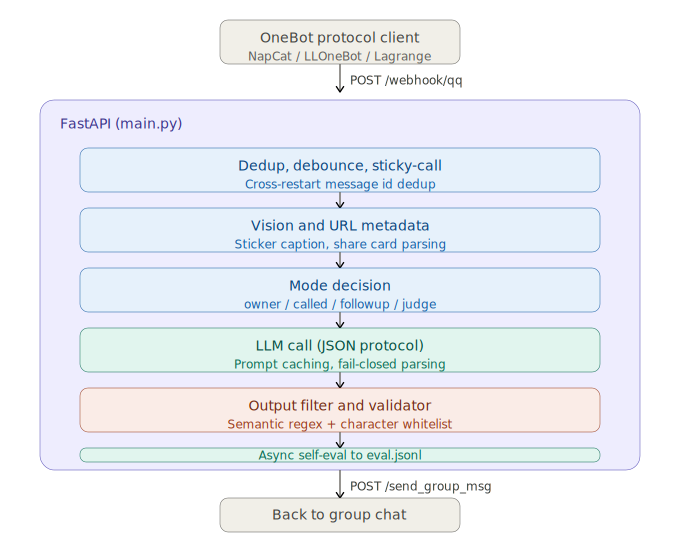
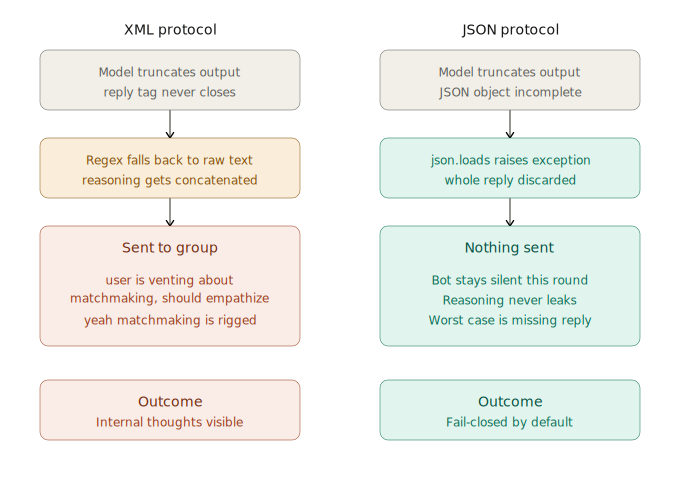
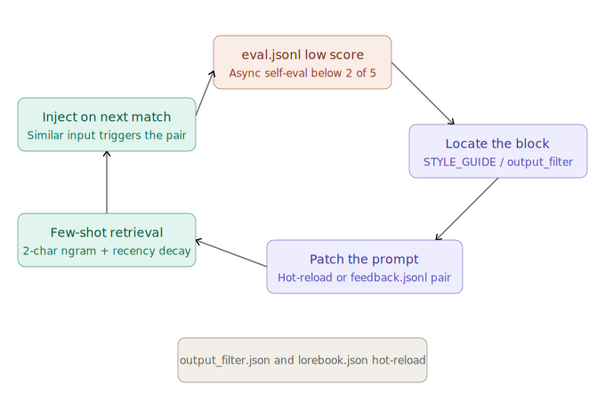
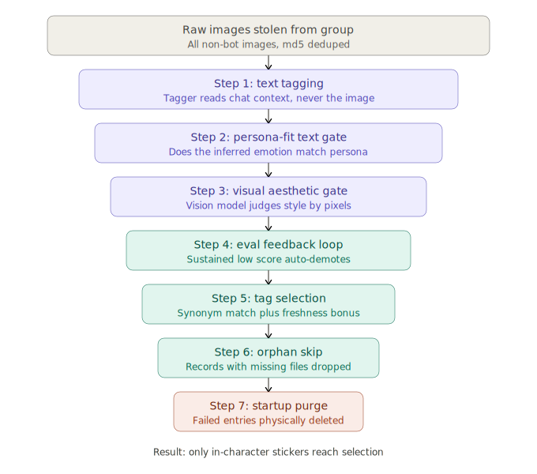

# onebot-llm-agent

**English** | [中文](README.zh-CN.md)

A **template for building persona-driven LLM agents on OneBot v11 group chats** — designed to send messages that read like a real person rather than a customer-service bot. This repo is primarily a study in LLM agent / prompt engineering design patterns; the OneBot platform integration is a demonstration carrier and contains no proprietary IM protocol code.

> **▶ [Live demo](https://qiankangwang.github.io/onebot-llm-agent/)** — a no-install, scripted walkthrough: watch the agent reason through a group chat (mode routing, the JSON output protocol, intent tags, sticker pick, PASS / stay-silent, and self-eval). No API key, no QQ. Replies are drawn straight from this repo's own example set.

> **English-first, bilingual.** The agent ships English by default and runs Chinese with one switch (`AGENT_LANG=zh`). See [Language](#language-english--中文). Want to try it in 30 seconds with no QQ account? Jump to [Try it without QQ](#try-it-without-qq).

> **Educational / research project. Not affiliated with, endorsed by, or sponsored by any IM platform vendor.**
> Read [DISCLAIMER.md](DISCLAIMER.md) before deploying. Third-party OneBot protocol clients (such as NapCat for QQ) are not sanctioned by their upstream IM platforms; if you choose to deploy against QQ, use a secondary account and run from a residential IP. Repo authors take no responsibility for downstream protocol-client choices.

## Why this exists

Most "LLM in a group chat" projects end up sounding like a chatbot stuck in customer-service mode — formal, eager, always replies, never has an opinion. This template attacks the persona problem from several angles:

- **Output safety first.** Reasoning, intent and reply are JSON fields, not XML inline tags, so a malformed model output can never leak the reasoning channel into the visible reply. A whitelist character validator drops anything that doesn't look like genuine chat for the active language (XML residue, JSON braces, provider tokens, leaked templates) — future unknown leak shapes are blocked automatically.
- **Style as code.** STYLE_GUIDE encodes the persona's *register*, forbidden phrases, identity-attack defenses, observer-position rules, and a "react to the image, don't describe it" rule — the kinds of rules that turn a chatbot into someone.
- **Stickers as part of the voice.** The library auto-steals new stickers seen in the group, vision-tags them, judges persona-fit twice (text + visual aesthetic), and lets the model send them inline via `[STICKER:<tag>]`. A real-conversation feedback loop demotes stickers that consistently feel off.
- **Read what's actually there.** Inline URLs, Bilibili / YouTube videos, and arbitrary mini-app share cards are fetched, parsed, and surfaced as structured context so the model isn't just staring at an opaque link.

## What's in the box

| Module | What it does |
|---|---|
| `agent.py` | JSON-protocol output (`reasoning` / `intent` / `reply` / `mem` as fields, not tags); whitelist character validator drops any reply that doesn't look like chat; 6 intent tags drive sub-styles; per-user RAG memory; dynamic few-shot retrieval over `data/examples.<lang>.jsonl` / `data/feedback.<lang>.jsonl`; regex pre-flight; async self-eval scoring each reply 1-5 to `eval.jsonl`; Anthropic prompt caching for the persistent prompt segments; cross-restart `seen_msg_ids` dedup |
| `stickers.py` | md5-deduped library; auto-steals new stickers seen in group; vision-tags them once context accumulates; persona-fit gate from both text (meaning/tags) and visual aesthetic; eval-driven quality feedback loop demotes stickers that score consistently low; freshness bonus rotates in newer picks; orphan-record skip during selection |
| `main.py` | FastAPI webhook receiver. NapCat POSTs group events to `/webhook/qq`; the agent processes and POSTs replies back to NapCat's HTTP API. Startup chains text-based + vision-based persona-fit rechecks → purge so the on-disk library only contains in-character stickers. |
| `tools/bootstrap_from_history.py` | One-shot bootstrap: pulls group history, computes owner's message-frequency profile, seeds the sticker library |
| `tools/auto_reviewer.py` | Scans low-score entries in `eval.jsonl` and proposes `failure_mode + constraint + BAD/OK pair_draft` for prompt patches |
| `tools/prompt_lab.py` | Offline interactive tuning: run the agent against `tools/fixtures.<lang>.jsonl`, rate replies, approved ones flow into `data/examples.<lang>.jsonl` |
| `tools/import_stickers_folder.py` | Bulk-import stickers from a local folder, auto-tag via vision model |

## Architecture sketch



<details>
<summary>Implementation detail (handler call chain)</summary>

```
NapCat (QQ ↔ OneBot)
    │
    │  HTTP POST /webhook/qq
    ▼
┌──────────────────── main.py (FastAPI) ────────────────────┐
│                                                            │
│  ┌──────────────────── agent.py ────────────────────────┐  │
│  │  handle(payload)                                     │  │
│  │    ├─ persistent dedup (seen_msg_ids.json)           │  │
│  │    ├─ debounce + sticky-call inheritance             │  │
│  │    ├─ vision (image / sticker caption)               │  │
│  │    ├─ URL / share-card metadata fetch                │  │
│  │    ├─ buffer (per-group rolling history)             │  │
│  │    ├─ mode decision (owner / called / followup / judge)│  │
│  │    └─ _think()                                       │  │
│  │         ├─ assemble cached system prompt blocks      │  │
│  │         ├─ call LLM (JSON output protocol)           │  │
│  │         ├─ _parse_model_output (fail-closed)         │  │
│  │         ├─ output filter (semantic regex rules)      │  │
│  │         ├─ _validate_reply_safe (char whitelist)     │  │
│  │         ├─ send via _send_qq (with sticker matching) │  │
│  │         └─ async self-eval → eval.jsonl + sticker score│ │
│  └──────────────────────────────────────────────────────┘  │
│                                                            │
│  ┌──────────────────── stickers.py ─────────────────────┐  │
│  │  steal → tag → persona-fit gate → visual aesthetic    │  │
│  │  → eval feedback loop → freshness-biased selection    │  │
│  └──────────────────────────────────────────────────────┘  │
└────────────────────────────────────────────────────────────┘
    │
    │  HTTP POST /send_group_msg
    ▼
NapCat → QQ
```
</details>

## Quick start

Requirements: Python 3.10+ and one OpenAI-compatible chat API key. A OneBot v11 client (e.g. NapCat) is only needed for a **live group** — not for the trial below.

```bash
# Bootstrap the venv, install deps, copy .env + persona templates
python quickstart.py
```

`quickstart.py` is idempotent — re-running just reports what's already in place. Manual equivalent: create `.venv`, `pip install -r requirements.txt`, copy `.env.example → .env`, copy `data/persona.example.en.txt → persona.txt`.

### Try it without QQ

The fastest way to feel out a persona — no QQ account, no NapCat, just an API key.

```bash
# In .env set just DEEPSEEK_API_KEY (+ DEEPSEEK_BASE_URL / DEEPSEEK_MODEL if not DeepSeek)
python try_chat.py             # English (default)
python try_chat.py --lang zh   # Chinese variant
python try_chat.py --owner     # speak as the configured owner
```

You type a line, the bot replies — through the **same** reasoning path the live bot uses (persona + style guide + JSON output protocol + the character-whitelist validator). It also prints the chosen `intent` and any extracted `mem`, so you can watch the protocol work. For batch/offline tuning against fixtures (rate replies, grow the few-shot bank), use `python tools/prompt_lab.py`.

### Run live on a group

1. **Configure `.env`** — fill the *REQUIRED FOR A LIVE QQ / OneBot DEPLOYMENT* block (`BOT_QQ`, `QQ_GROUPS`, `NAPCAT_API`) and write your `persona.txt`.
2. **Start the agent:**
   ```bash
   source .venv/bin/activate            # Windows: .venv\Scripts\activate
   python main.py                       # or: ./start.sh   (Windows: .\start.ps1)
   ```
   You should see `bot started on 0.0.0.0:8080 (agent=True, lang=en)`.
3. **Set up NapCat** (or any OneBot v11 client) and point it at the agent — see below.

#### NapCat in 3 steps

1. Download [NapCat](https://github.com/NapNeko/NapCatQQ) and log in a **secondary** QQ account (scan a QR / approve the login). Read [DISCLAIMER.md](DISCLAIMER.md) first — use a throwaway account and a residential IP.
2. In NapCat's OneBot config, enable the HTTP server **and** an HTTP webhook:
   ```json
   {
     "http": { "enable": true, "host": "0.0.0.0", "port": 3000 },
     "webhook": {
       "enable": true,
       "url": "http://127.0.0.1:8080/webhook/qq",
       "timeout": 5000
     }
   }
   ```
3. Start NapCat, then the agent. Post in the group and watch the logs.

#### Two ports, two directions

Newcomers mix these up — they point opposite ways:

```
NapCat  --(webhook: events)-->  agent :8080    (HOST / PORT in .env)
agent   --(send replies)----->  NapCat :3000   (NAPCAT_API in .env)
```

> **Windows one-click:** `launch.vbs` starts NapCat and the agent in two minimized windows. Edit the three values at the top (`BOT_QQ`, `NAPCAT_DIR`, `AGENT_DIR`) first; it prefers `.venv` automatically.

## Language (English / 中文)

The agent is **English-first** and runs Chinese with one switch. Set `AGENT_LANG` in `.env`:

- `AGENT_LANG=en` (default) — the primary English build.
- `AGENT_LANG=zh` — the Chinese variant.

The switch selects, in one move:

- **Data files** (under `data/`) by suffix: `data/persona.example.<lang>.txt`, `data/examples.<lang>.jsonl`, `data/feedback.<lang>.jsonl`, `data/output_filter.<lang>.json`, `data/lorebook.<lang>.json`. Each resolves to the `<lang>` file, falling back to a bare-named file if you drop in your own.
- **The reply validator** (`_validate_reply_safe`): English mode accepts any letter-bearing reply (and still drops XML/JSON/token leaks); `zh` mode requires CJK. Mixed zh/en code-switching passes either way.
- **Control-flow lexicons**: the few-shot/memory tokenizer and the topic-type classifier swap their word lists per language.
- **Dev tools**: `tools/auto_reviewer.py`, `tools/import_stickers_folder.py`, and `tools/prompt_lab.py` follow `AGENT_LANG` too.

To add another language, drop in `*.<lang>.*` data files and run with `AGENT_LANG=<lang>` (the validator treats any non-`zh` language as letter-based).

## Proactive messaging (optional)

By default the bot is purely reactive — it only speaks when a message arrives. Set `PROACTIVE_ENABLE=true` and a background loop will occasionally **initiate** a message with no trigger, so it reads like a person who sometimes breaks the silence rather than a 24/7 responder.

It's deliberately conservative — the failure mode ("needy bot spamming dead air") is worse than staying quiet:

- **Only after real silence**, outside the sleep window, with a per-chat cooldown and a low per-tick probability.
- **Never cold-opens.** It only acts in groups it's already seen talk, and only DMs people who've DMed it before (the owner + `PRIVATE_ALLOWED_QQS`) — it won't message someone out of nowhere.
- **The model is told to PASS unless it genuinely has something to say** — a callback to an earlier topic, a passing thought, or a light check-in — and *not* to post filler like "anyone here?". Most ticks produce nothing.
- Works the same in **groups and DMs**, each with their own silence / cooldown / probability knobs.

Tune `PROACTIVE_*` in `.env`. Defaults: groups quiet ≥ 45 min, ≥ 3 h between initiations, ~25% per check; DMs quiet ≥ 4 h, ≥ 24 h apart, ~20%.

## Output protocol — JSON, not XML

The model is required to emit a single JSON object per reply:

```json
{
  "reasoning": "...",      // ≤100 chars internal analysis, never shown
  "intent": "chat",        // one of: joke | vent | share | question | troll | chat
  "reply": "...",          // what the group actually sees (or "PASS" to skip)
  "mem": ""                // optional memory line; empty = nothing to record
}
```



Why JSON instead of `<reasoning>...</reasoning><intent>...</intent><reply>...</reply>`:

- **Field isolation.** If the model truncates, malforms tags, or emits provider-specific tokens, JSON parsing fails closed — nothing gets sent. The XML form had fallback branches that could leak the reasoning channel into the visible reply.
- **Easy robustness layers.** The parser strips optional ```json``` fences, tries `json.JSONDecoder.raw_decode` (handles concatenated objects), and as a last resort treats a short chat-shaped output as a naked reply (English or CJK, still validator-gated).
- **Caching-friendly.** The system prompt holds the schema; per-call differences live in the user message and a small "dynamic" segment. Persistent prompt segments are cached via Anthropic's `cache_control: ephemeral` blocks — repeated-call input cost drops to ~10% on hits.

Even past the parser, `_validate_reply_safe` applies a character whitelist before send. In English mode any reply carrying at least one letter passes, while XML / JSON braces / pipe / subword markers are always dropped; in `zh` mode the reply must contain CJK. Mixed zh/en code-switching passes either way. No per-shape regex rules required for future unknown leak forms.

## Reply examples

What "sounds like a real person" looks like in practice. (The primary build runs in English; set `AGENT_LANG=zh` for the Chinese variant — the patterns are identical.)

> **Friend** *(taking a jab)*: "doing your usual genius work today huh"
> **Bot**: "yeah just mashing keys and hoping a feature falls out"
> — takes the jab literally, plays along instead of getting defensive. No "I'm doing my best!", no apology.

> **Friend**: *(sends a reaction sticker, no text)*
> **Bot**: "stickers as a substitute for words. classic. [STICKER:eyeroll]"
> — reacts to the *act* of sending a sticker, not the contents of the image.

> **Friend**: "ranked is rigged man, lost 4 in a row, teammates feeding nonstop"
> **Bot**: "matchmaker decided you needed character development today [STICKER:resigned]"
> — joins the vent with a fitting sticker. No "why don't you take a break", no follow-up question.

> **Owner**: "wait what was that thing called again, the one we just talked about"
> **Bot**: "two minutes ago, bro. two minutes. [STICKER:smug]"
> — pokes fun at the owner; the closer relationship gives more license to tease.

The pattern: the agent reasons about who said what to whom (observer-position aware), picks an intent tag, then writes in the sub-style for that intent — no bulleted analysis, no service-counter politeness, and never describing what an image literally contains.

## Configuration

All settings come from `.env`. Key fields:

| Variable | What |
|---|---|
| `AGENT_LANG` | `en` (default) or `zh`. Selects the per-language data files, validator mode, and lexicons. See [Language](#language-english--中文) |
| `DEEPSEEK_API_KEY` / `DEEPSEEK_BASE_URL` / `DEEPSEEK_MODEL` | Primary chat-completion model. Any OpenAI-compatible endpoint works. **The only key needed for `python try_chat.py`** |
| `ANTHROPIC_API_KEY` / `ANTHROPIC_BASE_URL` / `ANTHROPIC_PRIVATE_MODEL` | **Optional.** Anthropic-compatible endpoint for the main reply path (`_call_anthropic`), where prompt caching kicks in. Leave blank to route through your primary endpoint's `{DEEPSEEK_BASE_URL}/anthropic` URL with `DEEPSEEK_API_KEY` |
| `BOT_QQ` / `BOT_NAME` | The bot account's QQ number and display name |
| `OWNER_QQ` / `OWNER_NAME` / `OWNER_RELATIONSHIP` | A "favorite person" the bot is closer to (optional, all blank by default) |
| `QQ_GROUPS` | Comma-separated group IDs to listen on. Empty = listen everywhere |
| `VISION_MODEL` + `GLM_API_KEY` / `GLM_BASE_URL` | Vision model for image / sticker understanding. Leave blank to skip (OCR-only fallback) |
| `PERSONA_FILE` | Path to your persona prompt (default `persona.txt`) |
| `PROACTIVE_ENABLE` (+ `PROACTIVE_*`) | Opt-in self-initiated messaging. See [Proactive messaging](#proactive-messaging-optional) |
| `FALLBACK_MODEL` + `RATE_THRESHOLD` + `RATE_WINDOW` | Auto-downgrade to a cheaper model when request rate spikes |
| `JUDGE_MODEL` | Cheapest model for the "should I reply?" gate on self-initiated modes (judge/followup/proactive). The reply that's actually sent is always written by the main model. Defaults to `FALLBACK_MODEL` |
| `EVAL_MODEL` | Model used by the async self-eval scorer (often a cheaper one is fine) |

See `.env.example` for the full list.

## Iteration loop



The agent's prompt is structured to make failures debuggable:

```
observe failure (eval.jsonl LOW-SCORE / live observation)
  ↓
locate which block owns it (STYLE_GUIDE / REASONING_PROTOCOL / INTENT_RULES / output_filter)
  ↓
add a hard constraint with a counter-example next to similar rules,
  or add a semantic regex rule in data/output_filter.<lang>.json
  ↓
write a BAD/OK pair into data/feedback.<lang>.jsonl
  ↓
next time a similar input arrives, dynamic few-shot retrieval surfaces the pair
```

The retrieval over `data/examples.<lang>.jsonl` + `data/feedback.<lang>.jsonl` uses language-aware tokens (English words minus stopwords, or Chinese 2-char ngrams) + scenario tags + recency decay, so even small datasets (5-10 entries per failure mode) start helping immediately.

`data/output_filter.<lang>.json` is hot-reloaded — edit it without restarting. Same for `data/lorebook.<lang>.json` (keyword-triggered context injection à la SillyTavern World Info).

## Sticker quality machinery



Stickers go through several gates before being eligible for selection:

1. **Steal.** Any non-bot image that lingers in conversation context gets md5-stored.
2. **Tag.** Once enough context accumulates, an LLM-tagger names the emotion / meme using the surrounding chat (it never sees the image).
3. **Text persona-fit gate.** Same tagger judges whether the inferred meaning fits the configured persona. Stale entries are re-judged whenever `PERSONA_PROMPT_VERSION` bumps.
4. **Visual aesthetic gate.** The vision model looks at the *pixels* and judges visual style (cleanly-designed meme vs. gaudy old family-group sticker). Catches what text alone can't. Stale entries are re-judged whenever `VISUAL_AESTHETIC_VERSION` bumps.
5. **Eval feedback loop.** Each sent sticker gets a 1-5 score from the self-eval. Sustained low average auto-demotes to `persona_fit=false`.
6. **Selection.** `pick_by_tag` matches with synonym expansion, gives a small freshness bonus to newer picks, skips orphan records (entries whose backing file is missing), and falls back to a cooled-down match before dropping a sticker-only reply.
7. **Purge.** Entries flagged `persona_fit=false` are physically removed (record + file) on the next startup pass.

## Privacy

Files that may contain real chat content are gitignored:

```
.env                      # API keys
eval.jsonl                # raw self-eval scoring trace
memory.json               # extracted long-term memories
core_memory.json          # self-maintained persona notes
stickers.json             # sticker index incl. sample chat contexts
stickers/auto/            # downloaded sticker binaries
seen_msg_ids.json         # cross-restart message dedup state
owner_profile.json        # owner's message-frequency profile
unknown_stickers.jsonl    # download URLs
candidates.jsonl          # auto-reviewer output
*.log                     # runtime logs
```

The committed `data/examples.{en,zh}.jsonl` / `data/feedback.{en,zh}.jsonl` / `tools/fixtures.{en,zh}.jsonl` in this template are **fully synthetic** examples showing the format only.

## License

[MIT](LICENSE).

## Acknowledgements

- The `<reasoning>` / `<intent>` / `<reply>` separation idea predates this repo; the JSON-field rewrite here keeps the spirit while removing a class of leak bugs.
- NapCat / OneBot v11 ecosystem for the QQ protocol layer.
- SillyTavern's World Info + regex extension model inspired the lorebook and output filter design.
