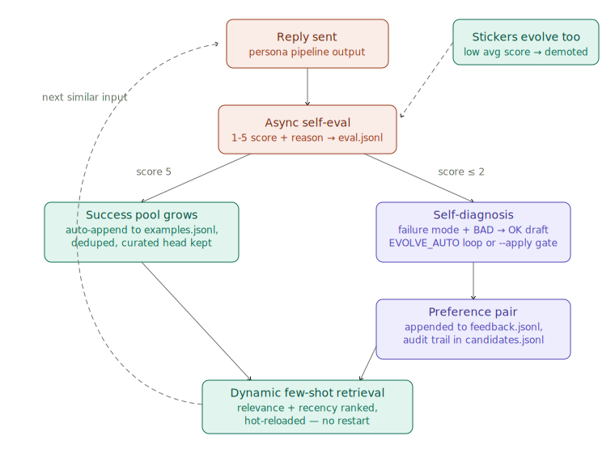
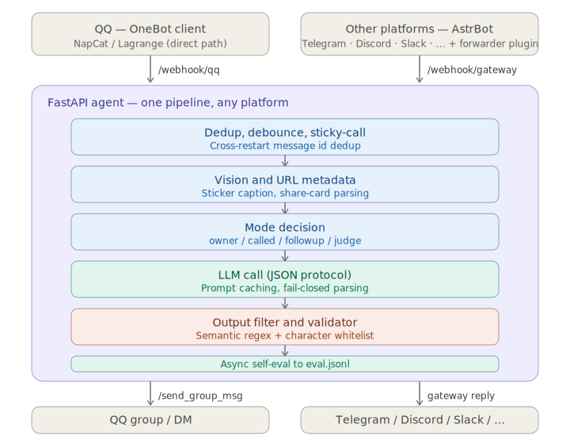

# personagent

[](https://wangkant.github.io/personagent/)
[](https://github.com/wangkant/personagent/actions/workflows/ci.yml)
[](LICENSE)
[](https://www.python.org/downloads/)

**English** | [中文](README.zh-CN.md)

> **You type. It replies like a person — not a help desk — and it gets better at it on its own.**

[](https://wangkant.github.io/personagent/)

A **template for building self-evolving, persona-driven LLM agents** for group chats and DMs — designed to send messages that read like a real person rather than a customer-service bot, and to keep getting better at it on its own: it learns primarily from **real user reactions** — a "no, I meant X" becomes a correction pair, laughter banks the reply as a proven example — with LLM self-scoring as the fallback channel (see [Self-evolution](#self-evolution)). The primary carrier is **OneBot v11 / QQ** (via NapCat); a bundled platform-neutral gateway plus an [AstrBot](https://github.com/AstrBotDevs/AstrBot) forwarder plugin extend the same persona to **Telegram, Discord, Slack, Lark, and KOOK** with no changes to the persona pipeline. This repository is primarily a study of LLM-agent and prompt-engineering design patterns; the platform integration is a demonstration carrier and contains no proprietary IM protocol code.

> **English-first, bilingual.** The agent ships English by default and runs Chinese with one switch (`AGENT_LANG=zh`). See [Language](#language-english--中文). Want to try it in 30 seconds with no QQ account? Jump to [Try it without QQ](#try-it-without-qq).

> **Educational / research project. Not affiliated with, endorsed by, or sponsored by any IM platform vendor.**
> Read [DISCLAIMER.md](DISCLAIMER.md) before deploying. Third-party OneBot protocol clients (such as NapCat for QQ) are not sanctioned by their upstream IM platforms; if you choose to deploy against QQ, use a secondary account and run from a residential IP. The repository authors accept no responsibility for downstream protocol-client choices.

## Table of contents

- [Motivation](#motivation)
- [Self-evolution](#self-evolution)
- [Quick start](#quick-start)
- [Multi-platform via AstrBot](#multi-platform-via-astrbot)
- [Language (English / 中文)](#language-english--中文)
- [Proactive messaging (optional)](#proactive-messaging-optional)
- [Output protocol: JSON, not XML](#output-protocol-json-not-xml)
- [Reply examples](#reply-examples)
- [Configuration](#configuration)
- [Iteration loop](#iteration-loop)
- [Sticker quality pipeline](#sticker-quality-pipeline)
- [Architecture](#architecture)
- [Project layout](#project-layout)
- [Components](#components)
- [Development](#development)
- [Privacy](#privacy)
- [License](#license)
- [Acknowledgements](#acknowledgements)

## Motivation

Most "LLM in a group chat" projects sound like a chatbot stuck in customer-service mode: formal, eager, always replying, never holding an opinion. This template addresses the persona problem on five fronts:

- **Output safety first.** Reasoning, intent, and reply are JSON fields rather than inline XML tags, so a malformed model output cannot leak the reasoning channel into the visible reply. A whitelist character validator rejects anything that does not resemble genuine chat for the active language (XML residue, JSON braces, provider tokens, leaked templates); previously unseen leak shapes are blocked automatically.
- **Style as code.** `STYLE_GUIDE` encodes the persona's *register*, forbidden phrasings, identity-attack defenses, observer-position rules, and a "react to the image, do not describe it" rule — the constraints that distinguish a character from a generic assistant.
- **Stickers as part of the voice.** The library collects new stickers seen in the group, tags them with a vision model, evaluates persona-fit twice (text and visual aesthetic), and lets the model send them inline via `[STICKER:<tag>]`. A conversation-driven feedback loop demotes stickers that consistently score poorly.
- **Understand the content.** Inline URLs, Bilibili and YouTube videos, and arbitrary mini-app share cards are fetched, parsed, and surfaced as structured context, so the model receives the underlying content rather than an opaque link.
- **Self-evolution.** The persona is not frozen at deployment. It learns primarily from real user reactions (corrections become preference pairs, laughter banks proven replies), with LLM self-scoring as the fallback — and everything hot-reloads into the very next similar conversation. See the next section.

## Self-evolution



The agent closes a full learning loop around its own output — all of it hot-reloaded into dynamic few-shot retrieval, no restart needed:

- **Learn from real user reactions (the primary signal).** Every sent reply briefly waits for a *directed* reaction — someone quoting the bot's message, @-ing it, or (in a DM) just answering. An in-process adjudicator classifies the reaction: *"no, I meant X"* is a **correction** (with the right answer inside it — it becomes a BAD → OK preference pair); re-asking the same thing in other words is a **rejection** (didn't land); laughing or riffing is a **positive** (the reply is banked into the example pool as a proven hit). The adjudicator filters banter and trolling before anything is written — the owner's corrections carry the most weight, a stranger must be self-evidently right — and every verdict is audited in `candidates.jsonl`. Reading a *reaction to a reply* is a far easier judgment than scoring "how human does this sound", which is why this channel works where naive LLM self-scoring is too lenient. Three mechanisms deepen the loop: **retry-completion** (user rejects reply A, the bot's retry B satisfies them — (A → B) closes into a pair with zero user effort), **delayed elicitation** (if a rejection taught nothing concrete, the bot may — after waiting out its own reply, at most once an hour — casually ask what they meant; the answer then adjudicates as a proper correction), and **teacher reputation** (per-user track record of adopted vs dismissed teachings feeds the adjudicator; persistently bad teachers get hard-blocked without costing a call). Prior art, honestly: this transplants the deployment-time learning line — [Self-Feeding Chatbot](https://arxiv.org/abs/1901.05415)'s feedback elicitation, [Alexa self-learning](https://arxiv.org/pdf/1911.02557)'s rephrase-and-retry signal, [BlenderBot 3x](https://arxiv.org/abs/2306.04707)'s troll-resistant teacher filtering — into a training-free, in-context form.
- **Learn from successes (fallback, fully automatic).** An async self-evaluator scores every sent reply 1–5 into `eval.jsonl`. Replies scoring a full 5 are auto-appended to `runtime/examples.<lang>.jsonl` (deduped and size-capped), while the tracked `data/examples.<lang>.jsonl` remains a read-only synthetic seed.
- **Learn from failures without a human in the loop (fallback).** Low-scoring replies are fed back to a model that names the failure mode ("service-desk tone", "answered the wrong person"), drafts one negative constraint, and writes a BAD → OK rewrite. Approved rewrites land in `runtime/feedback.<lang>.jsonl` as preference pairs — the strongest retrieval signal — so the next similar input surfaces the correction in-context. Two ways to run it:
  - **Human-gated:** `python tools/auto_reviewer.py --apply` shows each diagnosis and lets you approve / reject / edit before anything is written (`--yes` skips the prompt).
  - **Unattended:** set `EVOLVE_AUTO=true` and a background loop does the same thing in-process on a timer, restricted to clear failures (`score <= EVOLVE_THRESHOLD`, default 2). Every diagnosis — applied or rejected — is recorded in `candidates.jsonl`, so the CLI and the loop never double-process an entry and you can always audit what the bot taught itself.
- **Stickers evolve too.** Each sent sticker gets its own score; a sustained low average demotes it out of the library (see [Sticker quality pipeline](#sticker-quality-pipeline)).
- **The persona takes notes on itself.** A letta-style `core_memory.json` holds a per-group self-maintained note the model can update mid-conversation — standing facts about the group survive context-window turnover.

Guardrails, because an unattended feedback loop can also entrench garbage: every reaction passes the adjudicator (banter and trolling are filtered, strangers must be self-evidently right), only a top score grows the example pool (generous eval models would otherwise let disliked patterns reinforce themselves), the unattended path only touches clear failures, pairs are deduped against the whole feedback file, both files are size-capped, and `candidates.jsonl` keeps the full audit trail.

## Quick start

Requirements: Python 3.10+ and one OpenAI-compatible chat API key. A OneBot v11 client (e.g. NapCat) is only needed for a **live group** — not for the trial below.

```bash
# One command: venv + deps + an interactive setup wizard
python quickstart.py
```

The wizard asks for your API provider (DeepSeek / Kimi / OpenAI / Ollama / any OpenAI-compatible endpoint), key, bot name and language, writes the answers into `.env` for you, can verify the key with a 1-token test call, optionally collects the live-QQ settings too (and prints the exact NapCat config to paste), then offers to drop you straight into a terminal chat. **No manual `.env` editing needed** — the file still doubles as the fully-annotated reference for every advanced knob.

Idempotent — re-running reports what's in place and only re-offers the wizard if you want to reconfigure. `--no-input` (or piped stdin) skips the wizard for CI and just bootstraps: create `.venv`, `pip install -r requirements.txt`, copy `.env.example → .env` + persona template.

### Try it without QQ

The fastest way to feel out a persona — no QQ account, no NapCat, just an API key. The wizard offers this at the end of setup; to run it again later:

```bash
python try_chat.py             # English (default)
python try_chat.py --lang zh   # Chinese variant
python try_chat.py --owner     # speak as the configured owner
```

You type a line, the bot replies — through the **same** reasoning path the live bot uses (persona + style guide + JSON output protocol + the character-whitelist validator). It also prints the chosen `intent` and any extracted `mem`, so you can watch the protocol work. For batch/offline tuning against fixtures (rate replies, grow the few-shot bank), use `python tools/prompt_lab.py`.

### Run live on a group

1. **Configure `.env`** — if you answered the wizard's live-deployment questions this is already done; otherwise fill the *REQUIRED FOR A LIVE QQ / OneBot DEPLOYMENT* block (`BOT_QQ`, `QQ_GROUPS`, `NAPCAT_API`) and write your `persona.txt`.
2. **Start the agent:**
   ```bash
   source .venv/bin/activate            # Windows: .venv\Scripts\activate
   python main.py                       # or: ./start.sh   (Windows: .\start.ps1)
   ```
   You should see `bot started on 127.0.0.1:8080 (agent=True, lang=en)`.
3. **Set up NapCat** (or any OneBot v11 client) and point it at the agent — see below.

#### NapCat in 3 steps

1. Download [NapCat](https://github.com/NapNeko/NapCatQQ) and log in a **secondary** QQ account (scan a QR / approve the login). Read [DISCLAIMER.md](DISCLAIMER.md) first — use a throwaway account and a residential IP.
2. In NapCat's OneBot config, enable the HTTP server **and** an HTTP webhook:
   ```json
   {
     "http": { "enable": true, "host": "0.0.0.0", "port": 3000 },
     "webhook": {
       "enable": true,
       "url": "http://127.0.0.1:8080/webhook/qq",
       "timeout": 5000
     }
   }
   ```
3. Start NapCat, then the agent. Post in the group and watch the logs.

#### Ports and data flow

The two connections point in opposite directions and are easy to confuse:

```
NapCat  --(webhook: events)-->  agent :8080    (HOST / PORT in .env)
agent   --(send replies)----->  NapCat :3000   (NAPCAT_API in .env)
```

> **Windows launcher:** `launch.vbs` starts NapCat and the agent in two minimized windows. Set the three values at the top (`BOT_QQ`, `NAPCAT_DIR`, `AGENT_DIR`) first; it uses `.venv` automatically when present.

## Multi-platform via AstrBot

QQ/NapCat above is the primary path, but the agent also exposes a platform-neutral webhook — `POST /webhook/gateway` — so the same persona can sit in Telegram / Discord / Slack / Lark / KOOK groups and DMs through [AstrBot](https://github.com/AstrBotDevs/AstrBot)'s platform adapters. The persona pipeline is untouched: the gateway synthesizes a neutral inbound event into the existing handler and captures replies through a context-local sink, and a bundled forwarder plugin does the AstrBot-side translation.

```
Telegram / Discord / Slack / …  -->  AstrBot + forwarder plugin  --HTTP-->  agent /webhook/gateway
QQ                              -->  NapCat                      --HTTP-->  agent /webhook/qq      (unchanged)
```

1. Install AstrBot and configure the platform adapters you want.
2. Copy `integrations/astrbot/astrbot_plugin_llm_persona_gateway/` into AstrBot's `data/plugins/` and set its config (agent URL, optional shared token, group/DM whitelists). Full reference: [plugin README](integrations/astrbot/astrbot_plugin_llm_persona_gateway/README.md).
3. Optional hardening in `.env`: `GATEWAY_TOKEN` (shared secret checked on the webhook) and `GATEWAY_OWNER_IDS` (treat e.g. `telegram:12345` as the owner). See `.env.example`.

Gateway conversations are namespaced `<platform>:<id>`, so memory and state never collide with QQ. Keep `aiocqhttp` in the plugin's excluded platforms (the default) when NapCat already feeds the agent directly, or QQ messages get handled twice. QQ-only machinery (sticker stealing, OCR, proactive / missed-mention catch-up) stays on the QQ path; text / sticker / mention replies work everywhere.

## Language (English / 中文)

The agent is **English-first** and runs Chinese with one switch. Set `AGENT_LANG` in `.env`:

- `AGENT_LANG=en` (default) — the primary English build.
- `AGENT_LANG=zh` — the Chinese variant.

The switch selects, in one move:

- **Data files** (under `data/`) by suffix: `data/persona.example.<lang>.txt`, `data/examples.<lang>.jsonl`, `data/feedback.<lang>.jsonl`, `data/output_filter.<lang>.json`, `data/lorebook.<lang>.json`. Each resolves to the `<lang>` file, falling back to a bare-named file if you drop in your own.
- **The reply validator** (`_validate_reply_safe`): English mode accepts any letter-bearing reply (and still drops XML/JSON/token leaks); `zh` mode requires CJK. Mixed zh/en code-switching passes either way.
- **Control-flow lexicons**: the few-shot/memory tokenizer and the topic-type classifier swap their word lists per language.
- **Dev tools**: `tools/auto_reviewer.py`, `tools/import_stickers_folder.py`, and `tools/prompt_lab.py` follow `AGENT_LANG` too.

To add another language, drop in `*.<lang>.*` data files and run with `AGENT_LANG=<lang>` (the validator treats any non-`zh` language as letter-based).

## Proactive messaging (optional)

By default the bot is purely reactive — it only speaks when a message arrives. Set `PROACTIVE_ENABLE=true` and a background loop will occasionally **initiate** a message with no trigger, so it reads like a person who sometimes breaks the silence rather than a 24/7 responder.

The mechanism is deliberately conservative; an over-eager bot posting into silence is worse than one that stays quiet:

- **Only after genuine silence**, outside the sleep window, with a per-conversation cooldown and a low per-tick probability.
- **Never cold-opens.** It acts only in groups where it has already observed activity, and messages only people who have messaged it before (the owner and `PRIVATE_ALLOWED_QQS`); it will not contact someone unprompted.
- **The model is instructed to return PASS unless it genuinely has something to say** — a callback to an earlier topic, a passing thought, or a brief check-in — and *not* to post filler such as "anyone here?". Most ticks produce nothing.
- Behaves identically in **groups and direct messages**, each with independent silence, cooldown, and probability parameters.

Tune `PROACTIVE_*` in `.env`. Defaults: groups quiet ≥ 45 min, ≥ 3 h between initiations, ~25% per check; DMs quiet ≥ 4 h, ≥ 24 h apart, ~20%.

## Output protocol: JSON, not XML

The model is required to emit a single JSON object per reply:

```json
{
  "reasoning": "...",      // ≤100 chars internal analysis, never shown
  "intent": "chat",        // one of: joke | vent | share | question | troll | chat
  "reply": "...",          // what the group actually sees (or "PASS" to skip)
  "mem": ""                // optional memory line; empty = nothing to record
}
```


Why JSON instead of `<reasoning>...</reasoning><intent>...</intent><reply>...</reply>`:

- **Field isolation.** If the model truncates, malforms tags, or emits provider-specific tokens, JSON parsing fails closed — nothing gets sent. The XML form had fallback branches that could leak the reasoning channel into the visible reply.
- **Easy robustness layers.** The parser strips optional ```json``` fences, tries `json.JSONDecoder.raw_decode` (handles concatenated objects), and as a last resort treats a short chat-shaped output as a naked reply (English or CJK, still validator-gated).
- **Caching-friendly.** The system prompt holds the schema; per-call differences live in the user message and a small "dynamic" segment. Persistent prompt segments are cached via Anthropic's `cache_control: ephemeral` blocks — repeated-call input cost drops to ~10% on hits.

Even past the parser, `_validate_reply_safe` applies a character whitelist before send. In English mode any reply carrying at least one letter passes, while XML / JSON braces / pipe / subword markers are always dropped; in `zh` mode the reply must contain CJK. Mixed zh/en code-switching passes either way. No per-shape regex rules required for future unknown leak forms.

## Reply examples

What "sounds like a real person" looks like in practice. (The primary build runs in English; set `AGENT_LANG=zh` for the Chinese variant — the patterns are identical.)

> **Friend** *(taking a jab)*: "doing your usual genius work today huh"
> **Bot**: "yeah just mashing keys and hoping a feature falls out"
> — takes the jab literally, plays along instead of getting defensive. No "I'm doing my best!", no apology.

> **Friend**: *(sends a reaction sticker, no text)*
> **Bot**: "stickers as a substitute for words. classic. [STICKER:eyeroll]"
> — reacts to the *act* of sending a sticker, not the contents of the image.

> **Friend**: "ranked is rigged man, lost 4 in a row, teammates feeding nonstop"
> **Bot**: "matchmaker decided you needed character development today [STICKER:resigned]"
> — joins the vent with a fitting sticker. No "why don't you take a break", no follow-up question.

> **Owner**: "wait what was that thing called again, the one we just talked about"
> **Bot**: "two minutes ago, bro. two minutes. [STICKER:smug]"
> — pokes fun at the owner; the closer relationship gives more license to tease.

The pattern: the agent reasons about who said what to whom (observer-position aware), picks an intent tag, then writes in the sub-style for that intent — no bulleted analysis, no service-counter politeness, and never describing what an image literally contains.

## Configuration

All settings come from `.env`. Key fields:

| Variable | What |
|---|---|
| `AGENT_LANG` | `en` (default) or `zh`. Selects the per-language data files, validator mode, and lexicons. See [Language](#language-english--中文) |
| `AGENT_RUNTIME_DIR` | Ignored directory for learned examples and feedback (default `runtime/`) |
| `DEEPSEEK_API_KEY` / `DEEPSEEK_BASE_URL` / `DEEPSEEK_MODEL` | Primary chat-completion model. Any OpenAI-compatible endpoint works. **The only key needed for `python try_chat.py`** |
| `ANTHROPIC_PRIVATE_MODEL` | **Optional.** Alternate model name for 1:1 private chats, served by the same primary endpoint (the prefix is historical). Blank = `DEEPSEEK_MODEL` |
| `BOT_QQ` / `BOT_NAME` | The bot account's QQ number and display name |
| `OWNER_QQ` / `OWNER_NAME` / `OWNER_RELATIONSHIP` | A "favorite person" the bot is closer to (optional, all blank by default) |
| `QQ_GROUPS` | Comma-separated group IDs to listen on. Empty = listen everywhere |
| `VISION_MODEL` + `GLM_API_KEY` / `GLM_BASE_URL` | Vision model for image / sticker understanding. Leave blank to skip (OCR-only fallback) |
| `NAPCAT_IMAGE_DIR` / `MAX_IMAGE_BYTES` | Allowlisted local image-cache directory and maximum decoded image size. `file://` is rejected when the directory is unset |
| `MAX_WEBHOOK_BODY_BYTES` | Maximum raw request body accepted by either webhook (default 8 MB) |
| `PERSONA_FILE` | Path to your persona prompt (default `persona.txt`) |
| `PROACTIVE_ENABLE` (+ `PROACTIVE_*`) | Opt-in self-initiated messaging. See [Proactive messaging](#proactive-messaging-optional) |
| `REACT_LEARN` (+ `REACT_*`) | Learn from real user reactions (on by default — the primary self-evolution signal). See [Self-evolution](#self-evolution) |
| `EVOLVE_AUTO` (+ `EVOLVE_*`) | Opt-in unattended eval → feedback learning loop (fallback channel). See [Self-evolution](#self-evolution) |
| `FALLBACK_MODEL` + `RATE_THRESHOLD` + `RATE_WINDOW` | Auto-downgrade to a cheaper model when request rate spikes |
| `JUDGE_MODEL` | Cheapest model for the "should I reply?" gate on self-initiated modes (judge/followup/proactive). The reply that's actually sent is always written by the main model. Defaults to `FALLBACK_MODEL` |
| `EVAL_MODEL` | Model used by the async self-eval scorer (often a cheaper one is fine) |

See `.env.example` for the full list.

## Iteration loop


The [self-evolution loop](#self-evolution) handles the automatable part of this on its own; the manual loop below is for the failures that need a human judgment call — a new failure *class* that wants a hard constraint in the prompt, not just another retrieval pair. The agent's prompt is structured to make those debuggable:

```
observe failure (eval.jsonl LOW-SCORE / live observation)
  ↓
locate which block owns it (STYLE_GUIDE / REASONING_PROTOCOL / INTENT_RULES / output_filter)
  ↓
add a hard constraint with a counter-example next to similar rules,
  or add a semantic regex rule in data/output_filter.<lang>.json
  ↓
write a BAD/OK pair into runtime/feedback.<lang>.jsonl
  ↓
next time a similar input arrives, dynamic few-shot retrieval surfaces the pair
```

Retrieval merges the read-only synthetic seeds in `data/{examples,feedback}.<lang>.jsonl` with learned rows in `runtime/{examples,feedback}.<lang>.jsonl`. It uses language-aware tokens (English words minus stopwords, or Chinese 2-char ngrams) + scenario tags + recency decay, so even small datasets (5-10 entries per failure mode) start helping immediately.

`data/output_filter.<lang>.json` is hot-reloaded — edit it without restarting. Same for `data/lorebook.<lang>.json` (keyword-triggered context injection à la SillyTavern World Info).

## Sticker quality pipeline


Stickers pass through several gates before becoming eligible for selection:

1. **Collect.** Any non-bot image that appears in conversation context is stored, deduplicated by md5.
2. **Tag.** Once sufficient context accumulates, an LLM tagger names the emotion or meme from the surrounding chat (it never sees the image itself).
3. **Text persona-fit gate.** The same tagger evaluates whether the inferred meaning fits the configured persona. Stale entries are re-evaluated whenever `PERSONA_PROMPT_VERSION` is incremented.
4. **Visual aesthetic gate.** The vision model inspects the *pixels* and evaluates visual style (a cleanly designed meme versus a dated family-group sticker) — a distinction text alone cannot make. Stale entries are re-evaluated whenever `VISUAL_AESTHETIC_VERSION` is incremented.
5. **Evaluation feedback loop.** Each sent sticker receives a 1–5 score from the self-evaluator. A sustained low average demotes it to `persona_fit=false`.
6. **Selection.** `pick_by_tag` matches with synonym expansion, applies a small freshness bonus to newer entries, skips orphan records (entries whose backing file is missing), and falls back to a recently used match before dropping a sticker-only reply.
7. **Purge.** Entries flagged `persona_fit=false` are removed (record and file) on the next startup pass.

## Architecture



<details>
<summary>Implementation detail (handler call chain)</summary>

```
NapCat (QQ ↔ OneBot)          AstrBot + forwarder plugin
    │                              │
    │  POST /webhook/qq            │  POST /webhook/gateway
    ▼                              ▼
┌──────────────────── main.py (FastAPI) ────────────────────┐
│                                                            │
│  ┌─────────────── persona_agent/agent.py ───────────────┐  │
│  │  handle(payload)                                     │  │
│  │    ├─ persistent dedup (seen_msg_ids.json)           │  │
│  │    ├─ debounce + sticky-call inheritance             │  │
│  │    ├─ vision (image / sticker caption)               │  │
│  │    ├─ URL / share-card metadata fetch                │  │
│  │    ├─ buffer (per-group rolling history)             │  │
│  │    ├─ mode decision (owner / called / followup / judge)│  │
│  │    └─ _think()                                       │  │
│  │         ├─ assemble cached system prompt blocks      │  │
│  │         ├─ call LLM (JSON output protocol)           │  │
│  │         ├─ _parse_model_output (fail-closed)         │  │
│  │         ├─ output filter (semantic regex rules)      │  │
│  │         ├─ _validate_reply_safe (char whitelist)     │  │
│  │         ├─ send via _send_qq (with sticker matching) │  │
│  │         └─ async self-eval → eval.jsonl + sticker score│ │
│  └──────────────────────────────────────────────────────┘  │
│                                                            │
│  ┌────────────── persona_agent/stickers.py ─────────────┐  │
│  │  steal → tag → persona-fit gate → visual aesthetic    │  │
│  │  → eval feedback loop → freshness-biased selection    │  │
│  └──────────────────────────────────────────────────────┘  │
└────────────────────────────────────────────────────────────┘
    │                              │
    │  POST /send_group_msg        │  replies in the gateway response
    ▼                              ▼
NapCat → QQ                   AstrBot → Telegram / Discord / …
```
</details>

## Components

| Module | Responsibility |
|---|---|
| `persona_agent/agent.py` | JSON-protocol output (`reasoning` / `intent` / `reply` / `mem` as fields, not tags); whitelist character validator; transactional delivery/state commits; bounded image ingestion; per-user RAG memory; dynamic few-shot retrieval over seed + runtime examples/feedback; regex pre-flight; async self-eval; the opt-in `EVOLVE_AUTO` loop; cross-restart `seen_msg_ids` dedup |
| `persona_agent/reactions.py` | Learn from real user reactions (primary signal): pending-reply table with quote/@/DM attribution, one-call adjudicator (classify + genuineness + rewrite, owner-weighted), write-shapes for the feedback/examples pipelines |
| `persona_agent/evolution.py` | The eval → feedback learning-loop logic (load low scores, build the diagnosis prompt, convert drafts to preference pairs, dedup, audit trail) — shared by the in-process `EVOLVE_AUTO` loop and `tools/auto_reviewer.py`, transport-agnostic |
| `persona_agent/stickers.py` | md5-deduped library; auto-steals new stickers seen in group; vision-tags them once context accumulates; persona-fit gate from both text (meaning/tags) and visual aesthetic; eval-driven quality feedback loop demotes stickers that score consistently low; freshness bonus rotates in newer picks; orphan-record skip during selection |
| `main.py` | FastAPI webhook receiver. NapCat POSTs group events to `/webhook/qq`; the agent processes and POSTs replies back to NapCat's HTTP API. Startup chains text-based + vision-based persona-fit rechecks → purge so the on-disk library only contains in-character stickers. |
| `persona_agent/gateway.py` + `integrations/astrbot/` | Platform-neutral gateway: a neutral inbound event schema synthesized into the same handler pipeline, replies captured via a context-local sink, plus a bundled [AstrBot](https://github.com/AstrBotDevs/AstrBot) forwarder plugin that connects Telegram / Discord / Slack / … groups and DMs |
| `tools/bootstrap_from_history.py` | One-shot bootstrap: pulls group history, computes owner's message-frequency profile, seeds the sticker library |
| `tools/auto_reviewer.py` | The human-gated end of the learning loop: diagnoses low-score entries in `eval.jsonl` into `candidates.jsonl`, then `--apply` walks you through approving / editing each BAD → OK pair into runtime feedback (`--yes` for unattended) |
| `tools/prompt_lab.py` | Offline interactive tuning: run the agent against `tools/fixtures.<lang>.jsonl`, rate replies, approved ones flow into runtime examples |
| `tools/import_stickers_folder.py` | Bulk-import stickers from a local folder, auto-tag via vision model |

## Project layout

App-style layout: one importable core package, thin entry points at the root, state files at the root (so upgrades never migrate your data).

```
persona_agent/        the application package
  agent.py            persona pipeline: modes, output protocol, memory, retrieval, self-eval, evolve loop
  gateway.py          platform-neutral event schema + reply sink
  stickers.py         sticker library and its quality gates
  evolution.py        eval -> feedback learning-loop logic
  reactions.py        learn-from-real-user-reactions logic (primary signal)
  health.py           startup / runtime environment checks
  paths.py            ROOT anchor — all state lives at the repo root
main.py               FastAPI entry point (webhooks, lifespan, background loops)
try_chat.py           terminal chat through the full reasoning path
quickstart.py         one-command setup wizard
tools/                offline tuning + ops CLIs (auto_reviewer, prompt_lab, ...)
data/                 per-language datasets: persona, examples, feedback, lorebook, output_filter
runtime/              gitignored learned examples and feedback
docs/                 architecture + loop diagrams (en / zh)
tests/                stdlib-only regression suite (no pytest needed)
integrations/         AstrBot forwarder plugin for multi-platform
```

## Development

The regression suite runs without a test framework — plain standard-library Python, no pytest dependency:

```bash
python tests/test_gateway.py
python tests/test_evolution.py
python tests/test_benchmark.py
python tests/test_reactions.py
python tests/test_http.py
```

It uses a lightweight `check()` harness and covers the gateway pipeline, the reply/PASS gate, the output validator, memory eviction, the SSRF guard, outbound throttling, the setup wizard's `.env` writer, and the self-evolution loop (diagnosis parsing, pair conversion, dedup, the audit trail). Run it before opening a pull request.

For prompt and persona tuning:

- `python try_chat.py` — interactive single-turn chat through the full reasoning path (see [Quick start](#quick-start)).
- `python tools/prompt_lab.py` — offline batch tuning against `tools/fixtures.<lang>.jsonl`; approved replies flow into runtime examples.
- `python tools/auto_reviewer.py` — scans `eval.jsonl` for low-scoring replies and drafts prompt patches; add `--apply` to approve them into `feedback.jsonl` interactively (see [Self-evolution](#self-evolution)).
- `python tools/evolution_benchmark.py run` then score `judge_inbox.jsonl` and `... ingest` — measures the [self-evolution](#self-evolution) loop: runs an evolve-on vs evolve-off control over held-out scenarios and plots mean AI-tell score by round (`curve.svg`). An independent judge (Claude) scores blind, so the learning signal and the measurement never share a model.

## Privacy

Files that may contain real chat content are gitignored:

```
.env                      # API keys
eval.jsonl                # raw self-eval scoring trace
memory.json               # extracted long-term memories
core_memory.json          # self-maintained persona notes
stickers.json             # sticker index incl. sample chat contexts
stickers/auto/            # downloaded sticker binaries
seen_msg_ids.json         # cross-restart message dedup state
owner_profile.json        # owner's message-frequency profile
unknown_stickers.jsonl    # download URLs
candidates.jsonl          # auto-reviewer output
runtime/                  # learned examples/feedback from real conversations
*.log                     # runtime logs
```

The committed `data/examples.{en,zh}.jsonl` / `data/feedback.{en,zh}.jsonl` / `tools/fixtures.{en,zh}.jsonl` are **read-only, fully synthetic seeds** showing the format only. Learning from real conversations is written under gitignored `runtime/` (or `AGENT_RUNTIME_DIR`), so it cannot be committed accidentally.

## License

[MIT](LICENSE).

## Acknowledgements

- The `<reasoning>` / `<intent>` / `<reply>` separation idea predates this repository; the JSON-field rewrite here keeps the spirit while removing a class of leak bugs.
- NapCat / OneBot v11 ecosystem for the QQ protocol layer.
- SillyTavern's World Info + regex extension model inspired the lorebook and output filter design.
