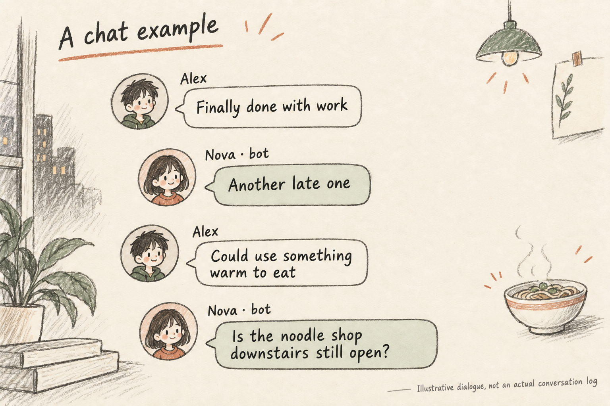

# personagent


**A character for your group chats that knows when to stay quiet, and learns from being corrected.**

Describe the character in a text file, point it at any OpenAI-compatible model, and chat with it in your terminal. When it is ready, an [AstrBot](https://github.com/AstrBotDevs/AstrBot) plugin carries it into QQ, Telegram, Discord, Slack and the other platforms AstrBot supports.

For an easier way to use personagent for one-on-one chats, try [**Charune**](https://www.charune.com/), which uses personagent as its conversation engine.

**English** · [简体中文](README.zh-CN.md)

[](https://github.com/wangkant/personagent/actions/workflows/ci.yml)
[](https://www.python.org/downloads/)
[](LICENSE)

[Why personagent](#why-personagent) · [Quick start](#quick-start) · [Write a persona](#write-a-persona) · [Put it in a chat](#put-it-in-a-chat) · [Teach it](#teach-it) · [How it works](#how-it-works) · [Troubleshooting](#troubleshooting)

## Why personagent

- **It knows when to stay quiet.** It answers when someone says its name or @s it. The rest of the time it listens, and joins in only when a person would.
- **It learns from corrections.** Tell it what you meant, and it keeps the better reply for next time. One joke or one troll cannot retrain it: a correction counts once it holds up, for example when you accept its second try.
- **It remembers each chat separately.** What one group tells it stays in that group. Ask `Nova, what do you remember?` to see.
- **Editing the character keeps what it learned.**

No model is fine-tuned. It learns by improving the examples in its prompt.



## Quick start

You need Git, Python 3.10–3.12, and an API key for an OpenAI-compatible endpoint, or a local Ollama. No chat account is needed to try it.

```bash
git clone https://github.com/wangkant/personagent.git
cd personagent
python quickstart.py
```

The wizard creates `.venv`, installs the dependencies, and asks for the endpoint, model, key, the character's name and a language (English or Chinese). Skip the AstrBot step the first time; at the end it offers to open a chat in your terminal. For Ollama, choose `Ollama (local)`, enter a model you have already pulled, and keep the placeholder key.

To chat again later, run `.venv/bin/python try_chat.py` (Windows: `.venv\Scripts\python.exe try_chat.py`).

| Type | To |
|---|---|
| `/as Alex I could use an early finish today` | speak as someone else |
| `/owner How was your day?` | speak once as the configured owner |
| `/reset` | clear the conversation |
| `/quit` | leave |

`--name Alex` sets your display name, `--owner` makes every message the owner's, and `--lang zh` switches to the Chinese seed data and checks.

The terminal runs the persona, example retrieval, generation and the character check. It skips the allowlists, the reply triggers, the output filters, self-evaluation and vision, so test the connected bot before you rely on its live behaviour. `(stays quiet)` means the model passed, returned nothing, or wrote a line the character check rejected; a rejection prints the reason.

## Write a persona

`persona.txt` in the repository root is the character. Say who they are, how they usually talk, and what they do in the situations you care about:

```text
Your name is Nova. You chat with friends about films and cooking.
You speak directly and make the occasional joke.

Usually reply in a sentence or two. Explain more when someone asks a serious question.
When a friend vents, listen before offering advice.
If you have not seen a film, say so instead of inventing an opinion.
Do not make jokes about someone's private information or personal difficulties.
```

Concrete habits work better than asking the model to "sound natural". The template the wizard copies contains placeholders such as `{bot_name}` and `{owner_name}`, and notes addressed to you at the end. Replace the placeholders and delete the notes: the file goes to the model as written.

Restart the chat or the service after editing. `AGENT_LANG` picks the language of the bundled examples, filters and checks; it does not translate your persona.

To go further:

| File | Holds |
|---|---|
| `data/examples.<lang>.jsonl` | Example exchanges the model can imitate |
| `data/feedback.<lang>.jsonl` | Replies paired with better versions |
| `data/lorebook.<lang>.json` | Background notes added when a keyword comes up |
| `data/output_filter.<lang>.json` | Replacement and rejection rules for live replies |
| `persona.card.json` | Optional emoji, character-set and length settings |

For example, to allow emoji and cap reply length:

```json
{ "reply_style": { "emoji": true, "max_chars": 320 } }
```

To let it see images, set `VISION_MODEL`, `VISION_API_KEY` and `VISION_BASE_URL`. Every setting is documented in [.env.example](.env.example).

## Put it in a chat

personagent never logs in to a chat account. AstrBot does, and a small forwarder plugin passes each message to personagent and carries the reply back.

```text
Chat platform  ⇄  AstrBot + forwarder plugin  ⇄  personagent  ⇄  Model API
```

1. Install [AstrBot](https://github.com/AstrBotDevs/AstrBot) and set up your platform in its WebUI.
2. Run `python quickstart.py` again, choose the AstrBot step and give it AstrBot's data directory. It copies the plugin and writes a shared `GATEWAY_TOKEN` to both sides. Answers you gave before are kept as the defaults.
3. Add the groups the bot may join to the plugin's allowlist. It forwards nothing until you do; private chats also need `private_enabled=true` and an allowlisted sender.
4. In personagent's `.env`, check `BOT_NAME`, the name it answers to. On QQ, also set `BOT_QQ` to the bot account's number.
5. Restart AstrBot, then start personagent from the repository root: `.venv/bin/python main.py` (Windows: `.venv\Scripts\python.exe main.py`).

Say its name in an allowed group to check. Restart personagent after editing `.env`, and AstrBot after changing a platform or the plugin.

Already set up? The same connection works without the wizard, and can switch a platform on in AstrBot's config from its token:

```bash
python quickstart.py --astrbot <AstrBot data dir> --platform telegram --token <bot token>
```

`--platform` accepts `telegram`, `discord`, `slack`, `kook` and `lark`; add `--qq` to route QQ through AstrBot as well. Run `python quickstart.py --help` for the rest.

<details>
<summary>QQ</summary>

QQ also needs a OneBot v11 implementation such as NapCat, connected through AstrBot's `aiocqhttp` adapter.

- Remove `aiocqhttp` from the plugin's `excluded_platforms`.
- Set `GATEWAY_NATIVE_PLATFORMS=aiocqhttp` in personagent's `.env`, so QQ conversations keep the same identities and memory. `--qq` does both.
- Keep NapCat's HTTP server on, at `NAPCAT_API`. Proactive messages, the follow-up question after a rejection, the excuse when the model fails and catching up on missed mentions go through it directly. On this path OCR fallback is skipped, and quoted messages are looked up in personagent's own recent-message index.
- The direct `/webhook/qq` ingress is deprecated since 0.3.0. Never run it alongside AstrBot forwarding, or every message arrives twice.

</details>

<details>
<summary>AstrBot in Docker, or on another host</summary>

The plugin posts only to a loopback address (the same host, or a container sharing its network namespace or using host networking), or to HTTPS with `gateway_token` set. Plain `http://` to anywhere else, such as `http://host.docker.internal:8080`, is refused and logged as `refusing unsafe agent_url`, and AstrBot's own model answers instead. Set `agent_url` in the plugin settings; the same-host default is `http://127.0.0.1:8080/webhook/gateway`.

personagent listens on `127.0.0.1:8080`. A non-loopback `HOST` requires both `GATEWAY_TOKEN` and `WEBHOOK_SECRET`. Put an HTTPS reverse proxy or a private tunnel in front, keep the request body byte-for-byte intact, and keep the two clocks within five minutes of each other.

</details>

<details>
<summary>Speaking first on platforms other than QQ</summary>

Outside QQ, personagent speaks first (proactive openers, the follow-up question after a rejection, the excuse when the model fails) through a connector that pulls its outbox; see the [connector protocol](docs/connectors.md). `PROACTIVE_PLATFORMS=qq` keeps the proactive loop on QQ. Without such a connector, a reply can only travel back inside the request that brought the message. For scheduled DMs, have an external job post a private gateway event with `proactive: true`; the text is read as a cue to the persona rather than as the other person's words, and the job relays whatever comes back. A group event with the flag is claimed and dropped. See the [deployment guide](docs/deploy.md#more-than-one-platform).

</details>

## Teach it

Talk to it in the group. The name has to be in the message (replace Nova with your `BOT_NAME`):

| Say | What happens |
|---|---|
| `Nova, remember Sam is vegetarian` | Saves a note for this group |
| `Nova, forget vegetarian` | Deletes matching notes. Members can delete their own; the owner can delete any |
| `Nova, what do you remember` | Lists the notes you are allowed to see |
| `Nova, what have you learned` | Counts notes, learned replies, fixes, and proposals waiting for a second voice, with the latest example |

None of these call the model. Notes are for facts: `Nova, remember: always reply in English` is turned down.

Corrections need no command. Quote the reply or use the name, and say what you wanted instead:

```text
Alex:  Nova, the deploy failed again
Nova:  did you check the logs? roll back first, then diff the configs
Alex:  Nova, I was just venting
Nova:  fair. that's a rough end to the day
Alex:  haha yeah it is, thanks Nova
```

A model call reads each reaction against the reply it answers, and filters out banter and trolling. Here Alex rejected the advice, which says something was off, then accepted the second attempt, which is strong evidence for it. Together they promote the pair (the advice, then the sympathy) for this conversation, and retrieval can offer it the next time someone there vents. The rule behind it: a change needs two agreeing signals from the same chat within 30 days, at least one of them strong (a correction with a better line from the person the reply was for, or a retry they accepted). Laughs and the bot's own scores never count on their own. A bare rejection can also bring the bot back once, two minutes later, to ask what would have been better (`REACT_ELICIT`).

To review or overrule the loop, use the ledger tool (on Windows, `.venv\Scripts\python.exe`):

```bash
.venv/bin/python tools/candidates_admin.py list                    # proposals waiting
.venv/bin/python tools/candidates_admin.py list --state promoted   # what is in use
.venv/bin/python tools/candidates_admin.py show <id>               # one proposal and its evidence
.venv/bin/python tools/candidates_admin.py promote <id>
.venv/bin/python tools/candidates_admin.py reject <id>
.venv/bin/python tools/candidates_admin.py rollback <id>           # stop using it; the record stays
.venv/bin/python tools/candidates_admin.py supersede <old_id> <new_id>
```

The defaults, all in `.env`:

- `REACT_LEARN`, `REACT_ELICIT` and `PROMOTE_AUTO` are on. Judging reactions costs extra model calls.
- `PROMOTE_AUTO=false` leaves every promotion to you.
- `PROMOTE_MIN_SPEAKERS=2` stops one member from teaching it alone; the owner is exempt.
- `EVAL_ENABLE` (the bot scoring its own replies) and `EVOLVE_AUTO` are off.

Changing `BOT_NAME` or `PERSONA_VERSION` starts a new character, and what the old one learned no longer applies.

## How it works


Every platform enters through one endpoint. A message is authenticated, de-duplicated and enriched (images described, links expanded). Then the decision step: if the bot was called it answers; otherwise it waits for enough of the conversation (30 messages by default), and a cheap gate call to `JUDGE_MODEL` decides whether a person would chime in. A burst gets one reply, to the latest line, and between 02:00 and 07:00 it mostly stays out unless called. The prompt combines the persona, matching lorebook entries, this conversation's memory and the most relevant examples. The model answers in JSON with `reasoning`, `intent`, `reply` and `mem`, and the reply passes the output filter and the character policy before it is split into chat-sized messages. A malformed answer fails closed: nothing is sent.

Learning runs beside that path, never inside it, and keeps its state in plain files under `runtime/`. Reactions go into an evidence log that is never rewritten. Adjudicating them proposes candidates, the promotion policy decides which may change replies, and promoted ones are written to small view files that retrieval reloads without a restart. Because the ledgers are append-only, "why does it talk like this?" always has an answer, and a rollback always has something to undo.

## Privacy and consent

Everything personagent stores stays on your machine, in `runtime/`, `.env`, `persona.txt` and `persona.card.json`. None of it is committed to Git, and it can hold credentials and real conversations, so back it up and keep it private.

The model provider does see conversations. Chat context goes to your `LLM_BASE_URL`. If you configure a fallback (`FALLBACK_MODEL`, `FALLBACK_BASE_URL`), it is called on ordinary turns too, for the reply gate, search decisions, reaction judging, self-evaluation and sticker tagging, and receives chat context as well. Images go to the vision endpoint, and when the model decides to look something up, the search query goes to Tavily (if `TAVILY_API_KEY` is set) or DuckDuckGo.

Before you connect it to real people, tell them it is a bot and get their consent to have their messages processed. Third-party QQ clients put the account at risk; read the [disclaimer](DISCLAIMER.md).

## Troubleshooting

**It runs but never replies.** Start with the AstrBot plugin: the allowlists, `private_enabled`, `agent_url`, and on QQ `excluded_platforms`. Then check `BOT_NAME`, `BOT_QQ` and the shared token. In a group it does not answer everything, so test by calling its name. The deployment guide lists [the usual causes, in order](docs/deploy.md#when-the-bot-goes-quiet).

**Is it up?** `curl http://127.0.0.1:8080/health` answers without calling a model. `.venv/bin/python tools/healthcheck.py` also checks the configuration, flags misspelled settings and probes the upstream services, and those probes may cost credits. `/health/details` probes too, and requires an `X-Gateway-Token` header once a token is configured.

**A setting has no effect.** Restart the process that reads it, check the spelling, and save `.env` as UTF-8 without a BOM. Shell environment variables override `.env`; booleans are `true` / `false`. The wizard rewrites some settings from your answers, so read each prompt when you rerun it. `TZ_OFFSET_HOURS` (default 8, UTC+8) sets the clock for the night window and proactive quiet hours.

## Status

Beta. QQ is where it has run in earnest; other platforms connect through AstrBot and have not all been validated end to end. CI runs the test suite on Linux with Python 3.10–3.12 and on Windows with Python 3.12. The tuning and evaluation scripts in `tools/` are experiments; they do not establish how well it converses.

- [Deployment guide](docs/deploy.md)
- [AstrBot forwarder plugin](integrations/astrbot/astrbot_plugin_llm_persona_gateway/README.md)
- [All settings](.env.example)
- [Changelog](CHANGELOG.md) · [Contributing](CONTRIBUTING.md)

## License

[MIT](LICENSE) © 2026 Qiankang Wang.

## Acknowledgements

- [AstrBot](https://github.com/AstrBotDevs/AstrBot) carries personagent onto every chat platform, and [NapCat](https://github.com/NapNeko/NapCatQQ) onto QQ.
- [FastAPI](https://github.com/fastapi/fastapi) and [httpx](https://github.com/encode/httpx) run the service and its model calls.
- Learning from reactions draws on [Self-Feeding Chatbot](https://arxiv.org/abs/1901.05415), [Alexa self-learning](https://arxiv.org/abs/1911.02557) and [BlenderBot 3x](https://arxiv.org/abs/2306.04707).
- The lorebook and output filters follow [SillyTavern](https://github.com/SillyTavern/SillyTavern)'s World Info and regex extensions.
