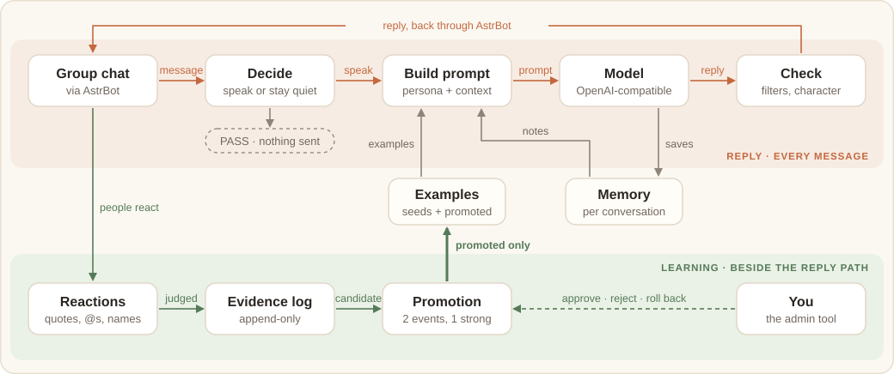

# personagent

[](https://github.com/wangkant/personagent/actions/workflows/ci.yml)
[](LICENSE)
[](https://www.python.org/downloads/)

**English** | [中文](README.zh-CN.md)

> **A self-evolving persona agent for group chats and DMs — built to sound like a regular, not a help desk.**

`personagent` turns an OpenAI-compatible model into a selective, bilingual chat persona that learns from the room.

- **Human-shaped conversation.** Persona and style constraints, content understanding, stickers, proactive messages, and the option to stay quiet.
- **Feedback that hot-reloads — behind a gate.** A reaction is recorded as evidence; adjudicating it proposes a candidate; only a *promoted* candidate reaches retrieval, and promotion can be rolled back. One correction, one laugh, or one self-score changes nothing.
- **One guarded pipeline.** Structured JSON is parsed and validated before a reply is sent through OneBot / QQ or the AstrBot gateway to Telegram, Discord, Slack, Lark, and KOOK.

### Try it in 60 seconds

Bring Python 3.10+ and one OpenAI-compatible API key. QQ and NapCat are not required:

```bash
python quickstart.py
```

That one command creates `.venv`, installs dependencies, writes `.env`, and offers to open the terminal trial immediately. To return later, use the platform-specific `.venv` interpreter commands in the [full quick start](#try-it-without-qq); the setup process cannot activate its parent shell.

[](#try-it-without-qq)

*Illustrated protocol trace: the indented block is the model's structured return; only the main-aligned `sent` line reaches the chat. The real terminal trial stays compact.*

<details>
<summary><strong>Deployment disclaimer</strong></summary>

This is an educational / research project, unaffiliated with and neither endorsed nor sponsored by any IM platform vendor. Read [DISCLAIMER.md](DISCLAIMER.md) before deploying. Third-party OneBot clients such as NapCat are not sanctioned by their upstream IM platforms; if you deploy against QQ, use a secondary account and a residential IP. The repository authors accept no responsibility for downstream protocol-client choices.

</details>

## Table of contents

- [Motivation](#motivation)
- [Self-evolution](#self-evolution)
- [Quick start](#quick-start)
- [Multi-platform via AstrBot](#multi-platform-via-astrbot)
- [Language (English / 中文)](#language-english--中文)
- [Proactive messaging (optional)](#proactive-messaging-optional)
- [Output protocol: JSON, not XML](#output-protocol-json-not-xml)
- [Reply examples](#reply-examples)
- [Configuration](#configuration)
- [Iteration loop](#iteration-loop)
- [Sticker quality pipeline](#sticker-quality-pipeline)
- [Architecture](#architecture)
- [Project layout](#project-layout)
- [Components](#components)
- [Development](#development)
- [Privacy](#privacy)
- [License](#license)
- [Acknowledgements](#acknowledgements)

## Motivation

Most "LLM in a group chat" projects sound like a chatbot stuck in customer-service mode: formal, eager, always replying, never holding an opinion. This template addresses the persona problem on five fronts:

- **Output safety first.** Reasoning, intent, and reply are JSON fields rather than inline XML tags, so a malformed model output cannot leak the reasoning channel into the visible reply. A whitelist character validator rejects anything that does not resemble genuine chat for the active language (XML residue, JSON braces, provider tokens, leaked templates); previously unseen leak shapes are blocked automatically.
- **Style as code.** `STYLE_GUIDE` encodes the persona's *register*, forbidden phrasings, identity-attack defenses, observer-position rules, and a "react to the image, do not describe it" rule — the constraints that distinguish a character from a generic assistant.
- **Stickers as part of the voice.** The library collects new stickers seen in the group, tags them with a vision model, evaluates persona-fit twice (text and visual aesthetic), and lets the model send them inline via `[STICKER:<tag>]`. A conversation-driven feedback loop demotes stickers that consistently score poorly.
- **Understand the content.** Inline URLs, Bilibili and YouTube videos, and arbitrary mini-app share cards are fetched, parsed, and surfaced as structured context, so the model receives the underlying content rather than an opaque link.
- **Self-evolution, with authority separated from evidence.** The persona is not frozen at deployment. It learns primarily from real user reactions — but a reaction is only *evidence*, and evidence has to be corroborated before it can change how the bot talks. Promoted material hot-reloads into the very next similar conversation, and can be revoked just as fast. See the next section.

## Self-evolution


The agent closes a full learning loop around its own output. Four words carry the whole design, and they are used in exactly this sense everywhere in the code, tests and docs:

| | |
|---|---|
| **Evidence** | An append-only record of something that happened in a conversation. A reaction is evidence — nothing more. |
| **Candidate** | A versioned, proposed behaviour change produced by adjudicating evidence. |
| **Promotion** | Granting a candidate authority to affect future behaviour. |
| **Rollback / supersession** | Removing that authority later, without erasing history. |

Only promoted candidates enter dynamic few-shot retrieval, and they hot-reload into the very next similar conversation with no restart.

- **Learn from real user reactions (the primary signal).** Every sent reply briefly waits for a *directed* reaction — someone quoting the bot's message, @-ing it, or (in a DM) just answering. An in-process adjudicator classifies it: *"no, I meant X"* is a **correction** (with the right answer inside it), re-asking the same thing in other words is a **rejection** (didn't land), laughing or riffing is a **positive**. The reaction is then written to `runtime/evidence.<lang>.jsonl` — always, accepted or dismissed, because a teaching attempt that was refused is worth being able to look up — and may propose a candidate in `runtime/candidate_ledger.<lang>.jsonl`. Neither changes a single reply. Reading a *reaction to a reply* is a far easier judgment than scoring "how human does this sound", which is why this channel works where naive LLM self-scoring is too lenient. Three mechanisms deepen it: **retry-completion** (user rejects reply A, the bot's retry B satisfies them — (A → B) becomes strong evidence with zero user effort), **delayed elicitation** (if a rejection taught nothing concrete, the bot may — after waiting out its own reply, at most once an hour — casually ask what they meant; the answer adjudicates as a proper correction and is linked to the complaint that prompted it), and **teacher reputation** (per-user track record of adopted vs dismissed teachings feeds the adjudicator; persistently bad teachers are hard-blocked without costing a call). Prior art, honestly: this transplants the deployment-time learning line — [Self-Feeding Chatbot](https://arxiv.org/abs/1901.05415)'s feedback elicitation, [Alexa self-learning](https://arxiv.org/pdf/1911.02557)'s rephrase-and-retry signal, [BlenderBot 3x](https://arxiv.org/abs/2306.04707)'s troll-resistant teacher filtering — into a training-free, in-context form.
- **Promotion is where authority is granted, and it is deliberately hard.** A candidate needs **two distinct compatible events, at least one of them strong**. Note that this counts *events*, not people — one member correcting a reply and then accepting the retry satisfies it alone, which is also what an honest clarification looks like. `PROMOTE_MIN_SPEAKERS=2` requires two different people instead (the owner stays exempt):
  - **Strong** — an explicit correction from the person the reply was aimed at, with a concrete replacement in it; or a retry that same person then accepted.
  - **Weaker** — a rejection with nothing concrete in it, a correction from a bystander, or the bot's own self-review. Real evidence that something was off; not a mandate to rewrite.
  - **Weak** — laughter, agreement, continued banter, the bot's own score. Never sufficient, *at any quantity*.

  Evidence combines only within one persona, persona version, language, conversation and mode. **Owner status does not substitute for being the affected recipient** — the owner's correction of a reply aimed at someone else is supporting evidence, not authority. If compatible evidence points two ways at once, automatic promotion is blocked and both candidates are left for a human. Because no positive signal is strong, **laughter alone can no longer grow the example pool at all**: it accumulates on a candidate and waits for you. All thresholds are named `.env` values (`PROMOTE_*`) with conservative defaults; `PROMOTE_AUTO=false` turns automatic promotion off entirely.
- **Rollback and supersession.** Rolling a candidate back removes its influence from retrieval immediately, without deleting anything. Superseding deactivates the old candidate and activates its replacement, preserving both records. An accepted rejection or correction of a reply does this automatically for whatever that reply had been promoted for.
- **You are the other half of the loop.** `python tools/candidates_admin.py list` shows what is waiting and *why the policy is holding it*; `show <id>` prints a candidate with every piece of evidence behind it, who said it, and whether it counts; `promote` / `reject` / `rollback` / `supersede` / `rebuild` do the rest. Every action appends a lifecycle event — nothing in the log is ever edited or removed.
- **Learn from successes (fallback).** An async self-evaluator scores every sent reply 1–5 into `eval.jsonl`. A full 5 is recorded as weak evidence and proposes a positive-example candidate. It will not promote itself: the evaluator is documented in-code as generous, and a generous grader marking its own homework is the weakest signal in the system.
- **Learn from failures without a human in the loop (fallback).** Low-scoring replies are fed back to a model that names the failure mode ("service-desk tone", "answered the wrong person"), drafts one negative constraint, and writes a BAD → OK rewrite. Two ways to run it:
  - **Human-gated:** `python tools/auto_reviewer.py --apply` shows each diagnosis and lets you approve / reject / edit before anything is written. You are the authority here, so approved pairs are written directly. The legacy `--yes` direct-apply mode is refused.
  - **Unattended:** set `EVOLVE_AUTO=true` and a background loop does the diagnosis in-process on a timer, restricted to clear failures (`score <= EVOLVE_THRESHOLD`, default 2). It files candidates rather than applying them — one automatic signal that nobody witnessed does not get to change behaviour. Every diagnosis is recorded in `candidates.jsonl`, so the CLI and the loop never double-process an entry and you can always audit what the bot proposed for itself.
- **Stickers evolve too.** Each sent sticker gets its own score; a sustained low average demotes it out of the library (see [Sticker quality pipeline](#sticker-quality-pipeline)).
- **The persona takes notes on itself.** A letta-style `core_memory.json` holds a per-group self-maintained note the model can update mid-conversation — standing facts about the group survive context-window turnover.

**Where the material actually lives.** The append-only event log is the single source of truth. Promoted candidates are materialized into `runtime/promoted.{examples,feedback}.<lang>.jsonl`, which retrieval reads alongside the `data/` seeds and the learned pools. That view is a cache: it is rewritten atomically on every promotion or rollback and can be rebuilt from the log at any time (`candidates_admin.py rebuild`). Keeping it separate is what makes rollback cheap and guarantees a rebuild can never disturb a row you wrote or approved yourself.

Guardrails, because an unattended feedback loop can also entrench garbage: every reaction passes the adjudicator (banter and trolling filtered, strangers must be self-evidently right); no single automatic signal of any kind can promote; evidence expires (`PROMOTE_EVIDENCE_MAX_AGE_DAYS`) and never crosses persona, language or conversation boundaries; contradictions block promotion instead of resolving themselves; the unattended path only touches clear failures; pairs are deduped against every pool; the views are size-capped; and both the evidence log and the candidate ledger are append-only, so every behaviour change has a traceable reason and a reversible decision behind it.

## Quick start

Requirements: Python 3.10+ and one OpenAI-compatible chat API key. A OneBot v11 client (e.g. NapCat) is only needed for a **live group** — not for the trial below.

```bash
# One command: venv + deps + an interactive setup wizard
python quickstart.py
```

The wizard asks for your API provider (DeepSeek / Kimi / OpenAI / Ollama / any OpenAI-compatible endpoint), key, bot name and language, writes the answers into `.env` for you, can verify the key with a 1-token test call, optionally collects the live-QQ settings too (and prints the exact NapCat config to paste), then offers to drop you straight into a terminal chat. **No manual `.env` editing needed** — the file still doubles as the fully-annotated reference for every advanced knob.

Idempotent — re-running reports what's in place and only re-offers the wizard if you want to reconfigure. `--no-input` (or piped stdin) skips the wizard for CI and just bootstraps: create `.venv`, `pip install -r requirements.txt`, copy `.env.example → .env` + persona template.

### Try it without QQ

The fastest way to feel out a persona — no QQ account, no NapCat, just an API key. The wizard offers this at the end of setup. To run it again later without activating a shell, call the interpreter that `quickstart.py` installed:

```bash
# macOS / Linux
.venv/bin/python try_chat.py             # English (default)
.venv/bin/python try_chat.py --lang zh   # Chinese variant
.venv/bin/python try_chat.py --owner     # speak as the configured owner

# Windows (PowerShell or Command Prompt)
.venv\Scripts\python.exe try_chat.py             # English (default)
.venv\Scripts\python.exe try_chat.py --lang zh   # Chinese variant
.venv\Scripts\python.exe try_chat.py --owner     # speak as the configured owner
```

You type a line, the bot replies — through the **same** reasoning path the live bot uses (persona + style guide + JSON output protocol + the character-whitelist validator). The trial prints the final reply plus the chosen `intent` and any extracted `mem`; the animated trace above expands the model-return → sent boundary so the protocol is easier to inspect. For batch/offline tuning against fixtures (rate replies, grow the few-shot bank), use `python tools/prompt_lab.py`.

### Run live on a group

1. **Configure `.env`** — if you answered the wizard's live-deployment questions this is already done; otherwise fill the *REQUIRED FOR A LIVE QQ / OneBot DEPLOYMENT* block (`BOT_QQ`, `QQ_GROUPS`, `NAPCAT_API`) and write your `persona.txt`.
2. **Start the agent:**
   ```bash
   source .venv/bin/activate            # Windows: .venv\Scripts\activate
   python main.py                       # or: ./start.sh   (Windows: .\start.ps1)
   ```
   You should see `bot started on 127.0.0.1:8080 (agent=True, lang=en)`.
3. **Set up NapCat** (or any OneBot v11 client) and point it at the agent — see below.

#### NapCat in 3 steps

1. Download [NapCat](https://github.com/NapNeko/NapCatQQ) and log in a **secondary** QQ account (scan a QR / approve the login). Read [DISCLAIMER.md](DISCLAIMER.md) first — use a throwaway account and a residential IP.
2. In NapCat's OneBot config, enable the HTTP server **and** an HTTP webhook:
   ```json
   {
     "http": { "enable": true, "host": "127.0.0.1", "port": 3000 },
     "webhook": {
       "enable": true,
       "url": "http://127.0.0.1:8080/webhook/qq",
       "timeout": 5000
     }
   }
   ```
3. Start NapCat, then the agent. Post in the group and watch the logs.

#### Ports and data flow

The two connections point in opposite directions and are easy to confuse:

```
NapCat  --(webhook: events)-->  agent :8080    (HOST / PORT in .env)
agent   --(send replies)----->  NapCat :3000   (NAPCAT_API in .env)
```

> **Windows launcher:** `launch.vbs` starts NapCat and the agent in two minimized windows. Set the three values at the top (`BOT_QQ`, `NAPCAT_DIR`, `AGENT_DIR`) first; it uses `.venv` automatically when present.

## Multi-platform via AstrBot

QQ/NapCat above is the primary path, but the agent also exposes a platform-neutral webhook — `POST /webhook/gateway` — so the same persona can sit in Telegram / Discord / Slack / Lark / KOOK groups and DMs through [AstrBot](https://github.com/AstrBotDevs/AstrBot)'s platform adapters. The persona pipeline is untouched: the gateway synthesizes a neutral inbound event into the existing handler and captures replies through a context-local sink, and a bundled forwarder plugin does the AstrBot-side translation.

```
Telegram / Discord / Slack / …  -->  AstrBot + forwarder plugin  --HTTP-->  agent /webhook/gateway
QQ                              -->  NapCat                      --HTTP-->  agent /webhook/qq      (unchanged)
```

1. Install AstrBot and configure the platform adapters you want.
2. Copy `integrations/astrbot/astrbot_plugin_llm_persona_gateway/` into AstrBot's `data/plugins/`, then explicitly allow the group IDs and/or DM senders to forward. The plugin is default-deny: empty allowlists forward nothing, and private forwarding starts off. Full reference: [plugin README](integrations/astrbot/astrbot_plugin_llm_persona_gateway/README.md).
3. Same host: keep the loopback agent URL. Different host: use HTTPS with the same non-empty secret in the plugin's `gateway_token` and the agent's `GATEWAY_TOKEN`, or terminate a private tunnel at a loopback URL visible to AstrBot. Signed timestamp/nonce/body envelopes prevent replay; never send the token over cleartext HTTP. `GATEWAY_OWNER_IDS` optionally treats e.g. `telegram:12345` as the owner. See `.env.example`.

Gateway conversations are namespaced `<platform>:<id>`, so memory and state never collide with QQ. Keep `aiocqhttp` in the plugin's excluded platforms (the default) when NapCat already feeds the agent directly, or QQ messages get handled twice. QQ-only machinery (sticker stealing, OCR, proactive / missed-mention catch-up) stays on the QQ path; text / sticker / mention replies work everywhere.

## Language (English / 中文)

The agent is **English-first** and runs Chinese with one switch. Set `AGENT_LANG` in `.env`:

- `AGENT_LANG=en` (default) — the primary English build.
- `AGENT_LANG=zh` — the Chinese variant.

The switch selects, in one move:

- **Data files** (under `data/`) by suffix: `data/persona.example.<lang>.txt`, `data/examples.<lang>.jsonl`, `data/feedback.<lang>.jsonl`, `data/output_filter.<lang>.json`, `data/lorebook.<lang>.json`. Each resolves to the `<lang>` file, falling back to a bare-named file if you drop in your own.
- **The reply validator** (`_validate_reply_safe`): English mode accepts any letter-bearing reply (and still drops XML/JSON/token leaks); `zh` mode requires CJK. Mixed zh/en code-switching passes either way.
- **Control-flow lexicons**: the few-shot/memory tokenizer and the topic-type classifier swap their word lists per language.
- **Dev tools**: `tools/auto_reviewer.py`, `tools/import_stickers_folder.py`, and `tools/prompt_lab.py` follow `AGENT_LANG` too.

To add another language, drop in `*.<lang>.*` data files and run with `AGENT_LANG=<lang>` (the validator treats any non-`zh` language as letter-based).

## Proactive messaging (optional)

By default the bot is purely reactive — it only speaks when a message arrives. Set `PROACTIVE_ENABLE=true` and a background loop will occasionally **initiate** a message with no trigger, so it reads like a person who sometimes breaks the silence rather than a 24/7 responder.

The mechanism is deliberately conservative; an over-eager bot posting into silence is worse than one that stays quiet:

- **Only after genuine silence**, outside the sleep window, with a per-conversation cooldown and a low per-tick probability.
- **Never cold-opens.** It acts only in groups where it has already observed activity, and messages only people who have messaged it before (the owner and `PRIVATE_ALLOWED_QQS`); it will not contact someone unprompted.
- **The model is instructed to return PASS unless it genuinely has something to say** — a callback to an earlier topic, a passing thought, or a brief check-in — and *not* to post filler such as "anyone here?". Most ticks produce nothing.
- Behaves identically in **groups and direct messages**, each with independent silence, cooldown, and probability parameters.

Tune `PROACTIVE_*` in `.env`. Defaults: groups quiet ≥ 45 min, ≥ 3 h between initiations, ~25% per check; DMs quiet ≥ 4 h, ≥ 24 h apart, ~20%.

## Output protocol: JSON, not XML

The model is required to emit a single JSON object per reply:

```json
{
  "reasoning": "...",      // ≤100 chars internal analysis, never shown
  "intent": "chat",        // one of: joke | vent | share | question | troll | chat
  "reply": "...",          // what the group actually sees (or "PASS" to skip)
  "mem": ""                // optional memory line; empty = nothing to record
}
```


Why JSON instead of `<reasoning>...</reasoning><intent>...</intent><reply>...</reply>`:

- **Field isolation.** If the model truncates, malforms tags, or emits provider-specific tokens, JSON parsing fails closed — nothing gets sent. The XML form had fallback branches that could leak the reasoning channel into the visible reply.
- **Easy robustness layers.** The parser strips optional ```json``` fences, tries `json.JSONDecoder.raw_decode` (handles concatenated objects), and as a last resort treats a short chat-shaped output as a naked reply (English or CJK, still validator-gated).
- **Caching-friendly.** The system prompt holds the schema; per-call differences live in the user message and a small "dynamic" segment. Persistent prompt segments are cached via Anthropic's `cache_control: ephemeral` blocks — repeated-call input cost drops to ~10% on hits.

Even past the parser, `_validate_reply_safe` applies a character whitelist before send. In English mode any reply carrying at least one letter passes, while XML / JSON braces / pipe / subword markers are always dropped; in `zh` mode the reply must contain CJK. Mixed zh/en code-switching passes either way. No per-shape regex rules required for future unknown leak forms.

## Reply examples

What "sounds like a real person" looks like in practice. (The primary build runs in English; set `AGENT_LANG=zh` for the Chinese variant — the patterns are identical.)

> **Friend** *(taking a jab)*: "doing your usual genius work today huh"
> **Bot**: "yeah just mashing keys and hoping a feature falls out"
> — takes the jab literally, plays along instead of getting defensive. No "I'm doing my best!", no apology.

> **Friend**: *(sends a reaction sticker, no text)*
> **Bot**: "stickers as a substitute for words. classic. [STICKER:eyeroll]"
> — reacts to the *act* of sending a sticker, not the contents of the image.

> **Friend**: "ranked is rigged man, lost 4 in a row, teammates feeding nonstop"
> **Bot**: "matchmaker decided you needed character development today [STICKER:resigned]"
> — joins the vent with a fitting sticker. No "why don't you take a break", no follow-up question.

> **Owner**: "wait what was that thing called again, the one we just talked about"
> **Bot**: "two minutes ago, bro. two minutes. [STICKER:smug]"
> — pokes fun at the owner; the closer relationship gives more license to tease.

The pattern: the agent reasons about who said what to whom (observer-position aware), picks an intent tag, then writes in the sub-style for that intent — no bulleted analysis, no service-counter politeness, and never describing what an image literally contains.

## Configuration

All settings come from `.env`. Key fields:

| Variable | What |
|---|---|
| `AGENT_LANG` | `en` (default) or `zh`. Selects the per-language data files, validator mode, and lexicons. See [Language](#language-english--中文) |
| `AGENT_RUNTIME_DIR` | Directory for all mutable text state: memory, evals, evidence, ledgers, replay cache, sticker metadata, promoted views and learned pools (default `runtime/`, which is gitignored). Legacy root-level files are copied here on first use. Custom in-repository paths must be added to `.gitignore` manually |
| `DEEPSEEK_API_KEY` / `DEEPSEEK_BASE_URL` / `DEEPSEEK_MODEL` | Primary chat-completion model. Any OpenAI-compatible endpoint works. **The only key needed for `python try_chat.py`** |
| `PRIVATE_MODEL` | **Optional.** Alternate model name for 1:1 private chats, served by the same primary endpoint. Blank = `DEEPSEEK_MODEL`. (Was `ANTHROPIC_PRIVATE_MODEL` before 0.1.2 — the old name still works) |
| `BOT_QQ` / `BOT_NAME` | The bot account's QQ number and display name |
| `OWNER_QQ` / `OWNER_NAME` / `OWNER_RELATIONSHIP` | A "favorite person" the bot is closer to (optional, all blank by default) |
| `QQ_GROUPS` | Comma-separated group IDs to listen on. Empty = listen everywhere |
| `VISION_MODEL` + `GLM_API_KEY` / `GLM_BASE_URL` | Vision model for image / sticker understanding. Leave blank to skip (OCR-only fallback) |
| `NAPCAT_IMAGE_DIR` / `MAX_IMAGE_BYTES` | Allowlisted local image-cache directory and maximum decoded image size. `file://` is rejected when the directory is unset |
| `MAX_WEBHOOK_BODY_BYTES` | Maximum raw request body accepted by either webhook (default 8 MB) |
| `MAX_INFLIGHT_WEBHOOKS` | Concurrent expensive webhook limit (default 64); excess requests receive HTTP 429 |
| `GATEWAY_TOKEN` | Shared secret for AstrBot bearer authentication and replay-resistant timestamp/nonce/body signatures. Required with HTTPS for off-host forwarding |
| `GATEWAY_SOURCE_MAX_AGE_SECONDS` | Maximum age of an original gateway event, independent of its forwarding time (default 86400 / 24 h) |
| `LOG_FILE` | Optional rotating file log. Blank keeps logs console-only; custom in-repository paths must be gitignored |
| `PERSONA_FILE` | Path to your persona prompt (default `persona.txt`) |
| `PROACTIVE_ENABLE` (+ `PROACTIVE_*`) | Opt-in self-initiated messaging. See [Proactive messaging](#proactive-messaging-optional) |
| `REACT_LEARN` (+ `REACT_*`) | Learn from real user reactions (on by default — the primary self-evolution signal). See [Self-evolution](#self-evolution) |
| `PROMOTE_AUTO` (+ `PROMOTE_*`) | When a candidate may gain authority over future replies: how many compatible events, how many strong, how old, and whether one conversation's evidence may speak for another. Conservative defaults; `PROMOTE_AUTO=false` leaves everything for human review. See [Self-evolution](#self-evolution) |
| `PERSONA_VERSION` | Optional label recorded with every evidence event next to a hash of your persona text. Both scope evidence, so a persona rewrite stops old evidence from authorizing changes to the new character |
| `EVOLVE_AUTO` (+ `EVOLVE_*`) | Opt-in unattended self-review loop; it files candidates rather than applying them (fallback channel). See [Self-evolution](#self-evolution) |
| `FALLBACK_MODEL` + `RATE_THRESHOLD` + `RATE_WINDOW` | Auto-downgrade to a cheaper model when request rate spikes |
| `JUDGE_MODEL` | Cheapest model for the "should I reply?" gate on self-initiated modes (judge/followup/proactive). The reply that's actually sent is always written by the main model. Defaults to `FALLBACK_MODEL` |
| `EVAL_MODEL` | Model used by the async self-eval scorer (often a cheaper one is fine) |

See `.env.example` for the full list.

## Iteration loop


The [self-evolution loop](#self-evolution) handles the automatable part of this on its own; the manual loop below is for the failures that need a human judgment call — a new failure *class* that wants a hard constraint in the prompt, not just another retrieval pair. The agent's prompt is structured to make those debuggable:

```
observe failure (eval.jsonl LOW-SCORE / live observation)
  ↓
locate which block owns it (STYLE_GUIDE / REASONING_PROTOCOL / INTENT_RULES / output_filter)
  ↓
add a hard constraint with a counter-example next to similar rules,
  or add a semantic regex rule in data/output_filter.<lang>.json
  ↓
write a BAD/OK pair into runtime/feedback.<lang>.jsonl
  ↓
next time a similar input arrives, dynamic few-shot retrieval surfaces the pair
```

What you write or approve by hand needs no promotion — you are the authority, so it is trusted immediately. The evidence-and-promotion machinery exists to gate what the *agent* proposes about itself.

Retrieval merges three sources: the read-only synthetic seeds in `data/{examples,feedback}.<lang>.jsonl`, learned rows in `runtime/{examples,feedback}.<lang>.jsonl`, and the promoted-candidate views in `runtime/promoted.{examples,feedback}.<lang>.jsonl`. It uses language-aware tokens (English words minus stopwords, or Chinese 2-char ngrams) + scenario tags + recency decay, so even small datasets (5-10 entries per failure mode) start helping immediately.

**Pool size is capped on purpose.** Only 4 examples + 6 pairs reach the prompt per turn, so the machine-written half keeps the newest `EXAMPLES_MAX_AUTO` / `FEEDBACK_MAX_AUTO` entries (500 each by default; `0` disables the cap). This bounds the promoted views, and the offline tools apply the same caps to what they write. It is a quality setting as much as a performance one: material promoted months ago came out of an older prompt, and once thousands of rows accumulate they outvote the recent ones. **Nothing you wrote or approved yourself is ever counted or dropped** — the `data/` seeds are read-only, rows you approved through `prompt_lab.py` carry no machine marker, and rows learned by a pre-ledger version are left exactly as they are. Dropping a row from a view is not a lifecycle change either: the candidate stays promoted in the ledger.

`data/output_filter.<lang>.json` is hot-reloaded — edit it without restarting. Same for `data/lorebook.<lang>.json` (keyword-triggered context injection à la SillyTavern World Info).

## Sticker quality pipeline


Stickers pass through several gates before becoming eligible for selection:

1. **Collect.** Any non-bot image that appears in conversation context is stored, deduplicated by md5.
2. **Tag.** Once sufficient context accumulates, an LLM tagger names the emotion or meme from the surrounding chat (it never sees the image itself).
3. **Text persona-fit gate.** The same tagger evaluates whether the inferred meaning fits the configured persona. Stale entries are re-evaluated whenever `PERSONA_PROMPT_VERSION` is incremented.
4. **Visual aesthetic gate.** The vision model inspects the *pixels* and evaluates visual style (a cleanly designed meme versus a dated family-group sticker) — a distinction text alone cannot make. Stale entries are re-evaluated whenever `VISUAL_AESTHETIC_VERSION` is incremented.
5. **Evaluation feedback loop.** Each sent sticker receives a 1–5 score from the self-evaluator. A sustained low average demotes it to `persona_fit=false`.
6. **Selection.** `pick_by_tag` matches with synonym expansion, applies a small freshness bonus to newer entries, skips orphan records (entries whose backing file is missing), and falls back to a recently used match before dropping a sticker-only reply.
7. **Purge.** Entries flagged `persona_fit=false` are removed (record and file) on the next startup pass.

## Architecture



<details>
<summary>Implementation detail (handler call chain)</summary>

```
NapCat (QQ ↔ OneBot)          AstrBot + forwarder plugin
    │                              │
    │  POST /webhook/qq            │  POST /webhook/gateway
    ▼                              ▼
┌──────────────────── main.py (FastAPI) ────────────────────┐
│                                                            │
│  ┌─────────────── persona_agent/agent.py ───────────────┐  │
│  │  handle(payload)                                     │  │
│  │    ├─ persistent dedup (seen_msg_ids.json)           │  │
│  │    ├─ debounce + sticky-call inheritance             │  │
│  │    ├─ vision (image / sticker caption)               │  │
│  │    ├─ URL / share-card metadata fetch                │  │
│  │    ├─ buffer (per-group rolling history)             │  │
│  │    ├─ mode decision (owner / called / followup / judge)│  │
│  │    └─ _think()                                       │  │
│  │         ├─ assemble cached system prompt blocks      │  │
│  │         ├─ call LLM (JSON output protocol)           │  │
│  │         ├─ _parse_model_output (fail-closed)         │  │
│  │         ├─ output filter (semantic regex rules)      │  │
│  │         ├─ _validate_reply_safe (char whitelist)     │  │
│  │         ├─ send via _send_qq (with sticker matching) │  │
│  │         └─ async self-eval → eval.jsonl + sticker score│ │
│  └──────────────────────────────────────────────────────┘  │
│                                                            │
│  ┌────────── the learning path (off the hot path) ──────┐  │
│  │  a reaction / an accepted retry / a self-eval score  │  │
│  │    ├─ evidence.py     append-only event, no authority│  │
│  │    ├─ candidates.py   versioned proposal, inert      │  │
│  │    └─ promotion.py    2+ events, 1+ strong?          │  │
│  │         ├─ no  → stays proposed (candidates_admin.py)│  │
│  │         └─ yes → lifecycle event + view rebuild:     │  │
│  │             promoted.{examples,feedback}.<lang>.jsonl│  │
│  │              which _examples_for_prompt reads next   │  │
│  │  rollback / supersede → rebuild → influence removed  │  │
│  └──────────────────────────────────────────────────────┘  │
│                                                            │
│  ┌────────────── persona_agent/stickers.py ─────────────┐  │
│  │  steal → tag → persona-fit gate → visual aesthetic    │  │
│  │  → eval feedback loop → freshness-biased selection    │  │
│  └──────────────────────────────────────────────────────┘  │
└────────────────────────────────────────────────────────────┘
    │                              │
    │  POST /send_group_msg        │  replies in the gateway response
    ▼                              ▼
NapCat → QQ                   AstrBot → Telegram / Discord / …
```
</details>

## Components

| Module | Responsibility |
|---|---|
| `persona_agent/agent.py` + mixins | JSON-protocol output (`reasoning` / `intent` / `reply` / `mem` as fields, not tags); whitelist character validator; transactional delivery/state commits; bounded image ingestion; per-user RAG memory; dynamic few-shot retrieval over seed + runtime examples/feedback; regex pre-flight; async self-eval; the opt-in `EVOLVE_AUTO` loop; cross-restart `seen_msg_ids` dedup. Split across `prompts` / `textproc` / `pools` / `ingestion` / `transport` / `learning` — see [Project layout](#project-layout) |
| `persona_agent/reactions.py` | Learn from real user reactions (primary signal): pending-reply table with quote/@/DM attribution, one-call adjudicator (classify + genuineness + rewrite), write-shapes for the feedback/examples pipelines |
| `persona_agent/evidence.py` | The append-only evidence log: what happened, with its scope, speaker and recipient, the structured verdict and the adjudicator's identity. Content-addressed ids make duplicates idempotent. No chain of thought is ever stored |
| `persona_agent/candidates.py` | Versioned candidates and the append-only lifecycle ledger that owns them (`proposed` / `promoted` / `rejected` / `superseded` / `rolled_back`), plus the materialized retrieval views. Current state is a replay of the log |
| `persona_agent/promotion.py` | The promotion policy: evidence strength, scope compatibility, conflict detection, thresholds — and the pre-ledger gate kept working for deployments that learned before it existed |
| `persona_agent/evolution.py` | The eval → candidate learning-loop logic (load low scores, build the diagnosis prompt, convert drafts to preference pairs, dedup, audit trail) — shared by the in-process `EVOLVE_AUTO` loop and `tools/auto_reviewer.py`, transport-agnostic |
| `persona_agent/stickers.py` | md5-deduped library; auto-steals new stickers seen in group; vision-tags them once context accumulates; persona-fit gate from both text (meaning/tags) and visual aesthetic; eval-driven quality feedback loop demotes stickers that score consistently low; freshness bonus rotates in newer picks; orphan-record skip during selection |
| `main.py` | FastAPI webhook receiver. NapCat POSTs group events to `/webhook/qq`; the agent processes and POSTs replies back to NapCat's HTTP API. Startup chains text-based + vision-based persona-fit rechecks → purge so the on-disk library only contains in-character stickers. |
| `persona_agent/gateway.py` + `integrations/astrbot/` | Platform-neutral gateway: a neutral inbound event schema synthesized into the same handler pipeline, replies captured via a context-local sink, plus a bundled [AstrBot](https://github.com/AstrBotDevs/AstrBot) forwarder plugin that connects Telegram / Discord / Slack / … groups and DMs |
| `tools/bootstrap_from_history.py` | One-shot bootstrap: pulls group history, computes owner's message-frequency profile, seeds the sticker library |
| `tools/auto_reviewer.py` | The human-gated end of the learning loop: diagnoses low-score entries in `eval.jsonl` into `candidates.jsonl`, then `--apply` walks you through approving / editing each BAD → OK pair into runtime feedback. Legacy `--yes` direct apply is refused |
| `tools/candidates_admin.py` | The human half of the promotion gate: list what is waiting and why, show a candidate with the evidence behind it, promote / reject / roll back / supersede, rebuild the retrieval views. Append-only — no action edits history |
| `tools/prompt_lab.py` | Offline interactive tuning: run the agent against `tools/fixtures.<lang>.jsonl`, rate replies, approved ones flow into runtime examples |
| `tools/import_stickers_folder.py` | Bulk-import stickers from a local folder, auto-tag via vision model |

## Project layout

App-style layout: one importable core package, thin entry points at the root, state files at the root (so upgrades never migrate your data).

```
persona_agent/        the application package — Agent composes one mixin per concern
  agent.py            orchestration: intake, modes, debounce, _think, prompt assembly
  prompts.py          the persona contract: style guide, output protocol, intent rules
  textproc.py         pure text: tokenising, sanitising, whitelist validator, splitting
  pools.py            append-aware JSONL loading for the retrieval datasets
  ingestion.py        links, share cards, images, OCR, vision — with the SSRF guard
  transport.py        throttling, chunking, typing simulation, sends, conversation LRU
  learning.py         self-eval, reaction adjudication, the EVOLVE_AUTO loop
  evidence.py         append-only record of what happened; carries no authority
  candidates.py       versioned proposals + their append-only lifecycle ledger
  promotion.py        when evidence may grant a candidate authority
  reactions.py        learn-from-real-user-reactions logic (primary signal)
  evolution.py        eval -> candidate learning-loop logic
  gateway.py          platform-neutral event schema + reply sink
  stickers.py         sticker library and its quality gates
  health.py           startup / runtime environment checks
  paths.py            ROOT anchor — all state lives at the repo root
main.py               FastAPI entry point (webhooks, lifespan, background loops)
try_chat.py           terminal chat through the full reasoning path
quickstart.py         one-command setup wizard
tools/                offline tuning + ops CLIs (auto_reviewer, candidates_admin, prompt_lab, ...)
data/                 per-language datasets: persona, examples, feedback, lorebook, output_filter
runtime/              gitignored: evidence log, candidate ledger, promoted views, learned pools
docs/                 architecture + loop diagrams (en / zh)
tests/                stdlib-only regression suite (no pytest needed)
integrations/         AstrBot forwarder plugin for multi-platform
```

## Development

Run what CI runs — one command covers every suite:

```bash
python -m pip install "pytest>=8,<10"
python -m pytest -q
```

The suites themselves are framework-free standard-library scripts; pytest is only the runner, so any single one stays directly executable while you work on it (`python tests/test_gateway.py`).

It uses a lightweight `check()` harness and covers the gateway pipeline, the reply/PASS gate, the output validator, memory eviction, the SSRF guard, outbound throttling, the setup wizard's `.env` writer, the self-evolution loop (diagnosis parsing, pair conversion, dedup, the audit trail), reaction learning, few-shot retrieval with its append-aware dataset loading, and the evidence → candidate → promotion path (what one signal may and may not do, scope isolation, contradictions, replay, rollback, supersession, append-only logs, legacy compatibility). Run it before opening a pull request.

To import the pipeline from your own code, `pip install -e .` (see [pyproject.toml](pyproject.toml)). Release notes live in [CHANGELOG.md](CHANGELOG.md); contribution guidelines, the module map and the "never let a test write real state" rule are in [CONTRIBUTING.md](CONTRIBUTING.md).

For prompt and persona tuning:

- `python try_chat.py` — interactive single-turn chat through the full reasoning path (see [Quick start](#quick-start)).
- `python tools/prompt_lab.py` — offline batch tuning against `tools/fixtures.<lang>.jsonl`; approved replies flow into runtime examples.
- `python tools/auto_reviewer.py` — scans `eval.jsonl` for low-scoring replies and drafts prompt patches; add `--apply` to approve them into `runtime/feedback.<lang>.jsonl` (or your `AGENT_RUNTIME_DIR`) interactively (see [Self-evolution](#self-evolution)).
- `python tools/candidates_admin.py list` — what the learning loop is proposing and why it is being held; then `show` / `promote` / `reject` / `rollback` / `supersede` / `rebuild` (see [Self-evolution](#self-evolution)).
- `python tools/evolution_benchmark.py run` then score `judge_inbox.jsonl` and `... ingest` — measures the [self-evolution](#self-evolution) loop: runs an evolve-on vs evolve-off control over held-out scenarios and plots mean AI-tell score by round (`curve.svg`). A separate judge scores the replies blind — `--judge export` writes an unlabelled inbox for a human or another model, `--judge openai --judge-model <name>` routes it to any OpenAI-compatible endpoint (`BENCH_JUDGE_BASE_URL` / `BENCH_JUDGE_API_KEY`, falling back to the `DEEPSEEK_*` vars), and `--judge anthropic` routes it to Anthropic (needs `pip install -e ".[judge]"`; the bot itself has no vendor SDK) — so the learning signal and the measurement never share a model with the generator. Current status: the first non-void blind run (2 rounds, 12 scenario families, deepseek-chat generating, deepseek-v4-pro evaluating and judging) shows the loop banking corrective pairs from its own failures and the predicted divergence -- evolve-on rising 4.76 to 4.94 while the frozen control fell 4.96 to 4.82 -- with the honest caveats that the effect size is within single-run noise and evaluator and judge share a model.

## Privacy

Files that may contain real chat content are gitignored:

```
.env                      # API keys
runtime/eval.jsonl        # raw self-eval scoring trace
runtime/memory.json       # extracted long-term memories
runtime/core_memory.json  # self-maintained persona notes
runtime/stickers.json     # sticker index incl. sample chat contexts
stickers/auto/            # downloaded sticker binaries
runtime/seen_msg_ids.json # cross-restart message dedup state
runtime/owner_profile.json # owner's message-frequency profile
unknown_stickers.jsonl    # download URLs
candidates.jsonl          # auto-reviewer output + reaction adjudication audit
runtime/                  # evidence log, candidate ledger, promoted views, learned pools
*.log                     # runtime logs
```

The committed `data/examples.{en,zh}.jsonl` / `data/feedback.{en,zh}.jsonl` / `tools/fixtures.{en,zh}.jsonl` are **read-only, fully synthetic seeds** showing the format only. Learning from real conversations is written under the default gitignored `runtime/`. If you set `AGENT_RUNTIME_DIR` to another in-repository directory, add it to `.gitignore` yourself before running the agent. The evidence log can quote recent context and real reactions verbatim alongside the structured verdict and one-sentence reason; it never stores the adjudicator's raw output or chain of thought.

## License

[MIT](LICENSE).

## Acknowledgements

- The reasoning / intent / reply separation predates this repository — thinking before speaking, in channels the reader never sees, is a long-standing character-prompting convention. The rewrite here only moves it from inline tags to JSON fields, which removes a class of leak bugs.
- [NapCat](https://github.com/NapNeko/NapCatQQ) and the [OneBot v11](https://github.com/botuniverse/onebot-11) standard — the QQ protocol layer, and the event/action schema the primary transport speaks (`persona_agent/transport.py`, `ingestion.py`).
- [AstrBot](https://github.com/AstrBotDevs/AstrBot) — its platform adapters are what let the same persona sit in Telegram / Discord / Slack / Lark / KOOK, via the forwarder plugin bundled in `integrations/astrbot/`.
- [SillyTavern](https://github.com/SillyTavern/SillyTavern)'s World Info + regex extension model inspired `lorebook.json` (keyword-triggered context entries, hot-reloaded) and `output_filter.json` (compiled regex rules applied to every outgoing reply).
- The OpenAI-compatible `/v1/chat/completions` convention — every LLM call (chat, judge, vision, sticker tagging) goes through it over plain [httpx](https://github.com/encode/httpx), which is what makes DeepSeek / Zhipu GLM / Moonshot / OpenAI / a local Ollama or llama.cpp server interchangeable by editing `.env`.
- [FastAPI](https://github.com/fastapi/fastapi) + [Uvicorn](https://github.com/encode/uvicorn) for the webhook service, and [Pillow](https://github.com/python-pillow/Pillow) for GIF → PNG first-frame extraction (most vision endpoints reject GIFs outright).
- [ddgs](https://github.com/deedy5/ddgs) (no-key DuckDuckGo, the default) and [Tavily](https://tavily.com) (optional, keyed) back the agent's auto-lookup when it meets something it doesn't recognize.
- bilibili's public `web-interface` API and YouTube's oEmbed endpoint — title, uploader and bilibili's own AI summary are what turn a bare share link into something the persona can actually react to.
- [DSPy](https://github.com/stanfordnlp/dspy)'s "a prompt is a program you optimize, not a string you tweak" framing is behind the `tools/dspy_tune.py` scaffold.
