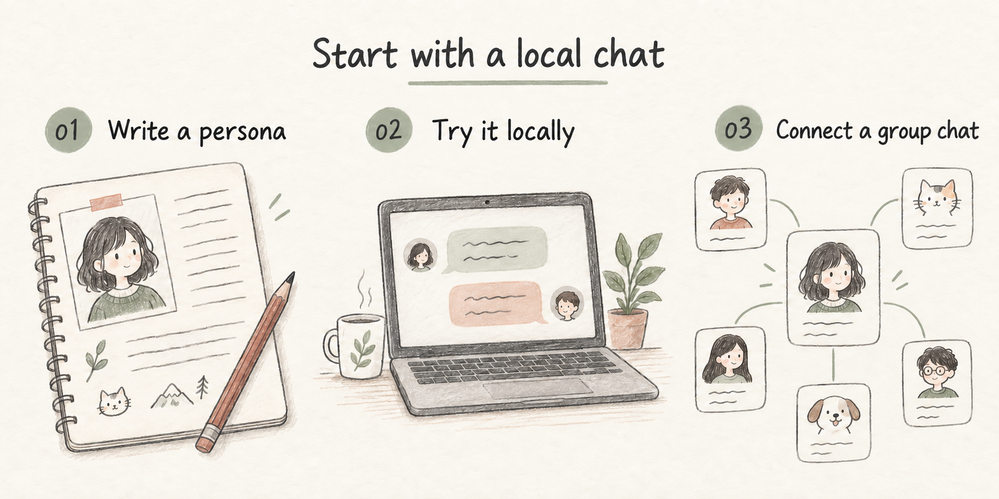

# personagent


A self-hosted chatbot with a custom persona, conversation memory, and feedback-based reply examples.

Describe a character in a text file, connect a model API, and try a conversation locally. For group chats and DMs, an AstrBot plugin forwards messages to personagent and sends its replies back to the platform.

**English** · [简体中文](README.zh-CN.md)

[](https://github.com/wangkant/personagent/actions/workflows/ci.yml)
[](https://www.python.org/downloads/)
[](LICENSE)

[Try locally](#try-locally) · [Write a persona](#write-a-persona) · [Connect a platform](#connect-a-platform) · [Memory and learning](#memory-and-learning) · [Troubleshooting](#troubleshooting)

## What it does

personagent is built for character conversations. Replies depend on the persona, the model, and the conversation. In group chats, it may choose to stay quiet.

- **Custom personas.** Write the character in `persona.txt`, with optional dialogue examples, background notes, and output filters.
- **Conversation memory.** Save notes within each conversation for later replies.
- **Corrections.** Record feedback as candidate examples and use accepted examples in future prompts. This does not train or fine-tune the model.
- **Images and links.** A configured vision model can describe images; supported links can be expanded into titles and summaries. Unparsed media, such as voice and video, appears as placeholder context.
- **Platform forwarding.** QQ, Telegram, Discord, and other AstrBot platforms share the reply pipeline. Available features vary by platform.

This is a Python application deployed from a repository checkout. personagent generates replies, AstrBot connects to the chat platform, and your configured OpenAI-compatible API provides the model. With a cloud model, relevant chat context is sent to that provider. A configured fallback provider (`FALLBACK_MODEL`, `FALLBACK_BASE_URL`) is also called on ordinary turns, for the reply gate, search decisions, reaction judging, self-evaluation and sticker tagging, and receives chat context too.


*Illustrative dialogue, not an actual conversation log.*

## Try locally



You need Git, Python 3.10–3.12, and an OpenAI-compatible model endpoint. No AstrBot installation or chat account is needed for the terminal trial.

```bash
git clone https://github.com/wangkant/personagent.git
cd personagent
python quickstart.py
```

The wizard creates a virtual environment, installs dependencies, and asks for the endpoint, model, API key, character name, and language. You can skip AstrBot setup on the first run and try the character in the terminal. The optional connection check and the conversation call your configured model.

For local Ollama, start the server and download a model first. Choose `Ollama (local)` in the wizard, enter your local model name, and keep the placeholder API key.

To open the trial again:

**Windows (PowerShell)**

```powershell
.venv\Scripts\python.exe try_chat.py
```

**macOS / Linux**

```bash
.venv/bin/python try_chat.py
```

Type a message and press Enter. Trial commands:

| Command | Purpose |
|---|---|
| `/as Alex I could use an early finish today` | Send a message under another display name |
| `/owner How was your day?` | Send one message as the configured owner |
| `/reset` | Clear the current conversation buffer |
| `/quit` | Exit |

Use `--name Alex` for your default display name, `--owner` for owner mode throughout, or `--lang zh` for Chinese seed data and validation. `/as` helps test dialogue; it is not a full multi-account simulation.

`(stays quiet)` can mean that the model chose not to reply, returned no text, or produced text rejected by character validation. A validation rejection also prints a diagnostic.

The trial uses the persona, example retrieval, generation, and character validator. It skips platform allowlists, reply-trigger checks, and output filters, and disables self-evaluation and vision. Test the connected bot separately before relying on its live behaviour.

## Write a persona

Edit `persona.txt` in the repository root. Describe the character, their usual speaking style, and how they respond in specific situations. For example:

```text
Your name is Nova. You chat with friends about films and cooking.
You speak directly and make the occasional joke.

Usually reply in a sentence or two. Explain more when someone asks a serious question.
When a friend vents, listen before offering advice.
If you have not seen a film, say so instead of inventing an opinion.
Do not make jokes about someone's private information or personal difficulties.
```

Adapt this to your character. Concrete habits are easier to test than repeatedly asking the model to sound natural.

The copied template includes placeholders such as `{bot_name}` and `{owner_name}`. Replace them yourself and remove the instructions intended for the person editing the file. These values are not substituted automatically.

Restart the trial or running service after editing the persona. `AGENT_LANG` selects language-specific examples, filters, and validation; it does not translate your persona text.

For further adjustments:

| File | Purpose |
|---|---|
| `data/examples.<lang>.jsonl` | Example conversations retrieved for the model |
| `data/feedback.<lang>.jsonl` | Original replies paired with corrected versions |
| `data/lorebook.<lang>.json` | Background notes included when keywords match |
| `data/output_filter.<lang>.json` | Replacement and rejection rules for live replies |
| `persona.card.json` | Optional emoji, character-set, and length settings |

For example, to allow emoji and set a reply length limit:

```json
{ "reply_style": { "emoji": true, "max_chars": 320 } }
```

Image understanding uses the separately configured `VISION_MODEL`, `VISION_API_KEY`, and `VISION_BASE_URL`. See [.env.example](.env.example) for the full settings. Editing the persona text preserves learned material. Changing `BOT_NAME` or `PERSONA_VERSION` changes the learning scope, so the old character's material no longer applies directly.

## Connect a platform

Install [AstrBot](https://github.com/AstrBotDevs/AstrBot) separately and configure your platform in its WebUI. personagent does not log in to chat accounts.

```text
Chat platform → AstrBot + forwarder → personagent → Model API
               Relays the reply   ← Returns reply
```

1. Run `python quickstart.py` from the personagent repository root. Choose AstrBot setup and provide its data directory. The wizard copies the forwarder plugin and writes a shared `GATEWAY_TOKEN` to both configurations. Re-running the wizard keeps your current provider, model, key, name and language as the defaults. An existing setup can also connect AstrBot without the wizard: `python quickstart.py --astrbot <AstrBot data dir> [--qq]`.
2. Check `agent_url` in the plugin settings. The same-host default is `http://127.0.0.1:8080/webhook/gateway`. The plugin only sends to a loopback address (same host, or containers sharing a network namespace or host networking) or to HTTPS with `gateway_token` set. Plain `http://` to another container or host, such as `http://host.docker.internal:8080`, is refused and logged as `refusing unsafe agent_url`, and AstrBot's own model answers instead.
3. Add the intended groups or private conversations to the plugin's allowlists. The default forwards nothing; private chats also need `private_enabled=true`.
4. Check `BOT_NAME` and `BOT_QQ` in personagent's `.env`. `BOT_QQ` is the bot's QQ account number and is needed only for QQ; leave it blank on other platforms.
5. Restart AstrBot, then start personagent:

**Windows (PowerShell)**

```powershell
.venv\Scripts\python.exe main.py
```

**macOS / Linux**

```bash
.venv/bin/python main.py
```

Run these commands from the repository root. Restart personagent after editing `.env`; restart AstrBot after changing platform or plugin settings. Test by naming or mentioning the character in an allowed conversation.

<details>
<summary>QQ setup notes</summary>

QQ also needs a OneBot v11 implementation such as NapCat, connected through AstrBot's `aiocqhttp` adapter.

- Remove `aiocqhttp` from the plugin's `excluded_platforms`.
- Set `GATEWAY_NATIVE_PLATFORMS=aiocqhttp` in personagent's `.env` to preserve existing QQ identity and memory scopes. The wizard's `--qq` option handles these two settings.
- Proactive messages and missed-mention recovery still require the OneBot HTTP API at `NAPCAT_API`. With AstrBot forwarding, OCR fallback is skipped and quoted messages are resolved through the Agent's recent-message index.
- Direct `/webhook/qq` ingress has been deprecated since 0.3.0. Do not enable it alongside AstrBot forwarding, or messages will arrive twice.

</details>

<details>
<summary>Separate hosts and other platform limits</summary>

The default bind address is `127.0.0.1:8080`. For separate hosts, configure a reachable address; a non-loopback `HOST` requires both `GATEWAY_TOKEN` and `WEBHOOK_SECRET`. Use an HTTPS reverse proxy or a private tunnel, preserve the exact request body, and keep the two clocks within five minutes of each other.

Non-QQ platforms return replies within the incoming gateway request and have no built-in independent proactive delivery channel. Scheduled proactive DMs require an external caller to send private gateway events with `proactive: true` and relay the results; a group event with the flag is claimed and dropped. See the [deployment guide](docs/deploy.md).

</details>

## Memory and learning

Memory stores facts about a conversation. Learning accumulates reply examples. Both are kept locally under `runtime/`.

To correct a reply, quote it, mention the bot, or use its name, then explain what you wanted instead. For example: “Nova, I was just venting. Next time, hold off on the advice.” This illustrates how to give feedback; it does not promise an immediate change.

Feedback first becomes a candidate. Automatic promotion requires compatible evidence from the same conversation, including at least one qualifying strong signal, such as an explicit correction and replacement from the original reply recipient. A single compliment does not automatically promote a good reply. Inspect or manage candidates with:

```bash
# macOS / Linux paths; on Windows use .venv\Scripts\python.exe
.venv/bin/python tools/candidates_admin.py list
.venv/bin/python tools/candidates_admin.py list --state promoted
.venv/bin/python tools/candidates_admin.py show <id>
.venv/bin/python tools/candidates_admin.py promote <id>
.venv/bin/python tools/candidates_admin.py reject <id>
.venv/bin/python tools/candidates_admin.py rollback <id>
.venv/bin/python tools/candidates_admin.py supersede <old_id> <new_id>
```

`REACT_LEARN`, `REACT_ELICIT`, and `PROMOTE_AUTO` are enabled by default. Feedback classification makes additional model calls; disable these settings in `.env` if you do not need them. `EVAL_ENABLE` and `EVOLVE_AUTO` are off by default. Rolling back a candidate stops its use but does not erase the underlying records.

In a group, send `Nova what have you learned` or `Nova what do you remember` to inspect that conversation's learning and memory. Replace Nova with `BOT_NAME` and include the name in the message text. These queries do not call a model.

## Troubleshooting

**The service starts, but the bot does not reply.**

Check the AstrBot plugin's allowlists, private-chat switch, and `agent_url` first. Confirm that messages reach personagent. For QQ, also check `excluded_platforms`. Then verify `BOT_NAME`, `BOT_QQ`, and the shared token. Group messages do not always trigger replies; start by addressing the character by name.

**How do I check whether the service is running?**

```bash
curl http://127.0.0.1:8080/health
```

This liveness endpoint does not call a model. `tools/healthcheck.py` checks configuration and upstream services, including model probes that may cost credits. `/health/details` also probes dependencies and requires an `X-Gateway-Token` header when a token is configured.

**Configuration changes have no effect.**

Restart the relevant process, check for misspelled variable names, and save `.env` as UTF-8 without a BOM. Shell environment variables override `.env`. Use `true` / `false` for booleans. When rerunning the wizard, review each answer: it rewrites some settings from the new inputs. `TZ_OFFSET_HOURS` defaults to UTC+8 and affects proactive quiet hours.

**What should I back up?**

Back up `runtime/`, `.env`, `persona.txt`, and the optional `persona.card.json`. They are not committed to Git and may contain credentials and real conversation text.

## Status and documentation

The project is in beta. QQ is the primary deployed use case; other platforms connect through AstrBot and should not be assumed to have complete end-to-end validation. CI covers Python 3.10–3.12 on Linux and Python 3.12 on Windows. Experimental tuning and evaluation scripts do not establish real-world conversation quality.

- [Deployment guide](docs/deploy.md)
- [AstrBot forwarder plugin](integrations/astrbot/astrbot_plugin_llm_persona_gateway/README.md)
- [Full configuration](.env.example)
- [Changelog](CHANGELOG.md) · [Contributing](CONTRIBUTING.md)

Before connecting to real conversations, tell participants that it is a bot and obtain consent to process their messages. Third-party QQ clients carry account risks; see the [disclaimer](DISCLAIMER.md).

## License

[MIT](LICENSE) © 2026 Qiankang Wang.

## Acknowledgements

Built on the [OneBot v11](https://github.com/botuniverse/onebot-11) event model, [NapCat](https://github.com/NapNeko/NapCatQQ), [AstrBot](https://github.com/AstrBotDevs/AstrBot), [FastAPI](https://github.com/fastapi/fastapi) and [httpx](https://github.com/encode/httpx), with ideas from [Self-Feeding Chatbot](https://arxiv.org/abs/1901.05415), [Alexa self-learning](https://arxiv.org/abs/1911.02557) and [BlenderBot 3x](https://arxiv.org/abs/2306.04707). The lorebook and output-filter model follows SillyTavern's World Info and regex extensions.
