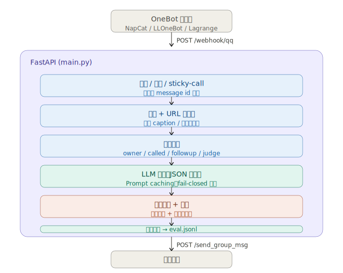
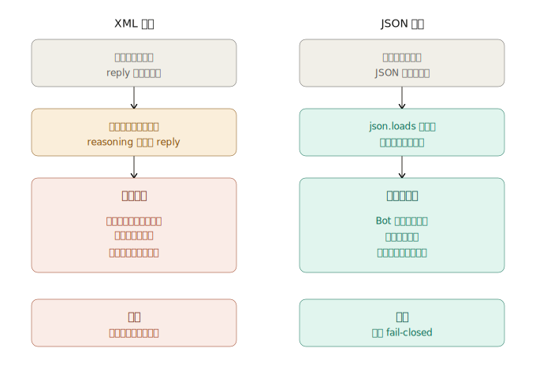
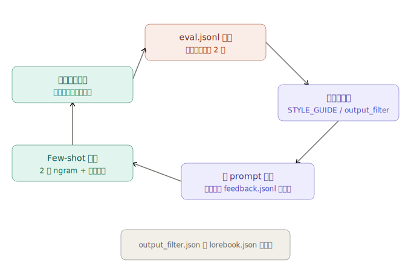
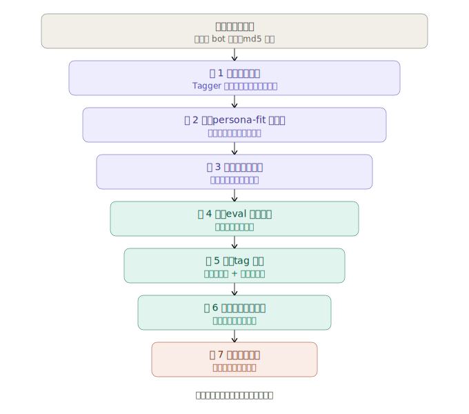

# onebot-llm-agent

[](https://qiankangwang.github.io/onebot-llm-agent/)

[English](README.md) | **中文**

一个**人设型 LLM agent 在 OneBot v11 群聊上的模板** —— 目标是发出来的消息像真人闲聊，而不是客服机器人。本仓库的主要价值在于 LLM agent / prompt engineering 的设计模式实践；接 OneBot 平台只是演示载体，仓库内不包含任何 IM 协议实现。

> **英文优先, 中英双语。** agent 默认跑英文, 一个开关 (`AGENT_LANG=zh`) 切到中文。详见[语言](#语言english--中文)。想 30 秒上手、不需要 QQ 账号？直接看[免 QQ 试用](#免-qq-试用)。

> **教育/研究用途。本项目与任何 IM 平台厂商无关联，未获任何平台授权或赞助。**
> 部署之前先看 [DISCLAIMER.md](DISCLAIMER.md)。第三方 OneBot 协议端 (例如 QQ 的 NapCat) 没有上游 IM 平台背书；如果你选择部署到 QQ，建议用小号 + 家庭/居民 IP 跑。仓库作者不对你选择的协议端承担任何责任。

## 这个项目想解决什么

大部分"群里跑 LLM"的项目最后都像卡在客服模式的机器人 —— 礼貌、热心、有问必答，没自己的脾气。这套模板从几个角度治这个病：

- **输出安全优先。** reasoning / intent / reply 不再是 XML 内嵌标签，而是 JSON 字段 —— 模型输出哪怕半截，也不可能把内部思考漏到群里。送出前还过一层字符白名单，凡是不像**当前语言**真实聊天的(XML 残片、JSON 大括号、模型 token、漏出的模板) 整条丢 —— 未来出现的未知漏出形态会被自动挡掉。
- **风格当成代码写。** STYLE_GUIDE 把人设的*口吻*、雷区句式、身份攻击防御、旁观者位规则、"看图不念图"等都编码进 prompt —— 这些规则是把"AI 客服"变成"一个人"的关键。
- **表情包是声音的一部分。** 表情库自动收新表情、打标签、文字+视觉两层 persona-fit 过滤；真实对话反馈闭环会把不合人设的表情慢慢降级。模型用 `[STICKER:<tag>]` 标记发表情。
- **真正看懂内容。** 文本里贴的链接、B 站 / YouTube 视频、各种小程序分享卡都会抓取元信息，作为结构化上下文喂给模型，不再让它对着一个 URL 干瞪眼。

## 仓库结构

| 模块 | 作用 |
|---|---|
| `agent.py` | JSON 协议输出（reasoning / intent / reply / mem 是字段不是标签）；字符白名单校验器丢掉所有不像聊天的回复；6 个 intent 标签驱动子风格；按用户的 RAG 记忆；针对 `data/examples.<lang>.jsonl` / `data/feedback.<lang>.jsonl` 的动态 few-shot 检索；正则前置过滤；异步自评对每条回复打 1-5 分写入 `eval.jsonl`；持久 system prompt 走 Anthropic prompt caching；跨重启 `seen_msg_ids` 去重 |
| `stickers.py` | md5 去重的表情库；自动收新表情；上下文够了再视觉打标；文字 + 视觉两层 persona-fit 过滤；eval 闭环按真实使用反馈淘汰低分表情；选用时给新表情新鲜度加分；跳过文件丢失的孤儿条目 |
| `main.py` | FastAPI webhook 接收端。NapCat 把群事件 POST 到 `/webhook/qq`，agent 处理后再 POST 回 NapCat 的 HTTP API。启动钩子链式跑文字 + 视觉两轮 persona-fit recheck → purge，磁盘上只剩合人设的表情 |
| `tools/bootstrap_from_history.py` | 一次性 bootstrap：拉群历史，计算主人发言频率画像，初始化表情包库 |
| `tools/auto_reviewer.py` | 扫 `eval.jsonl` 里低分条目，自动生成 `failure_mode + constraint + BAD/OK 草稿` 用于打补丁 |
| `tools/prompt_lab.py` | 离线交互调优：让 agent 跑 `tools/fixtures.<lang>.jsonl`，人工打分，通过的回复流到 `data/examples.<lang>.jsonl` |
| `tools/import_stickers_folder.py` | 从本地文件夹批量导入表情包，自动调视觉模型打标 |

## 架构图



<details>
<summary>实现细节（handler 调用链）</summary>

```
NapCat (QQ ↔ OneBot)
    │
    │  HTTP POST /webhook/qq
    ▼
┌──────────────────── main.py (FastAPI) ────────────────────┐
│                                                            │
│  ┌──────────────────── agent.py ────────────────────────┐  │
│  │  handle(payload)                                     │  │
│  │    ├─ 持久 dedup (seen_msg_ids.json)                  │  │
│  │    ├─ 防抖 + sticky-call 继承                          │  │
│  │    ├─ 视觉 (图 / 表情 caption)                         │  │
│  │    ├─ URL / 分享卡 元信息抓取                          │  │
│  │    ├─ buffer (按群滚动历史)                             │  │
│  │    ├─ 模式判定 (owner / called / followup / judge)     │  │
│  │    └─ _think()                                       │  │
│  │         ├─ 拼缓存分块 system prompt                    │  │
│  │         ├─ 调 LLM (JSON 输出协议)                      │  │
│  │         ├─ _parse_model_output (fail-closed)         │  │
│  │         ├─ output_filter (语义正则规则)                │  │
│  │         ├─ _validate_reply_safe (字符白名单)           │  │
│  │         ├─ _send_qq (表情匹配 + 发送)                   │  │
│  │         └─ 异步自评 → eval.jsonl + sticker 评分        │  │
│  └──────────────────────────────────────────────────────┘  │
│                                                            │
│  ┌──────────────────── stickers.py ─────────────────────┐  │
│  │  偷 → 打标 → persona-fit 文字门 → 视觉审美门            │  │
│  │  → eval 反馈闭环 → 偏向新鲜度的选择                     │  │
│  └──────────────────────────────────────────────────────┘  │
└────────────────────────────────────────────────────────────┘
    │
    │  HTTP POST /send_group_msg
    ▼
NapCat → QQ
```
</details>

## 快速开始

依赖：Python 3.10+、一个 OpenAI 兼容的 chat completions API key。OneBot v11 客户端（例如 NapCat）只有跑**真实群聊**时才需要 —— 下面的试用不用。

```bash
# 一行命令搞定 venv、装依赖、复制 .env + persona 模板
python quickstart.py
```

`quickstart.py` 是幂等的 —— 重跑只会报告哪些已经就位。等价的手动步骤：创建 `.venv`、`pip install -r requirements.txt`、复制 `.env.example → .env`、复制 `data/persona.example.<lang>.txt → persona.txt`。

### 免 QQ 试用

体验人设最快的路子 —— 不要 QQ 账号、不要 NapCat，只要一个 API key。

```bash
# .env 里只填 DEEPSEEK_API_KEY（不是 DeepSeek 的话再加 DEEPSEEK_BASE_URL / DEEPSEEK_MODEL）
python try_chat.py             # 英文（默认）
python try_chat.py --lang zh   # 中文变体
python try_chat.py --owner     # 以配置的 owner 身份说话
```

你打一行，bot 回一句 —— 走的是和线上 bot **完全相同**的推理路径（人设 + 风格指南 + JSON 输出协议 + 字符白名单校验器）。它还会把选中的 `intent` 和抽取到的 `mem` 一起打印出来，方便你看协议怎么运作。想针对 fixture 做批量/离线调优（给回复打分、扩充 few-shot 库），用 `python tools/prompt_lab.py`。

### 在群里实际运行

1. **配 `.env`** —— 填 *REQUIRED FOR A LIVE QQ / OneBot DEPLOYMENT* 那一块（`BOT_QQ`、`QQ_GROUPS`、`NAPCAT_API`），并写好你的 `persona.txt`。
2. **启动 agent：**
   ```bash
   source .venv/bin/activate            # Windows: .venv\Scripts\activate
   python main.py                       # 或: ./start.sh   (Windows: .\start.ps1)
   ```
   应当看到 `bot started on 0.0.0.0:8080 (agent=True, lang=zh)`。
3. **配好 NapCat**（或任意 OneBot v11 客户端）并指向 agent —— 见下文。

#### NapCat 三步走

1. 下载 [NapCat](https://github.com/NapNeko/NapCatQQ) 并登录一个**小号** QQ（扫码 / 确认登录）。先看 [DISCLAIMER.md](DISCLAIMER.md) —— 用一次性小号 + 家庭/居民 IP。
2. 在 NapCat 的 OneBot 配置里同时开启 HTTP 服务器**和** HTTP webhook：
   ```json
   {
     "http": { "enable": true, "host": "0.0.0.0", "port": 3000 },
     "webhook": {
       "enable": true,
       "url": "http://127.0.0.1:8080/webhook/qq",
       "timeout": 5000
     }
   }
   ```
3. 先起 NapCat，再起 agent。在群里发条消息，看日志。

#### 两个端口、两个方向

新手最容易搞混 —— 这两条是反方向的：

```
NapCat  --(webhook: 事件)-->  agent :8080    (.env 里的 HOST / PORT)
agent   --(发送回复)------->  NapCat :3000   (.env 里的 NAPCAT_API)
```

> **Windows 一键启动:** `launch.vbs` 用两个最小化窗口同时启动 NapCat 和 agent。用之前先改文件开头的三个值（`BOT_QQ`、`NAPCAT_DIR`、`AGENT_DIR`）；它会自动优先用 `.venv`。

## 语言（English / 中文）

agent **英文优先**，一个开关切到中文。在 `.env` 里设 `AGENT_LANG`：

- `AGENT_LANG=en`（默认）—— 主英文构建。
- `AGENT_LANG=zh` —— 中文变体。

这个开关一步到位地选择：

- **按后缀选数据文件（在 `data/` 下）**：`data/persona.example.<lang>.txt`、`data/examples.<lang>.jsonl`、`data/feedback.<lang>.jsonl`、`data/output_filter.<lang>.json`、`data/lorebook.<lang>.json`。每个先解析到 `<lang>` 文件，找不到再回退到不带后缀的同名文件（方便你放自己的）。
- **回复校验器**（`_validate_reply_safe`）：英文模式接受任何带字母的回复（仍然丢掉 XML / JSON / token 漏出）；`zh` 模式要求含 CJK。中英混说两种模式都放行。
- **控制流词表**：few-shot/记忆的分词器和话题类型分类器按语言切换各自的词表。
- **开发工具**：`tools/auto_reviewer.py`、`tools/import_stickers_folder.py`、`tools/prompt_lab.py` 同样跟随 `AGENT_LANG`。

想加一门新语言，放进一套 `*.<lang>.*` 数据文件，用 `AGENT_LANG=<lang>` 跑即可（校验器把任何非 `zh` 的语言当成基于字母处理）。

## 主动发言（可选）

默认 bot 是纯被动的 —— 只在有消息进来时才说话。设 `PROACTIVE_ENABLE=true` 后，后台循环会偶尔在没有任何触发的情况下**主动**发一句，让它更像一个偶尔会打破沉默的真人，而不是 24 小时待命的应答机。

这套机制刻意保守 ——「黏人 bot 对着空气刷屏」比安静更糟：

- **只在真正冷场之后**、且在 sleep window 之外触发，带每个会话的冷却和很低的单次概率。
- **绝不凭空开口。** 只在它已经见过有人说话的群里动，只主动私聊曾经私聊过它的人（owner + `PRIVATE_ALLOWED_QQS`）—— 不会无缘无故给谁发消息。
- **模型被告知：除非真有话想说否则一律 PASS** —— 接之前的话题 / 一个路过的想法 / 轻问候 —— 而且**不许发**「在吗」这种空话。大多数 tick 什么都不产出。
- **群聊和私聊**一视同仁，各自有独立的静默 / 冷却 / 概率旋钮。

在 `.env` 里调 `PROACTIVE_*`。默认值：群冷场 ≥45 分钟、两次间隔 ≥3 小时、每次检查约 25%；私聊冷场 ≥4 小时、间隔 ≥24 小时、约 20%。

## 输出协议 — JSON 不是 XML

模型每条回复输出单个 JSON 对象：

```json
{
  "reasoning": "...",      // ≤100 字内部分析, 永不展示
  "intent": "chat",        // joke | vent | share | question | troll | chat 六选一
  "reply": "...",          // 群里实际看到的内容 (写 "PASS" 表示不接)
  "mem": ""                // 可选记忆行, 空字符串=不记
}
```



为什么不用 `<reasoning>...</reasoning><intent>...</intent><reply>...</reply>` XML：

- **字段隔离。** 模型截断、标签拼错、吐出厂商内部 token 时，JSON 解析直接失败 — 整条不发。原 XML 形式的兜底分支会把 reasoning 漏到 reply。
- **多层容错好加。** parser 剥可选的 ```json``` 围栏 → `json.JSONDecoder.raw_decode`（处理双对象拼接）→ 兜底把短的、长得像聊天的输出当裸 reply（英文或 CJK 都行，仍然走 validator 把关）。
- **缓存友好。** system prompt 持有 schema；每次调用的差异落在 user message 和一小段「动态」分块里。持久部分用 Anthropic `cache_control: ephemeral` 标记，命中时重复调用的输入成本降到约 ~10%。

即便过了 parser，`_validate_reply_safe` 在 send 前还要过一道字符白名单，且**按语言区分**：英文模式下，任何带至少一个字母的回复放行，而 XML / JSON 大括号 / 管道 / 子词标记一律丢；`zh` 模式下回复必须含 CJK。中英混说两种模式都放行。未来出现的未知漏出形态无需逐条加正则即可自动挡掉。

## 回复示例

"像真人"在实际对话里的样子 (示例已脱敏 / 改写)。(主构建为英文；设 `AGENT_LANG=zh` 切到中文变体，模式一致。)

> 群友 *(挑刺)*: `今天又做天才发明家了?`
> Bot: `对啊 一直在敲键盘碰运气 等哪个 feature 自己掉出来`
> — 顺着对方的话演下去, 不防御也不道歉.

> 群友: `(只发了一张表情包, 无文字)`
> Bot: `又开始用表情包代替说话 经典 [STICKER:翻白眼]`
> — 反应"对方发表情"这个**动作**, 不复述图里画的啥.

> 群友: `匹配机制烂死了 连跪 4 把 队友疯狂送`
> Bot: `匹配系统觉得你今天该长长教训 [STICKER:无奈]`
> — 加入吐槽, 配合表情, 不问"怎么了"也不给方案.

> Owner: `等等 刚才说的那个 那个梗叫啥来着`
> Bot: `哥 两分钟前的事 这记忆堪比金鱼 [STICKER:嘲讽]`
> — 对熟人 (owner) 可以小调侃, 留台阶.

风格规律：agent 先推理谁说啥给谁(旁观者位敏感)、选 intent、用对应子风格写 reply ——不列点、不分析腔、不客服腔。

## 配置

所有配置在 `.env`。重点字段：

| 变量 | 含义 |
|---|---|
| `AGENT_LANG` | `en`（默认）或 `zh`。选择按语言区分的数据文件、校验器模式和词表。详见[语言](#语言english--中文) |
| `DEEPSEEK_API_KEY` / `DEEPSEEK_BASE_URL` / `DEEPSEEK_MODEL` | 主 chat-completion 模型, 任意 OpenAI 兼容端点都行。**`python try_chat.py` 唯一需要的 key** |
| `ANTHROPIC_API_KEY` / `ANTHROPIC_BASE_URL` / `ANTHROPIC_PRIVATE_MODEL` | **可选。** 主回复路径（`_call_anthropic`）走的 Anthropic 兼容端点，prompt caching 在这条上启用。留空则回退到主端点的 `{DEEPSEEK_BASE_URL}/anthropic` URL，用 `DEEPSEEK_API_KEY` 走这条路径 |
| `BOT_QQ` / `BOT_NAME` | bot 账号的 QQ 号和昵称 |
| `OWNER_QQ` / `OWNER_NAME` / `OWNER_RELATIONSHIP` | bot 比较熟的人 (可选, 默认空) |
| `QQ_GROUPS` | 监听的群号, 逗号分隔. 留空 = 所有群都听 |
| `VISION_MODEL` + `GLM_API_KEY` / `GLM_BASE_URL` | 视觉模型 (图/表情理解). 留空 = 只走 NapCat OCR 兜底 |
| `PERSONA_FILE` | 人设 prompt 路径 (默认 `persona.txt`) |
| `PROACTIVE_ENABLE`（+ `PROACTIVE_*`）| 可选的主动发言。详见[主动发言](#主动发言可选) |
| `FALLBACK_MODEL` + `RATE_THRESHOLD` + `RATE_WINDOW` | 请求过密时自动降级到便宜模型 |
| `JUDGE_MODEL` | 最便宜的模型，只用于自发模式（judge/followup/proactive）「要不要回」的判断门；真正发出去的回复永远由主模型写。留空 = 用 `FALLBACK_MODEL` |
| `EVAL_MODEL` | 异步自评打分用的模型 (用便宜的就行) |

完整列表见 `.env.example`。

## 迭代循环



prompt 的分块结构是为了让 bug 好定位：

```
观察到失败 (eval.jsonl LOW-SCORE / 线上观察)
  ↓
定位归属块 (STYLE_GUIDE / REASONING_PROTOCOL / INTENT_RULES / output_filter)
  ↓
在相近规则旁边加硬约束 + 反例,
  或往 data/output_filter.<lang>.json 里加一条语义正则
  ↓
在 data/feedback.<lang>.jsonl 里加一条 BAD/OK pair
  ↓
下次类似输入触发, 动态 few-shot 检索把这对拿出来注入
```

`data/examples.<lang>.jsonl` + `data/feedback.<lang>.jsonl` 的检索用按语言区分的 token（英文是去停用词后的单词，中文是 2 字 ngram）+ 场景 tag + 时间衰减，所以即使每个 failure mode 只有 5-10 条样本也已经能起效。

`data/output_filter.<lang>.json` 是**热加载**的，改完不用重启。`data/lorebook.<lang>.json`（SillyTavern World Info 风格的关键词触发上下文注入）也一样。

## 表情包质量机制



表情包在能被选用之前要过多层门：

1. **偷.** 群里出现的非 bot 图片，按 md5 去重存盘。
2. **打标.** 上下文够了，tagger LLM 根据**周围聊天**推断这个表情的情绪/梗（它看不到图）。
3. **文字 persona-fit 门.** 同 tagger 判定推断的情绪是不是合人设。`PERSONA_PROMPT_VERSION` 一 bump，旧条目下次启动会被重新评判。
4. **视觉审美门.** 视觉模型直接**看图**判视觉风格 (现代清爽设计 vs 中老年群家族风)。文字判不出来的它能。`VISUAL_AESTHETIC_VERSION` 同样 bump 触发重跑。
5. **eval 反馈闭环.** 每张发出去的表情都拿 1-5 分；累积平均低于阈值自动 `persona_fit=false`。
6. **选择.** `pick_by_tag` 同义词扩展 + 新鲜度加分 + 跳孤儿条目 + 冷却兜底（避免纯表情回复整条丢）。
7. **清理.** `persona_fit=false` 的下次启动物理删除(条目 + 文件)。

## 隐私

可能包含真实聊天内容的文件已经 gitignore：

```
.env                      # API key
eval.jsonl                # 自评打分原始记录
memory.json               # 抽取出来的长期记忆
core_memory.json          # 自维护的人设笔记
stickers.json             # 表情索引 + 样本上下文
stickers/auto/            # 下载的表情图片
seen_msg_ids.json         # 跨重启 message-id 去重状态
owner_profile.json        # owner 发言频率画像
unknown_stickers.jsonl    # 下载 URL
candidates.jsonl          # auto-reviewer 输出
*.log                     # 运行日志
```

仓库里附带的 `data/examples.{en,zh}.jsonl` / `data/feedback.{en,zh}.jsonl` / `tools/fixtures.{en,zh}.jsonl` 是**纯合成**的格式示例，没有真实聊天内容。

## License

[MIT](LICENSE)。

## 致谢

- `<reasoning>` / `<intent>` / `<reply>` 分离的想法早于本仓库；这里改写成 JSON 字段是为了消掉一类漏出 bug，保留原思路。
- NapCat / OneBot v11 生态提供 QQ 协议层。
- SillyTavern 的 World Info + regex extension 启发了这里的 lorebook 和 output_filter 设计。
