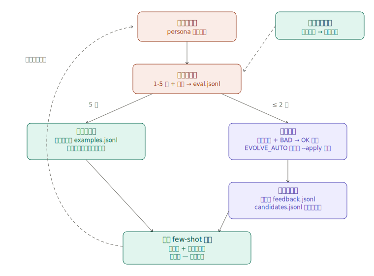
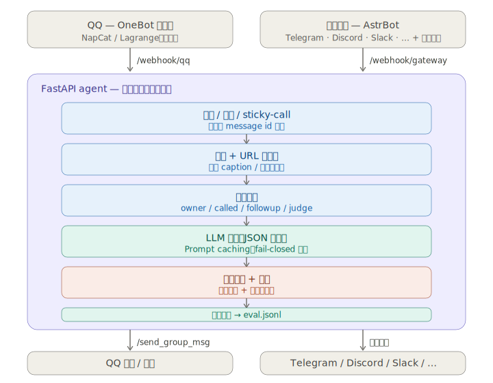

# persona-llm-agent

[](https://wangkant.github.io/persona-llm-agent/)
[](https://github.com/wangkant/persona-llm-agent/actions/workflows/ci.yml)
[](LICENSE)
[](https://www.python.org/downloads/)

[English](README.md) | **中文**

> **你打一句，它像真人一样接话——不是客服腔——而且越用越像。**

[](https://wangkant.github.io/persona-llm-agent/)

一个**自进化的人设型 LLM agent 模板**，用于群聊和私聊，目标是让发出的消息读起来像真人闲聊，而非客服机器人——并且越用越像：每条回复都被自评分，成功样本自动扩充 few-shot 池，失败样本被自我诊断成偏好对，直接影响下一次同类回复（见[自进化](#自进化)）。主载体是 **OneBot v11 / QQ**（经 NapCat）；内置一个平台无关网关与 [AstrBot](https://github.com/AstrBotDevs/AstrBot) 转发插件，可在人设管线零改动的前提下，将同一人设扩展到 **Telegram、Discord、Slack、飞书、KOOK**。本仓库的核心价值在于 LLM agent 与 prompt engineering 的设计模式实践；平台接入仅为演示载体，仓库内不包含任何 IM 协议实现。

> **英文优先，中英双语。** agent 默认运行英文，通过一个开关（`AGENT_LANG=zh`）即可切换至中文。详见[语言](#语言english--中文)。想在 30 秒内上手、且无需 QQ 账号？请直接查看[免 QQ 试用](#免-qq-试用)。

> **教育/研究用途。本项目与任何 IM 平台厂商无关联，未获任何平台授权或赞助。**
> 部署之前先看 [DISCLAIMER.md](DISCLAIMER.md)。第三方 OneBot 协议端 (例如 QQ 的 NapCat) 没有上游 IM 平台背书；如果你选择部署到 QQ，建议用小号 + 家庭/居民 IP 跑。仓库作者不对你选择的协议端承担任何责任。

## 目录

- [设计动机](#设计动机)
- [自进化](#自进化)
- [快速开始](#快速开始)
- [多平台接入（AstrBot）](#多平台接入astrbot)
- [语言（English / 中文）](#语言english--中文)
- [主动发言（可选）](#主动发言可选)
- [输出协议：JSON 不是 XML](#输出协议json-不是-xml)
- [回复示例](#回复示例)
- [配置](#配置)
- [迭代循环](#迭代循环)
- [表情包质量管线](#表情包质量管线)
- [架构](#架构)
- [项目结构](#项目结构)
- [组成模块](#组成模块)
- [开发](#开发)
- [隐私](#隐私)
- [License](#license)
- [致谢](#致谢)

## 设计动机

大多数"群聊 LLM"项目最终都停留在客服模式：礼貌、热心、有问必答，却没有自己的立场。本模板从五个方面解决人设问题：

- **输出安全优先。** reasoning / intent / reply 是 JSON 字段而非内嵌 XML 标签，因此模型输出即便残缺，也无法将内部思考泄露到可见回复中。发送前还会经过一层字符白名单，凡是不符合**当前语言**正常聊天特征的内容（XML 残片、JSON 大括号、模型 token、泄露的模板）整条丢弃；未来出现的未知泄露形态也会被自动拦截。
- **将风格作为代码维护。** `STYLE_GUIDE` 将人设的*口吻*、禁用句式、身份攻击防御、旁观者位规则以及"看图而不复述图"等规则编码进 prompt——这些约束正是让 agent 具备人格、而非通用助手的关键。
- **表情包是语气的一部分。** 表情库自动收集群内新表情，用视觉模型打标，进行文字与视觉两层 persona-fit 评估，并允许模型通过 `[STICKER:<tag>]` 内联发送。基于真实对话的反馈闭环会将持续表现不佳的表情降级。
- **理解实际内容。** 文本中的链接、B 站 / YouTube 视频以及各类小程序分享卡都会被抓取、解析，并以结构化上下文提供给模型，使其接收到底层内容，而非一个不透明的 URL。
- **自进化。** 人设不是部署完就冻结的。每条回复都被打分，分数路由进两条学习通道之一（扩充成功池 / 诊断失败），结果热加载进下一次同类对话——见下一节。

## 自进化



agent 围绕自己的输出闭合了一整条学习回路——两个半环都不需要重启，因为 `examples.jsonl` 和 `feedback.jsonl` 都会热加载进动态 few-shot 检索：

- **从成功中学（全自动）。** 异步自评器给每条已发送回复打 1–5 分写入 `eval.jsonl`。满 5 分的回复自动追加进 `data/examples.<lang>.jsonl`（去重、有大小上限、手工精选的头部永远保留），检索池随真实的高光时刻增长，而不是停在 bootstrap 那一刻。
- **从失败中学（人审或无人值守，自己选）。** 低分回复会交给一个模型命名失败模式（「客服腔」「回错人了」）、起草一条负向约束，并写出 BAD → OK 改写。通过的改写以偏好对形式落进 `data/feedback.<lang>.jsonl`——检索里信号最强的形态——下一次同类输入就会在上下文里看到这条纠正。两种跑法：
  - **人审:** `python tools/auto_reviewer.py --apply` 逐条展示诊断,批准 / 拒绝 / 编辑后才写入（`--yes` 跳过人审）。
  - **无人值守:** 设 `EVOLVE_AUTO=true`,进程内后台循环定时做同样的事,只处理明确的失败（`score <= EVOLVE_THRESHOLD`,默认 2）。每次诊断——无论采纳还是拒绝——都记录在 `candidates.jsonl`,CLI 和循环永远不会重复处理同一条,你也随时能审计 bot 教了自己什么。
- **表情包也在进化。** 每张发出的表情有自己的评分;持续低分会被降级出库（见[表情包质量管线](#表情包质量管线)）。
- **人设给自己记笔记。** letta 风格的 `core_memory.json` 按群维护一条模型可以在对话中更新的自留笔记——群里的长期事实不随上下文窗口滚动而丢失。

护栏（无人值守的反馈回路同样可能固化垃圾）：只有满分才能进示例池（自评模型普遍手松,否则用户明确不喜欢的句式会自我强化）、无人值守只碰明确失败、偏好对对整个 feedback 文件去重、两个文件都有大小上限、`candidates.jsonl` 保留完整审计痕迹。

## 快速开始

依赖：Python 3.10+ 与一个 OpenAI 兼容的 chat completions API key。OneBot v11 客户端（例如 NapCat）仅在运行**真实群聊**时才需要；下面的试用无需它。

```bash
# 一条命令：venv + 依赖 + 交互式配置向导
python quickstart.py
```

装完环境后向导会问你：API 服务商（DeepSeek / Kimi / OpenAI / Ollama / 任意 OpenAI 兼容端点）、key、bot 名字、语言 —— 答案自动写进 `.env`，可以顺手发一次 1-token 调用验证 key，选择上真实群的话还会继续收集 live 配置并**把要粘贴的 NapCat 配置直接打出来**，最后可以直接进终端试聊。**全程不用手动编辑 `.env`** —— 这个文件仍然是所有进阶开关的完整注释参考。

幂等 —— 重跑只报告哪些已就位，想重新配置才会再进向导。`--no-input`（或管道输入）跳过向导只做经典引导（建 `.venv`、`pip install -r requirements.txt`、复制 `.env.example → .env` 和 persona 模板），适合 CI。

### 免 QQ 试用

体验人设最快的方式——无需 QQ 账号、无需 NapCat，只要一个 API key。向导会在最后一步引导你进入；之后如需再次运行：

```bash
python try_chat.py             # 英文（默认）
python try_chat.py --lang zh   # 中文变体
python try_chat.py --owner     # 以配置的 owner 身份说话
```

你输入一行，bot 回复一句——走的是与线上 bot **完全相同**的推理路径（人设 + 风格指南 + JSON 输出协议 + 字符白名单校验器）。它还会一并打印选中的 `intent` 与抽取到的 `mem`，便于观察协议的运作。若需针对 fixture 做批量 / 离线调优（为回复打分、扩充 few-shot 库），使用 `python tools/prompt_lab.py`。

### 在群里实际运行

1. **配 `.env`** —— 向导里答过 live 部署那几问的话这步已经完成；否则填 *REQUIRED FOR A LIVE QQ / OneBot DEPLOYMENT* 那一块（`BOT_QQ`、`QQ_GROUPS`、`NAPCAT_API`），并写好你的 `persona.txt`。
2. **启动 agent：**
   ```bash
   source .venv/bin/activate            # Windows: .venv\Scripts\activate
   python main.py                       # 或: ./start.sh   (Windows: .\start.ps1)
   ```
   应当看到 `bot started on 127.0.0.1:8080 (agent=True, lang=zh)`。
3. **配好 NapCat**（或任意 OneBot v11 客户端）并指向 agent —— 见下文。

#### NapCat 三步走

1. 下载 [NapCat](https://github.com/NapNeko/NapCatQQ) 并登录一个**小号** QQ（扫码 / 确认登录）。先看 [DISCLAIMER.md](DISCLAIMER.md) —— 用一次性小号 + 家庭/居民 IP。
2. 在 NapCat 的 OneBot 配置里同时开启 HTTP 服务器**和** HTTP webhook：
   ```json
   {
     "http": { "enable": true, "host": "0.0.0.0", "port": 3000 },
     "webhook": {
       "enable": true,
       "url": "http://127.0.0.1:8080/webhook/qq",
       "timeout": 5000
     }
   }
   ```
3. 先起 NapCat，再起 agent。在群里发条消息，看日志。

#### 端口与数据流向

这两条连接方向相反，容易混淆：

```
NapCat  --(webhook: 事件)-->  agent :8080    (.env 里的 HOST / PORT)
agent   --(发送回复)------->  NapCat :3000   (.env 里的 NAPCAT_API)
```

> **Windows 启动器：** `launch.vbs` 用两个最小化窗口同时启动 NapCat 和 agent。使用前先设置文件开头的三个值（`BOT_QQ`、`NAPCAT_DIR`、`AGENT_DIR`）；存在 `.venv` 时会自动优先使用。

## 多平台接入（AstrBot）

上面的 QQ/NapCat 是主链路，但 agent 还暴露了一个平台无关的 webhook —— `POST /webhook/gateway`，借助 [AstrBot](https://github.com/AstrBotDevs/AstrBot) 的平台适配器，同一个人设可以进 Telegram / Discord / Slack / 飞书 / KOOK 的群聊和私聊。人设管线完全不动：网关把中立入站事件合成进原有 handler、回复经上下文局部 sink 捕获，AstrBot 侧的翻译由内置转发插件完成。

```
Telegram / Discord / Slack / …  -->  AstrBot + 转发插件  --HTTP-->  agent /webhook/gateway
QQ                              -->  NapCat             --HTTP-->  agent /webhook/qq      (不变)
```

1. 装好 AstrBot，配上想要的平台适配器。
2. 把 `integrations/astrbot/astrbot_plugin_llm_persona_gateway/` 拷进 AstrBot 的 `data/plugins/`，改插件配置（agent 地址、可选共享密钥、群/私聊白名单）。完整说明见[插件 README](integrations/astrbot/astrbot_plugin_llm_persona_gateway/README.md)。
3. `.env` 可选加固：`GATEWAY_TOKEN`（webhook 共享密钥）和 `GATEWAY_OWNER_IDS`（把例如 `telegram:12345` 当主人对待），见 `.env.example`。

网关会话全部带 `<平台>:<id>` 命名空间，记忆和状态不会跟 QQ 串。NapCat 直连 agent 时，插件的排除平台里要留着 `aiocqhttp`（默认就是），否则 QQ 消息会被处理两遍。QQ 专属机制（偷表情包、OCR、主动发言/漏 @ 补抓）只走 QQ 链路；文字 / 表情包 / @ 回复全平台都通。

## 语言（English / 中文）

agent **英文优先**，一个开关切到中文。在 `.env` 里设 `AGENT_LANG`：

- `AGENT_LANG=en`（默认）—— 主英文构建。
- `AGENT_LANG=zh` —— 中文变体。

这个开关一步到位地选择：

- **按后缀选数据文件（在 `data/` 下）**：`data/persona.example.<lang>.txt`、`data/examples.<lang>.jsonl`、`data/feedback.<lang>.jsonl`、`data/output_filter.<lang>.json`、`data/lorebook.<lang>.json`。每个先解析到 `<lang>` 文件，找不到再回退到不带后缀的同名文件（方便你放自己的）。
- **回复校验器**（`_validate_reply_safe`）：英文模式接受任何带字母的回复（仍然丢掉 XML / JSON / token 漏出）；`zh` 模式要求含 CJK。中英混说两种模式都放行。
- **控制流词表**：few-shot/记忆的分词器和话题类型分类器按语言切换各自的词表。
- **开发工具**：`tools/auto_reviewer.py`、`tools/import_stickers_folder.py`、`tools/prompt_lab.py` 同样跟随 `AGENT_LANG`。

想加一门新语言，放进一套 `*.<lang>.*` 数据文件，用 `AGENT_LANG=<lang>` 跑即可（校验器把任何非 `zh` 的语言当成基于字母处理）。

## 主动发言（可选）

默认 bot 是纯被动的 —— 只在有消息进来时才说话。设 `PROACTIVE_ENABLE=true` 后，后台循环会偶尔在没有任何触发的情况下**主动**发一句，让它更像一个偶尔会打破沉默的真人，而不是 24 小时待命的应答机。

该机制刻意保守：一个对着空场刷屏的 bot 比保持安静更糟：

- **仅在真正冷场之后**，且在 sleep window 之外触发，附带每个会话的冷却时间与很低的单次触发概率。
- **绝不凭空开口。** 仅在已观察到有人发言的群里活动，也只主动私聊曾私聊过它的人（owner 与 `PRIVATE_ALLOWED_QQS`）；不会无端联系任何人。
- **模型被要求：除非确有话可说，否则一律返回 PASS**——例如接续此前的话题、一个偶发的想法，或一句简短问候——并**不得发送**「在吗」之类的空话。大多数 tick 不产出任何内容。
- **群聊与私聊**行为一致，各自拥有独立的静默、冷却与概率参数。

在 `.env` 里调 `PROACTIVE_*`。默认值：群冷场 ≥45 分钟、两次间隔 ≥3 小时、每次检查约 25%；私聊冷场 ≥4 小时、间隔 ≥24 小时、约 20%。

## 输出协议：JSON 不是 XML

模型每条回复输出单个 JSON 对象：

```json
{
  "reasoning": "...",      // ≤100 字内部分析, 永不展示
  "intent": "chat",        // joke | vent | share | question | troll | chat 六选一
  "reply": "...",          // 群里实际看到的内容 (写 "PASS" 表示不接)
  "mem": ""                // 可选记忆行, 空字符串=不记
}
```


为什么不用 `<reasoning>...</reasoning><intent>...</intent><reply>...</reply>` XML：

- **字段隔离。** 模型截断、标签拼错、吐出厂商内部 token 时，JSON 解析直接失败 — 整条不发。原 XML 形式的兜底分支会把 reasoning 漏到 reply。
- **多层容错好加。** parser 剥可选的 ```json``` 围栏 → `json.JSONDecoder.raw_decode`（处理双对象拼接）→ 兜底把短的、长得像聊天的输出当裸 reply（英文或 CJK 都行，仍然走 validator 把关）。
- **缓存友好。** system prompt 持有 schema；每次调用的差异落在 user message 和一小段「动态」分块里。持久部分用 Anthropic `cache_control: ephemeral` 标记，命中时重复调用的输入成本降到约 ~10%。

即便过了 parser，`_validate_reply_safe` 在 send 前还要过一道字符白名单，且**按语言区分**：英文模式下，任何带至少一个字母的回复放行，而 XML / JSON 大括号 / 管道 / 子词标记一律丢；`zh` 模式下回复必须含 CJK。中英混说两种模式都放行。未来出现的未知漏出形态无需逐条加正则即可自动挡掉。

## 回复示例

"像真人"在实际对话里的样子 (示例已脱敏 / 改写)。(主构建为英文；设 `AGENT_LANG=zh` 切到中文变体，模式一致。)

> 群友 *(挑刺)*: `今天又做天才发明家了?`
> Bot: `对啊 一直在敲键盘碰运气 等哪个 feature 自己掉出来`
> — 顺着对方的话演下去, 不防御也不道歉.

> 群友: `(只发了一张表情包, 无文字)`
> Bot: `又开始用表情包代替说话 经典 [STICKER:翻白眼]`
> — 反应"对方发表情"这个**动作**, 不复述图里画的啥.

> 群友: `匹配机制烂死了 连跪 4 把 队友疯狂送`
> Bot: `匹配系统觉得你今天该长长教训 [STICKER:无奈]`
> — 加入吐槽, 配合表情, 不问"怎么了"也不给方案.

> Owner: `等等 刚才说的那个 那个梗叫啥来着`
> Bot: `哥 两分钟前的事 这记忆堪比金鱼 [STICKER:嘲讽]`
> — 对熟人 (owner) 可以小调侃, 留台阶.

风格规律：agent 先推理谁对谁说了什么（具备旁观者位意识），选定 intent，再以对应子风格撰写 reply——不列点、不用分析腔、不用客服腔。

## 配置

所有配置在 `.env`。重点字段：

| 变量 | 含义 |
|---|---|
| `AGENT_LANG` | `en`（默认）或 `zh`。选择按语言区分的数据文件、校验器模式和词表。详见[语言](#语言english--中文) |
| `DEEPSEEK_API_KEY` / `DEEPSEEK_BASE_URL` / `DEEPSEEK_MODEL` | 主 chat-completion 模型, 任意 OpenAI 兼容端点都行。**`python try_chat.py` 唯一需要的 key** |
| `ANTHROPIC_PRIVATE_MODEL` | **可选。** 私聊(1:1)用的备选模型名，走同一个主端点（前缀是历史遗留）。留空 = 私聊也用 `DEEPSEEK_MODEL` |
| `BOT_QQ` / `BOT_NAME` | bot 账号的 QQ 号和昵称 |
| `OWNER_QQ` / `OWNER_NAME` / `OWNER_RELATIONSHIP` | bot 比较熟的人 (可选, 默认空) |
| `QQ_GROUPS` | 监听的群号, 逗号分隔. 留空 = 所有群都听 |
| `VISION_MODEL` + `GLM_API_KEY` / `GLM_BASE_URL` | 视觉模型 (图/表情理解). 留空 = 只走 NapCat OCR 兜底 |
| `PERSONA_FILE` | 人设 prompt 路径 (默认 `persona.txt`) |
| `PROACTIVE_ENABLE`（+ `PROACTIVE_*`）| 可选的主动发言。详见[主动发言](#主动发言可选) |
| `EVOLVE_AUTO`（+ `EVOLVE_*`）| 可选的无人值守 eval → feedback 学习循环。详见[自进化](#自进化) |
| `FALLBACK_MODEL` + `RATE_THRESHOLD` + `RATE_WINDOW` | 请求过密时自动降级到便宜模型 |
| `JUDGE_MODEL` | 最便宜的模型，只用于自发模式（judge/followup/proactive）「要不要回」的判断门；真正发出去的回复永远由主模型写。留空 = 用 `FALLBACK_MODEL` |
| `EVAL_MODEL` | 异步自评打分用的模型 (用便宜的就行) |

完整列表见 `.env.example`。

## 迭代循环


可自动化的部分[自进化闭环](#自进化)已经自己在跑;下面这条手动循环留给需要人类判断的失败——一类新的失败*类型*,该在 prompt 里加硬约束,而不只是多一条检索样本。prompt 的分块结构是为了让这种 bug 好定位：

```
观察到失败 (eval.jsonl LOW-SCORE / 线上观察)
  ↓
定位归属块 (STYLE_GUIDE / REASONING_PROTOCOL / INTENT_RULES / output_filter)
  ↓
在相近规则旁边加硬约束 + 反例,
  或往 data/output_filter.<lang>.json 里加一条语义正则
  ↓
在 data/feedback.<lang>.jsonl 里加一条 BAD/OK pair
  ↓
下次类似输入触发, 动态 few-shot 检索把这对拿出来注入
```

`data/examples.<lang>.jsonl` + `data/feedback.<lang>.jsonl` 的检索用按语言区分的 token（英文是去停用词后的单词，中文是 2 字 ngram）+ 场景 tag + 时间衰减，所以即使每个 failure mode 只有 5-10 条样本也已经能起效。

`data/output_filter.<lang>.json` 是**热加载**的，改完不用重启。`data/lorebook.<lang>.json`（SillyTavern World Info 风格的关键词触发上下文注入）也一样。

## 表情包质量管线


表情包在可被选用之前需经过多道门：

1. **收集。** 群内出现的非 bot 图片按 md5 去重后存盘。
2. **打标。** 上下文积累足够后，tagger LLM 依据**周围聊天**推断该表情的情绪 / 梗（它看不到图片本身）。
3. **文字 persona-fit 门。** 同一 tagger 判定推断出的含义是否契合人设。`PERSONA_PROMPT_VERSION` 递增后，旧条目会在下次启动时重新评判。
4. **视觉审美门。** 视觉模型直接**查看图片**判定视觉风格（现代清爽设计 vs. 陈旧的家族群风格）——这是文字无法分辨的。`VISUAL_AESTHETIC_VERSION` 递增时同样触发重新评判。
5. **评估反馈闭环。** 每张发出的表情由自评器打 1–5 分；累积平均低于阈值即自动降级为 `persona_fit=false`。
6. **选择。** `pick_by_tag` 通过同义词扩展进行匹配，为较新条目给予少量新鲜度加分，跳过孤儿条目（backing 文件缺失的条目），并在丢弃纯表情回复前回退到近期用过的匹配项。
7. **清理。** 标记为 `persona_fit=false` 的条目会在下次启动时删除（记录与文件）。

## 架构



<details>
<summary>实现细节（handler 调用链）</summary>

```
NapCat (QQ ↔ OneBot)          AstrBot + 转发插件
    │                              │
    │  POST /webhook/qq            │  POST /webhook/gateway
    ▼                              ▼
┌──────────────────── main.py (FastAPI) ────────────────────┐
│                                                            │
│  ┌─────────────── persona_agent/agent.py ───────────────┐  │
│  │  handle(payload)                                     │  │
│  │    ├─ 持久 dedup (seen_msg_ids.json)                  │  │
│  │    ├─ 防抖 + sticky-call 继承                          │  │
│  │    ├─ 视觉 (图 / 表情 caption)                         │  │
│  │    ├─ URL / 分享卡 元信息抓取                          │  │
│  │    ├─ buffer (按群滚动历史)                             │  │
│  │    ├─ 模式判定 (owner / called / followup / judge)     │  │
│  │    └─ _think()                                       │  │
│  │         ├─ 拼缓存分块 system prompt                    │  │
│  │         ├─ 调 LLM (JSON 输出协议)                      │  │
│  │         ├─ _parse_model_output (fail-closed)         │  │
│  │         ├─ output_filter (语义正则规则)                │  │
│  │         ├─ _validate_reply_safe (字符白名单)           │  │
│  │         ├─ _send_qq (表情匹配 + 发送)                   │  │
│  │         └─ 异步自评 → eval.jsonl + sticker 评分        │  │
│  └──────────────────────────────────────────────────────┘  │
│                                                            │
│  ┌────────────── persona_agent/stickers.py ─────────────┐  │
│  │  偷 → 打标 → persona-fit 文字门 → 视觉审美门            │  │
│  │  → eval 反馈闭环 → 偏向新鲜度的选择                     │  │
│  └──────────────────────────────────────────────────────┘  │
└────────────────────────────────────────────────────────────┘
    │                              │
    │  POST /send_group_msg        │  网关响应里带回复
    ▼                              ▼
NapCat → QQ                   AstrBot → Telegram / Discord / …
```
</details>

## 项目结构

app 式布局：一个可导入的核心包，根目录只留薄薄的入口脚本，状态文件也留在根目录（升级永远不用迁移数据）。

```
persona_agent/        应用核心包
  agent.py            人设管线:模式、输出协议、记忆、检索、自评、进化循环
  gateway.py          平台无关事件 schema + 回复 sink
  stickers.py         表情包库及其质量门
  evolution.py        eval -> feedback 学习循环逻辑
  health.py           启动 / 运行时环境体检
  paths.py            ROOT 锚点——所有状态文件都在仓库根
main.py               FastAPI 入口(webhook、lifespan、后台循环)
try_chat.py           走完整推理路径的终端试聊
quickstart.py         一条命令的配置向导
tools/                离线调优 + 运维 CLI(auto_reviewer、prompt_lab 等)
data/                 按语言区分的数据集:persona、examples、feedback、lorebook、output_filter
docs/                 架构 + 闭环示意图(中英)
tests/                纯标准库回归测试(不依赖 pytest)
integrations/         AstrBot 转发插件(多平台)
```

## 组成模块

| 模块 | 职责 |
|---|---|
| `persona_agent/agent.py` | JSON 协议输出（reasoning / intent / reply / mem 是字段不是标签）；字符白名单校验器丢掉所有不像聊天的回复；6 个 intent 标签驱动子风格；按用户的 RAG 记忆；针对 `data/examples.<lang>.jsonl` / `data/feedback.<lang>.jsonl` 的动态 few-shot 检索；正则前置过滤；异步自评对每条回复打 1-5 分写入 `eval.jsonl` 并把满分回复自动追加进示例池；可选的 `EVOLVE_AUTO` 循环；持久 system prompt 走 Anthropic prompt caching；跨重启 `seen_msg_ids` 去重 |
| `persona_agent/evolution.py` | eval → feedback 学习循环逻辑（读低分、拼诊断 prompt、草稿转偏好对、去重、审计痕迹）——进程内 `EVOLVE_AUTO` 循环和 `tools/auto_reviewer.py` 共用，不绑定任何传输层 |
| `persona_agent/stickers.py` | md5 去重的表情库；自动收新表情；上下文够了再视觉打标；文字 + 视觉两层 persona-fit 过滤；eval 闭环按真实使用反馈淘汰低分表情；选用时给新表情新鲜度加分；跳过文件丢失的孤儿条目 |
| `main.py` | FastAPI webhook 接收端。NapCat 把群事件 POST 到 `/webhook/qq`，agent 处理后再 POST 回 NapCat 的 HTTP API。启动钩子链式跑文字 + 视觉两轮 persona-fit recheck → purge，磁盘上只剩合人设的表情 |
| `persona_agent/gateway.py` + `integrations/astrbot/` | 平台无关网关：中立入站事件合成进同一条处理管线，回复经上下文局部 sink 捕获；附带 [AstrBot](https://github.com/AstrBotDevs/AstrBot) 转发插件，接入 Telegram / Discord / Slack 等平台的群聊和私聊 |
| `tools/bootstrap_from_history.py` | 一次性 bootstrap：拉群历史，计算主人发言频率画像，初始化表情包库 |
| `tools/auto_reviewer.py` | 学习循环的人审端：把 `eval.jsonl` 低分条目诊断进 `candidates.jsonl`,再用 `--apply` 逐条批准 / 编辑 BAD → OK 偏好对写入 `data/feedback.<lang>.jsonl`（`--yes` 无人值守） |
| `tools/prompt_lab.py` | 离线交互调优：让 agent 跑 `tools/fixtures.<lang>.jsonl`，人工打分，通过的回复流到 `data/examples.<lang>.jsonl` |
| `tools/import_stickers_folder.py` | 从本地文件夹批量导入表情包，自动调视觉模型打标 |

## 开发

回归测试无需测试框架——纯标准库 Python，不依赖 pytest：

```bash
python tests/test_gateway.py
python tests/test_evolution.py
```

它使用一个轻量的 `check()` 断言框架，覆盖网关管线、回复 / PASS 判定门、输出校验器、记忆淘汰、SSRF 防护、出站限流、配置向导的 `.env` 写入逻辑，以及自进化闭环（诊断解析、偏好对转换、去重、审计痕迹）。提交 PR 前请先跑一遍。

用于 prompt 与人设调优：

- `python try_chat.py`——通过完整推理路径进行交互式单轮对话（见[快速开始](#快速开始)）。
- `python tools/prompt_lab.py`——针对 `tools/fixtures.<lang>.jsonl` 的离线批量调优；通过的回复会流入 `data/examples.<lang>.jsonl`。
- `python tools/auto_reviewer.py`——扫描 `eval.jsonl` 中的低分回复并起草 prompt 补丁;加 `--apply` 逐条批准写入 `feedback.jsonl`（见[自进化](#自进化)）。

## 隐私

可能包含真实聊天内容的文件已经 gitignore：

```
.env                      # API key
eval.jsonl                # 自评打分原始记录
memory.json               # 抽取出来的长期记忆
core_memory.json          # 自维护的人设笔记
stickers.json             # 表情索引 + 样本上下文
stickers/auto/            # 下载的表情图片
seen_msg_ids.json         # 跨重启 message-id 去重状态
owner_profile.json        # owner 发言频率画像
unknown_stickers.jsonl    # 下载 URL
candidates.jsonl          # auto-reviewer 输出
*.log                     # 运行日志
```

仓库里附带的 `data/examples.{en,zh}.jsonl` / `data/feedback.{en,zh}.jsonl` / `tools/fixtures.{en,zh}.jsonl` 是**纯合成**的格式示例，没有真实聊天内容。

## License

[MIT](LICENSE)。

## 致谢

- `<reasoning>` / `<intent>` / `<reply>` 分离的想法早于本仓库；这里改写成 JSON 字段是为了消掉一类漏出 bug，保留原思路。
- NapCat / OneBot v11 生态提供 QQ 协议层。
- SillyTavern 的 World Info + regex extension 启发了这里的 lorebook 和 output_filter 设计。
