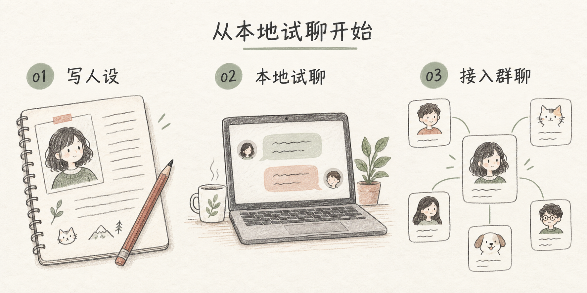

# personagent


一个可以自定义角色、接入群聊和私聊的聊天机器人。

用文本写下角色的性格和说话习惯，配置模型接口后就能在本地试聊。接入聊天平台后，它会根据上下文决定是否回复，保存会话记忆，并从纠正中积累可供后续使用的回复示例。

[English](README.md) · **简体中文**

[](https://github.com/wangkant/personagent/actions/workflows/ci.yml)
[](https://www.python.org/downloads/)
[](LICENSE)

[本地试用](#本地试用) · [写人设](#写人设) · [接入聊天平台](#接入聊天平台) · [记忆与学习](#记忆与学习) · [常见问题](#常见问题)

## 能做什么

personagent 主要用于角色闲聊。回复的语气和内容取决于人设、模型以及当前对话，群聊中也可能选择不回复。

- **自定义角色。** 人设写在 `persona.txt` 中，还可以补充对话示例、背景资料和输出过滤规则。
- **保存会话记忆。** 按会话保存笔记，供后续聊天使用。
- **接收纠正。** 将反馈记录为候选示例，满足条件后用于后续回复。这里的学习不涉及模型训练。
- **处理图片和链接。** 配置视觉模型后可获取图片描述；部分网页链接可展开为标题和简介。语音、视频等未解析内容会以占位信息进入上下文。
- **接入多个平台。** 通过 AstrBot 转发消息，QQ、Telegram、Discord 等平台使用同一套回复逻辑。各平台可用功能有所不同，见下方接入说明。

这是一个自行部署的 Python 应用。personagent 负责生成回复，AstrBot 负责连接聊天平台，模型由你配置的 OpenAI 兼容接口提供。使用云端模型时，相关聊天上下文会发送给该供应商。如果配置了备用供应商（`FALLBACK_MODEL`、`FALLBACK_BASE_URL`），它在普通回合中也会被调用（回复判断、搜索决策、反应评判、自评和表情包标注），同样会收到聊天上下文。


*示意对话，非实际运行记录。*

## 本地试用



准备 Git、Python 3.10–3.12，以及一个 OpenAI 兼容模型接口。本地试用不需要 AstrBot 或聊天平台账号。

```bash
git clone https://github.com/wangkant/personagent.git
cd personagent
python quickstart.py
```

向导会创建虚拟环境、安装依赖，并询问模型地址、模型名、API Key、角色名和语言。第一次使用时，可以跳过 AstrBot 接入，先在终端里试聊。接口测试和对话会调用你配置的模型。

也可以使用已经运行并下载好模型的本地 Ollama：在向导中选择 `Ollama (local)`，填写本地模型名，API Key 保留向导提供的占位值即可。

之后重新打开试用：

**Windows（PowerShell）**

```powershell
.venv\Scripts\python.exe try_chat.py --lang zh
```

**macOS / Linux**

```bash
.venv/bin/python try_chat.py --lang zh
```

输入消息后按回车。可以用这些命令试不同的对话：

| 命令 | 用途 |
|---|---|
| `/as 小林 今天想早点下班` | 换一个显示名发言 |
| `/owner 今天过得怎么样` | 以配置中的主人身份发一条消息 |
| `/reset` | 清空当前对话上下文 |
| `/quit` | 退出 |

`--name 小林` 设置默认显示名，`--owner` 全程使用主人身份。终端里的 `/as` 用于试说话方式，不是完整的多账号模拟。

如果显示 `(stays quiet)`，可能是模型选择了不回复，也可能是回复为空或未通过字符校验；后者会附带校验提示。

终端试用包含人设、示例检索、模型生成和字符校验，但不执行完整的上线流程：它跳过平台白名单、回复触发判断和输出过滤器，也关闭了自评分与视觉。因此，接入平台后还需要实际测试。

## 写人设

打开仓库根目录的 `persona.txt`，写清楚角色是谁、平时怎么说话，以及遇到具体情况时会怎么回应。例如：

```text
你叫小夏，在群里和熟人闲聊。喜欢电影和做饭，说话直接，偶尔开玩笑。

平时回复一两句；别人认真问问题时，可以多解释一点。
朋友抱怨时先听他说，不急着列解决办法。
遇到没看过的电影就说没看过，不编观后感。
开玩笑别拿别人的隐私和难处当话题。
```

这只是写法示例，可以按自己的角色修改。比起反复写“自然一点”，补充几条具体的对话习惯通常更容易调试。

向导复制的模板中有 `{bot_name}`、`{owner_name}` 等占位符，需要手动替换，并删掉末尾给使用者看的说明。文件内容会直接交给模型，不会自动填入这些名字。

改完后重新打开终端试用；已运行的服务也需要重启。`AGENT_LANG=zh` 选择中文示例、过滤器和校验规则，不会翻译你写的人设。

进一步调整时可以编辑：

| 文件 | 作用 |
|---|---|
| `data/examples.<lang>.jsonl` | 供模型参考的对话示例 |
| `data/feedback.<lang>.jsonl` | 原回复与修改后回复的配对示例 |
| `data/lorebook.<lang>.json` | 按关键词加入上下文的背景资料 |
| `data/output_filter.<lang>.json` | 上线回复的替换、拦截规则 |
| `persona.card.json` | 可选的 emoji、字符集和长度设置 |

例如，允许 emoji 并设置回复长度上限：

```json
{ "reply_style": { "emoji": true, "max_chars": 320 } }
```

图片理解需要 `VISION_MODEL`、`VISION_API_KEY` 和 `VISION_BASE_URL`，使用单独配置的视觉接口。完整设置见 [.env.example](.env.example)。修改人设正文不会重置已学内容；修改 `BOT_NAME` 或 `PERSONA_VERSION` 会切换学习作用域，旧角色的内容不再直接适用。

## 接入聊天平台

需要先单独安装 [AstrBot](https://github.com/AstrBotDevs/AstrBot)，并在它的 WebUI 中配置好目标平台。personagent 不负责登录聊天账号。

```text
聊天平台 → AstrBot + 转发插件 → personagent → 模型接口
          将回复发回聊天平台 ← 返回回复
```

1. 在 personagent 仓库根目录运行 `python quickstart.py`，选择连接 AstrBot，填写它的 data 目录。向导会复制转发插件，并将共享的 `GATEWAY_TOKEN` 写入两边配置。再次运行向导时，当前的供应商、模型、密钥、名字和语言会作为默认值保留。已经配置好的环境也可以不走向导，直接运行 `python quickstart.py --astrbot <AstrBot data 目录> [--qq]` 连接 AstrBot。
2. 在 AstrBot 的插件配置页检查 `agent_url`。同机部署默认使用 `http://127.0.0.1:8080/webhook/gateway`；插件只会发往回环地址（同一台机器，或共享网络命名空间 / 使用 host 网络的容器），或者设置了 `gateway_token` 的 HTTPS 地址。指向其他容器或主机的明文 `http://`（例如 `http://host.docker.internal:8080`）会被拒绝，日志记为 `refusing unsafe agent_url`，随后由 AstrBot 自己的模型回复。
3. 填入群聊或私聊白名单。插件默认不转发任何会话，私聊还需要设置 `private_enabled=true`。
4. 检查 personagent 的 `.env` 中的 `BOT_NAME` 和 `BOT_QQ`。`BOT_QQ` 是机器人的 QQ 账号，只有接入 QQ 时才需要；其他平台请留空。
5. 重启 AstrBot，再启动 personagent：

**Windows（PowerShell）**

```powershell
.venv\Scripts\python.exe main.py
```

**macOS / Linux**

```bash
.venv/bin/python main.py
```

这些命令都在仓库根目录执行。修改 `.env` 后重启 personagent，修改平台或转发插件配置后重启 AstrBot。接好后，在白名单内的会话中叫角色名或 @ 它，检查是否收到回复。

<details>
<summary>QQ 接入注意事项</summary>

QQ 还需要 NapCat 等 OneBot v11 实现，并通过 AstrBot 的 `aiocqhttp` 适配器连接。

- 从转发插件的 `excluded_platforms` 中移除 `aiocqhttp`。
- 在 personagent 的 `.env` 中设置 `GATEWAY_NATIVE_PLATFORMS=aiocqhttp`，保留原有 QQ 会话的身份与记忆作用域。向导的 `--qq` 参数会处理这两项。
- 主动消息和离线 @ 补发仍依赖 `NAPCAT_API` 指向的 OneBot HTTP 接口。经 AstrBot 转发时，OCR 回退会跳过，引用消息通过 Agent 的近期消息索引查找。
- `/webhook/qq` 直连入口自 0.3.0 起废弃。不要与 AstrBot 转发同时启用，以免重复接收消息。

</details>

<details>
<summary>跨机器部署与其他平台限制</summary>

默认监听 `127.0.0.1:8080`。跨机器部署时，设置可访问的地址；使用非回环 `HOST` 必须同时配置 `GATEWAY_TOKEN` 和 `WEBHOOK_SECRET`。通过 HTTPS 反向代理或私有隧道连接，代理应保留原始请求体，两端时钟偏差不能超过五分钟。

非 QQ 平台的回复通过当前网关请求返回，没有内置的独立主动发送通道。若要定时主动私聊，需要外部调度器发送带 `proactive: true` 的私聊网关事件，并负责转发结果；带此标记的群聊事件会被认领后丢弃。详细配置见[部署指南](docs/deploy.md)。

</details>

## 记忆与学习

记忆用于保存会话中的事实；学习用于积累回复示例，两者都保存在本地 `runtime/` 中。

想纠正一条回复时，引用它、@ 机器人或叫它的名字，再说明哪里不合适、希望怎样回复。例如：“小夏，我刚才只是想吐槽，下次先别给建议。”这是一条反馈示例，不代表说完就会立即生效。

反馈会先成为候选项。自动采纳需要同一会话中的多个兼容信号，并且至少包含一个符合条件的强信号，例如原回复对象给出了明确纠正和替代说法。单次表扬不会让一条好回复自动进入学习结果。可以用管理工具查看和手动处理：

```bash
# 以下示例使用 macOS / Linux 路径；Windows 改用 .venv\Scripts\python.exe
.venv/bin/python tools/candidates_admin.py list
.venv/bin/python tools/candidates_admin.py list --state promoted
.venv/bin/python tools/candidates_admin.py show <id>
.venv/bin/python tools/candidates_admin.py promote <id>
.venv/bin/python tools/candidates_admin.py reject <id>
.venv/bin/python tools/candidates_admin.py rollback <id>
.venv/bin/python tools/candidates_admin.py supersede <old_id> <new_id>
```

`REACT_LEARN`、`REACT_ELICIT` 和 `PROMOTE_AUTO` 默认开启。反馈判定会额外调用模型；不需要时可在 `.env` 中关闭。`EVAL_ENABLE` 和 `EVOLVE_AUTO` 默认关闭。撤销候选项会停止使用它，但不会删除原始记录。

群聊里也可以发送 `小夏 学到了什么` 或 `小夏 记得什么`，查看当前会话的学习情况和记忆。把“小夏”替换成 `BOT_NAME`，名字需要出现在消息正文中。这两个查询不调用模型。

## 常见问题

**服务启动了，为什么不回复？**

先检查 AstrBot 插件白名单、私聊开关和 `agent_url`，确认消息能到达 personagent。QQ 还要检查 `excluded_platforms`。之后检查 `BOT_NAME`、`BOT_QQ` 和两边的 token。群聊中并非每条消息都会触发回复，可以先直接叫角色名测试。

**怎么检查服务状态？**

```bash
curl http://127.0.0.1:8080/health
```

这个接口只检查存活，不调用模型。`tools/healthcheck.py` 可检查配置和上游服务，但其中的模型探测会消耗额度；`/health/details` 也会探测依赖，配置 token 后需要 `X-Gateway-Token` 请求头。

**为什么改了配置没效果？**

确认重启了对应进程，检查变量名是否拼错，并用 UTF-8 无 BOM 保存 `.env`。系统环境变量优先于 `.env`；布尔值统一写 `true` / `false`。重新运行向导时不要一路回车，向导会按本次输入重写部分配置。时区由 `TZ_OFFSET_HOURS` 设置，默认 UTC+8，会影响主动发言时段。

**需要备份什么？**

备份 `runtime/`、`.env`、`persona.txt` 和可选的 `persona.card.json`。这些文件不随 Git 提交，可能包含密钥和真实对话，应妥善保存。

## 当前状态与文档

项目目前处于 beta 阶段。QQ 是主要的实际使用场景，其他平台通过 AstrBot 接入，尚不能视为都经过完整的端到端验证。CI 覆盖 Linux 上的 Python 3.10–3.12 和 Windows 上的 Python 3.12。实验性的调优与评估脚本不代表实际聊天效果。

- [部署指南](docs/deploy.md)（英文）
- [AstrBot 转发插件说明](integrations/astrbot/astrbot_plugin_llm_persona_gateway/README.md)
- [完整配置](.env.example)
- [更新日志](CHANGELOG.md) · [贡献指南](CONTRIBUTING.md)

接入真实群聊前，请告知参与者这是机器人，并取得处理消息的同意。QQ 第三方协议客户端存在账号风险，详见[免责声明](DISCLAIMER.md)。

## 许可证

[MIT](LICENSE) © 2026 Qiankang Wang。

## 致谢

基于 [OneBot v11](https://github.com/botuniverse/onebot-11) 事件模型、[NapCat](https://github.com/NapNeko/NapCatQQ)、[AstrBot](https://github.com/AstrBotDevs/AstrBot)、[FastAPI](https://github.com/fastapi/fastapi) 和 [httpx](https://github.com/encode/httpx) 构建，思路借鉴 [Self-Feeding Chatbot](https://arxiv.org/abs/1901.05415)、[Alexa self-learning](https://arxiv.org/abs/1911.02557) 和 [BlenderBot 3x](https://arxiv.org/abs/2306.04707)。世界书与输出过滤器的模型参考了 SillyTavern 的 World Info 与正则扩展。
