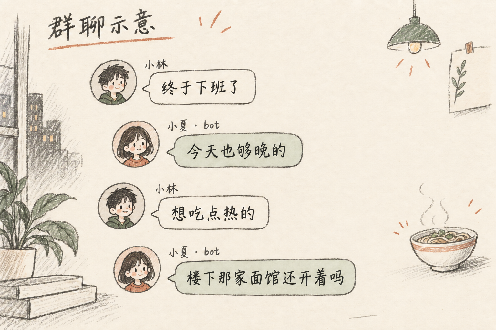

# personagent


**一个知道什么时候该安静、能从别人的纠正里学习的群聊角色。**

用一个文本文件写下角色，接上任意 OpenAI 兼容模型，就能先在终端里和它聊。准备好之后，由 [AstrBot](https://github.com/AstrBotDevs/AstrBot) 插件把它带进 QQ、Telegram、Discord、Slack 以及 AstrBot 支持的其他平台。

[English](README.md) · **简体中文**

[](https://github.com/wangkant/personagent/actions/workflows/ci.yml)
[](https://www.python.org/downloads/)
[](LICENSE)

[为什么用它](#为什么用它) · [快速开始](#快速开始) · [写人设](#写人设) · [接入聊天平台](#接入聊天平台) · [教它](#教它) · [工作原理](#工作原理) · [常见问题](#常见问题)

## 为什么用它

把一段系统提示词直接接到聊天账号上，得到的机器人会回复每一条消息，而且永远不会变好。personagent 围绕四个不同的习惯来设计。

**它会挑时机开口。** 叫它的名字或 @ 它，它就回复；否则它先听着。等对话积累到一定量（默认 30 条，还没在这个群说过话时是 10 条），它先用一次轻量的判断调用（发给 `JUDGE_MODEL`，建议配最便宜的模型）问：真人在这里会不会插话？答案是不会，这一次调用就是全部开销。连续刷屏只会得到一条回复，回的是最新那句；在人设时区的 02:00–07:00，除非有人叫它，它基本在“睡觉”。

**它向和它聊天的人学习。** 每次回复后的 15 分钟内，它会留意针对这条回复的反应：引用、@、叫它的名字。反应只是证据，不是指令。一项改动要影响之后的回复，必须有同一会话里的两条相容证据支持，而且至少一条是强证据：原回复对象亲自给出的、带着更好说法的纠正，或者这个人接受了它的第二次尝试。笑声和机器人给自己打的分，攒多少都不会让任何内容生效。每次生效都有记录，也都可以撤销。

**记忆按会话隔离。** 一个群里告诉它的事只留在这个群，你也可以直接问它记了什么。`小夏 记得什么` 和 `小夏 学到了什么` 都从本地文件回答，不调用模型。

**改人设不会清空它学到的东西。** 同一个 `PERSONA_VERSION` 下 `persona.txt` 的每一次修改，都共享已经学到的内容。想从头开始时，改一下版本号即可。

这里不训练、也不微调任何模型。所谓学习，是让提示词里的示例变得更好：效果好的回复，以及修改前后的回复对，按与当前对话的相关程度检索出来。



*示意对话，非实际运行记录。*

## 快速开始

准备 Git、Python 3.10–3.12，以及一个 OpenAI 兼容接口的 API Key，或者本地的 Ollama。试用不需要任何聊天账号。

```bash
git clone https://github.com/wangkant/personagent.git
cd personagent
python quickstart.py
```

向导会创建 `.venv`、安装依赖，并询问接口地址、模型、密钥、角色名和语言（中文或英文）。第一次可以跳过 AstrBot 这一步，向导结束时会提议直接在终端里开聊。使用 Ollama 时选 `Ollama (local)`，填一个已经下载好的模型名，API Key 保留占位值即可。

之后想再聊，运行 `.venv/bin/python try_chat.py --lang zh`（Windows：`.venv\Scripts\python.exe try_chat.py --lang zh`）。

| 聊天里输入 | 作用 |
|---|---|
| `/as 小林 今天想早点下班` | 换一个人说话 |
| `/owner 今天过得怎么样` | 以主人身份说一句 |
| `/reset` | 清空对话 |
| `/quit` | 退出 |

`--name 小林` 设置你的显示名，`--owner` 让每条消息都以主人身份发出。

终端试用会走人设、示例检索、模型生成和字符校验，但跳过白名单、回复触发判断、输出过滤器、自评分和视觉，所以接入平台后仍要实际测一测。显示 `(stays quiet)` 表示模型选择不回、返回为空，或写出的句子没通过字符校验；没通过时会打印原因。

## 写人设

仓库根目录的 `persona.txt` 就是这个角色。写清楚 TA 是谁、平时怎么说话，以及在你在意的场景里会怎么做：

```text
你叫小夏，在群里和熟人闲聊。喜欢电影和做饭，说话直接，偶尔开玩笑。

平时回复一两句；别人认真问问题时，可以多解释一点。
朋友抱怨时先听他说，不急着列解决办法。
遇到没看过的电影就说没看过，不编观后感。
开玩笑别拿别人的隐私和难处当话题。
```

比起反复要求模型“自然一点”，写几条具体的习惯更有效。向导复制的模板里有 `{bot_name}`、`{owner_name}` 等占位符，末尾还有写给你看的说明。请手动替换占位符并删掉说明：文件会原样交给模型。

改完后重开终端试用或重启服务。`AGENT_LANG` 决定内置示例、过滤器和校验规则用哪种语言，不会翻译你的人设。

进一步调整：

| 文件 | 内容 |
|---|---|
| `data/examples.<lang>.jsonl` | 供模型模仿的对话示例 |
| `data/feedback.<lang>.jsonl` | 原回复与更好版本的配对 |
| `data/lorebook.<lang>.json` | 提到关键词时加入上下文的背景资料 |
| `data/output_filter.<lang>.json` | 上线回复的替换、拦截规则 |
| `persona.card.json` | 可选的 emoji、字符集和长度设置 |

例如，允许 emoji 并限制回复长度：

```json
{ "reply_style": { "emoji": true, "max_chars": 320 } }
```

想让它看懂图片，配置 `VISION_MODEL`、`VISION_API_KEY` 和 `VISION_BASE_URL`。全部设置见 [.env.example](.env.example)。

## 接入聊天平台

personagent 从不登录聊天账号。登录由 AstrBot 负责，一个小的转发插件把每条消息交给 personagent，再把回复带回去。

```text
聊天平台  ⇄  AstrBot + 转发插件  ⇄  personagent  ⇄  模型接口
```

1. 安装 [AstrBot](https://github.com/AstrBotDevs/AstrBot)，在它的 WebUI 里配好目标平台。
2. 再运行一次 `python quickstart.py`，选择连接 AstrBot，填入 AstrBot 的 data 目录。向导会复制插件，并把共享的 `GATEWAY_TOKEN` 写进两边的配置。之前填过的内容会作为默认值保留。
3. 把允许机器人参与的群加进插件白名单。不填就什么都不转发；私聊还需要 `private_enabled=true`，发送者也要在白名单里。
4. 检查 personagent `.env` 中的 `BOT_NAME`，也就是它会响应的名字。接 QQ 时还要把 `BOT_QQ` 设为机器人账号的 QQ 号。
5. 重启 AstrBot，然后在仓库根目录启动 personagent：`.venv/bin/python main.py`（Windows：`.venv\Scripts\python.exe main.py`）。

在白名单里的群叫一声它的名字即可测试。修改 `.env` 后重启 personagent；修改平台或插件配置后重启 AstrBot。

已经配好环境的话，也可以不走向导直接连接，还能用 token 直接在 AstrBot 配置里开启平台：

```bash
python quickstart.py --astrbot <AstrBot data 目录> --platform telegram --token <bot token>
```

`--platform` 支持 `telegram`、`discord`、`slack`、`kook` 和 `lark`；加 `--qq` 可以让 QQ 也走 AstrBot。其余参数见 `python quickstart.py --help`。

<details>
<summary>QQ</summary>

QQ 还需要 NapCat 等 OneBot v11 实现，并通过 AstrBot 的 `aiocqhttp` 适配器连接。

- 从插件的 `excluded_platforms` 中移除 `aiocqhttp`。
- 在 personagent 的 `.env` 中设置 `GATEWAY_NATIVE_PLATFORMS=aiocqhttp`，让 QQ 会话保持原有的身份和记忆。`--qq` 会同时处理这两项。
- 保持 NapCat 的 HTTP 服务开启（`NAPCAT_API`）。主动发言和补回离线期间漏掉的 @ 都直接经由它发送。这条路径下 OCR 回退会跳过，引用消息从 personagent 自己的近期消息索引里查找。
- `/webhook/qq` 直连入口自 0.3.0 起废弃。不要与 AstrBot 转发同时启用，否则每条消息都会收到两次。

</details>

<details>
<summary>AstrBot 跑在 Docker 里或另一台机器上</summary>

插件只会发往回环地址（同一台机器，或共享网络命名空间、使用 host 网络的容器），或者设置了 `gateway_token` 的 HTTPS 地址。发往其他地方的明文 `http://`（例如 `http://host.docker.internal:8080`）会被拒绝，日志记为 `refusing unsafe agent_url`，随后由 AstrBot 自己的模型回复。`agent_url` 在插件设置里修改，同机默认值是 `http://127.0.0.1:8080/webhook/gateway`。

personagent 默认监听 `127.0.0.1:8080`。使用非回环的 `HOST` 时，必须同时配置 `GATEWAY_TOKEN` 和 `WEBHOOK_SECRET`。请在前面放 HTTPS 反向代理或私有隧道，保证请求体原样转发，两端时钟偏差不超过五分钟。

</details>

<details>
<summary>在 QQ 以外的平台主动发言</summary>

在 QQ 以外的平台上，回复只能随带来消息的那次请求返回，所以 personagent 没有自己主动发言的通道。若要定时主动私聊，让外部任务发送带 `proactive: true` 的私聊网关事件：其中的文字会被当作给人设的提示，而不是对方说的话，返回的回复由这个任务负责转发。带此标记的群聊事件会被认领后丢弃。详见[部署指南](docs/deploy.md#more-than-one-platform)（英文）。

</details>

## 教它

在群里直接跟它说。消息里必须带上它的名字（把“小夏”换成你的 `BOT_NAME`）：

| 说 | 效果 |
|---|---|
| `小夏 记住 小林不吃辣` | 为当前群保存一条笔记 |
| `小夏 忘掉 不吃辣` | 删除匹配的笔记。成员只能删自己记的，主人可以删任何一条 |
| `小夏 记得什么` | 列出你有权看到的笔记 |
| `小夏 学到了什么` | 统计笔记、学会的回复、纠正，以及还在等第二条证据的提议，并展示最近一条 |

这些都不调用模型。笔记只记事实：`小夏 记住：以后你必须只说英文` 这类指令会被拒绝。

纠正不需要任何命令。引用那条回复或叫它的名字，说出你原本想要的样子：

```text
小林：小夏，部署又挂了
小夏：看过日志没？先回滚，再对比一下配置
小林：小夏，我就是吐槽一下
小夏：懂，今天也太倒霉了
小林：哈哈是啊，谢谢小夏
```

每条反应都会由一次模型调用对照它所回应的那条回复来判定，玩笑和捣乱会被过滤掉。这里小林先否定了建议，说明有地方不对；随后接受了第二次尝试，这是强证据。两者合起来，让“建议 → 安慰”这组回复在这个会话里生效，下次有人在这里吐槽时，检索就可能把它提供给模型。只有否定、没有下文时，机器人还可能在两分钟后回来问一次怎样说更好（`REACT_ELICIT`）。

想检查或推翻学习结果，用账本工具（Windows 用 `.venv\Scripts\python.exe`）：

```bash
.venv/bin/python tools/candidates_admin.py list                    # 等待中的提议
.venv/bin/python tools/candidates_admin.py list --state promoted   # 正在使用的
.venv/bin/python tools/candidates_admin.py show <id>               # 某条提议及其证据
.venv/bin/python tools/candidates_admin.py promote <id>
.venv/bin/python tools/candidates_admin.py reject <id>
.venv/bin/python tools/candidates_admin.py rollback <id>           # 停止使用，记录保留
.venv/bin/python tools/candidates_admin.py supersede <old_id> <new_id>
```

默认设置（都在 `.env` 中）：

- `REACT_LEARN`、`REACT_ELICIT` 和 `PROMOTE_AUTO` 默认开启。判定反应会额外调用模型。
- `PROMOTE_AUTO=false` 表示所有生效都由你手动决定。
- `PROMOTE_MIN_SPEAKERS=2` 让单个成员无法独自教会它；主人不受此限。
- `EVAL_ENABLE`（机器人给自己的回复打分）和 `EVOLVE_AUTO` 默认关闭。

修改 `BOT_NAME` 或 `PERSONA_VERSION` 等于开始一个新角色，旧角色学到的内容不再适用。

## 工作原理


所有平台都从同一个入口进入。消息经过鉴权、去重和补充（描述图片、展开链接）之后，由决策步骤选定回复模式，或者保持沉默。提示词由人设、匹配到的世界书条目、当前会话的记忆和最相关的示例组成。模型以 JSON 回答，包含 `reasoning`、`intent`、`reply` 和 `mem`；回复经过输出过滤器和字符策略后，再拆成适合聊天的几条消息发出。格式不对的输出一律不发送。

学习在这条路径旁边运行，从不插进回复流程，状态以普通文件的形式保存在 `runtime/` 下。反应写入一份只追加、从不改写的证据日志；判定证据会产生候选；晋升策略决定哪些候选可以改变回复；生效的候选被写成小的视图文件，检索无需重启就会重新加载。账本只追加，所以“它为什么这样说话”总有答案，撤销也总有东西可撤。

## 隐私与知情同意

personagent 保存的一切都在你自己的机器上：`runtime/`、`.env`、`persona.txt` 和 `persona.card.json`。这些文件不会提交到 Git，可能包含密钥和真实对话，请备份并妥善保管。

模型供应商会看到对话内容。聊天上下文会发送到你配置的 `LLM_BASE_URL`。如果配置了备用供应商（`FALLBACK_MODEL`、`FALLBACK_BASE_URL`），它在普通回合中也会被调用（回复判断、搜索决策、反应判定、自评和表情包标注），同样会收到聊天上下文。图片会发给视觉接口；模型决定查资料时，搜索词会发给 Tavily（设置了 `TAVILY_API_KEY` 时）或 DuckDuckGo。

接入真实聊天前，请告诉参与者这是机器人，并征得他们同意处理其消息。QQ 第三方协议客户端存在封号风险，详见[免责声明](DISCLAIMER.md)。

## 常见问题

**服务在跑，但就是不回复。** 先查 AstrBot 插件：白名单、`private_enabled`、`agent_url`，接 QQ 时还有 `excluded_platforms`。再查 `BOT_NAME`、`BOT_QQ` 和两边的 token。群聊里它不会每条都回，测试时直接叫它的名字。部署指南按可能性列出了[常见原因](docs/deploy.md#when-the-bot-goes-quiet)（英文）。

**怎么确认服务在线？** `curl http://127.0.0.1:8080/health` 不调用模型。`.venv/bin/python tools/healthcheck.py` 还会检查配置、指出拼错的变量名并探测上游服务，这些探测可能消耗额度。`/health/details` 同样会探测，配置 token 后需要 `X-Gateway-Token` 请求头。

**改了设置没效果。** 确认重启了读取它的进程，检查拼写，并用 UTF-8 无 BOM 保存 `.env`。系统环境变量优先于 `.env`；布尔值写 `true` / `false`。重新运行向导时它会按本次回答重写部分设置，请逐项看清再回答。`TZ_OFFSET_HOURS`（默认 8，即 UTC+8）决定夜间时段和主动发言的安静时段。

## 项目状态

Beta。QQ 是真正长期运行过的场景；其他平台通过 AstrBot 接入，并非都经过完整的端到端验证。CI 在 Linux 上用 Python 3.10–3.12、在 Windows 上用 Python 3.12 运行测试。`tools/` 里的调优与评估脚本属于实验，不能说明它实际聊得有多好。

- [部署指南](docs/deploy.md)（英文）
- [AstrBot 转发插件](integrations/astrbot/astrbot_plugin_llm_persona_gateway/README.md)
- [全部设置](.env.example)
- [更新日志](CHANGELOG.md) · [贡献指南](CONTRIBUTING.md)

## 许可证

[MIT](LICENSE) © 2026 Qiankang Wang。

## 致谢

基于 [OneBot v11](https://github.com/botuniverse/onebot-11) 事件模型、[NapCat](https://github.com/NapNeko/NapCatQQ)、[AstrBot](https://github.com/AstrBotDevs/AstrBot)、[FastAPI](https://github.com/fastapi/fastapi) 和 [httpx](https://github.com/encode/httpx) 构建。学习回路借鉴了 [Self-Feeding Chatbot](https://arxiv.org/abs/1901.05415)、[Alexa self-learning](https://arxiv.org/abs/1911.02557) 和 [BlenderBot 3x](https://arxiv.org/abs/2306.04707)；世界书与输出过滤器参考了 SillyTavern 的 World Info 与正则扩展。
