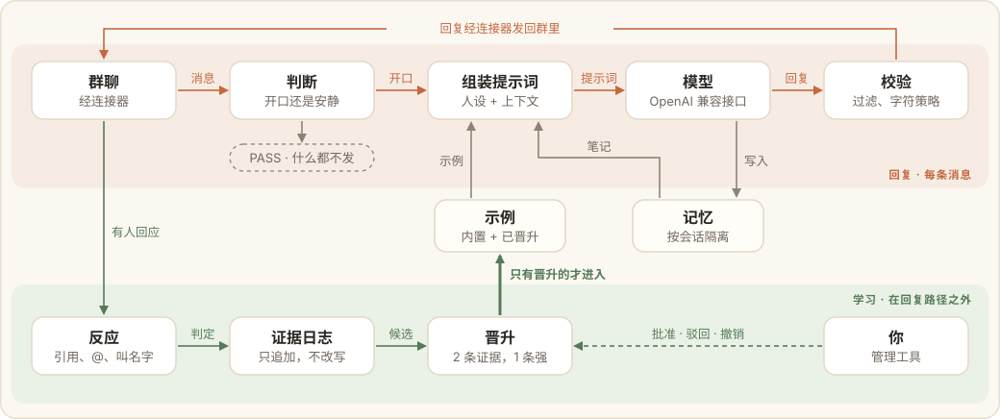

<div align="center">

# personagent

<p><strong>一个知道怎么说话，也知道什么时候不该说话的人设 Agent。</strong></p>

可部署于群聊和私聊，理解聊天现场，默认有选择地回应；<br>
能够从真实反应中学习，但不会让一次噪声反馈直接改写自己的性格。

[English](README.md) · [**简体中文**](README.zh-CN.md)

[](https://github.com/wangkant/personagent/actions/workflows/ci.yml)
[](https://github.com/wangkant/personagent/releases)
[](https://www.python.org/downloads/)
[](LICENSE)

[**快速开始**](#快速开始) · [为什么不同](#为什么选择-personagent) · [部署](#部署方式) · [架构](#架构) · [配置](#配置)

</div>

<a href="#快速开始">
  
</a>

`personagent` 可以把任意 OpenAI 兼容聊天模型变成一个真正处在对话现场中的人设角色。它既能在终端本地运行，也能通过 OneBot v11 直接接入 QQ，或借助仓库内置的 AstrBot 网关接入 Telegram、Discord、Slack、飞书和 KOOK。

## 快速开始

你只需要 Git、Python 3.10+，以及一个 OpenAI 兼容 API Key。本地试用不需要 QQ、NapCat 或其他消息平台适配器。

```bash
git clone https://github.com/wangkant/personagent.git
cd personagent
python quickstart.py
```

配置向导会创建 `.venv`、安装依赖、写入 `.env`、按需验证模型接口、创建人设文件，并询问是否直接进入终端试用。它可以安全地重复运行，支持 DeepSeek、Kimi、OpenAI、Ollama 和自定义 OpenAI 兼容接口。

<details>
<summary><strong>再次进入终端试用，或进行无交互初始化</strong></summary>

```bash
# macOS / Linux
.venv/bin/python try_chat.py
.venv/bin/python try_chat.py --lang zh

# Windows
.venv\Scripts\python.exe try_chat.py
.venv\Scripts\python.exe try_chat.py --lang zh

# CI / 自动化部署
python quickstart.py --no-input
```

终端试用与线上部署共用相同的人设、Prompt 组装、检索、输出解析和回复验证链路。使用 `--owner` 测试配置好的主人关系，或用 `--name <名字>` 指定当前说话者。

</details>

## 为什么选择 personagent

大多数群聊机器人始终处于“值班”状态：正式、积极、明显像一个助理。`personagent` 的出发点则是成为聊天中的一个参与者。

| **处在现场的人设** | **默认有选择地回应** |
|---|---|
| 语域、关系、现场位置、意图和有作用域的记忆都位于核心回复链路中。 | `PASS` 是一等结果；当沉默比再发一条消息更合适时，Agent 可以选择不接话。 |
| **门控之后再学习** | **把媒体当作上下文** |
| 用户反应先成为只追加证据；只有经过交叉验证并晋升的候选项才能影响后续回复，而且每次晋升都可以撤销。 | 图片、表情包、URL、视频和分享卡片都会变成可用上下文，也可以成为人设表达的一部分。 |

### 默认具备生产防线

- **失败即关闭的输出边界：** 模型的结构化输出会先经过解析、过滤、字符策略和投递验证，再进入聊天。
- **供应商无关且便于运维：** 聊天、裁决、评估和视觉调用都使用 OpenAI 兼容 HTTP 接口；同时内置 Webhook 鉴权、重放防护、限流、持久化去重、健康检查、运行数据隔离和跨平台 CI。

> **Beta：** 版本发布遵循语义化版本规范，行为与存储变更会记录在[更新日志](CHANGELOG.md)中。当前版本支持受控的个人部署，但平台政策与账号风险仍由部署者承担。连接第三方 IM 客户端前请阅读[部署免责声明](DISCLAIMER.md)。

## 部署方式

| 方式 | 适用场景 | 入口 | 说明 |
|---|---|---|---|
| **终端** | 人设设计与本地评估 | `try_chat.py` | 不需要 IM 账号或适配器。 |
| **OneBot v11** | 完整 QQ 部署 | `main.py` → `/webhook/qq` | 主部署路径；支持 QQ 专属的图片、表情包、主动消息和漏接补偿能力。 |
| **AstrBot 网关** | Telegram、Discord、Slack、飞书、KOOK 及其他 AstrBot 适配平台 | `/webhook/gateway` | 通过内置转发插件复用同一套 Agent 链路。 |

### 通过 OneBot 接入 QQ

1. 运行 `python quickstart.py` 并回答可选的线上部署问题；也可以直接在 `.env` 中填写 `BOT_QQ`、`BOT_NAME`、`NAPCAT_API` 和 `QQ_GROUPS`。
2. 启动 Agent：

   ```bash
   python main.py
   # 或：./start.sh
   # Windows：.\start.ps1
   ```

3. 为 [NapCat](https://github.com/NapNeko/NapCatQQ) 等 OneBot v11 客户端启用 HTTP API 和 Webhook：

   ```json
   {
     "http": { "enable": true, "host": "127.0.0.1", "port": 3000 },
     "webhook": {
       "enable": true,
       "url": "http://127.0.0.1:8080/webhook/qq",
       "timeout": 5000
     }
   }
   ```

两个 HTTP 方向用途不同：

```text
OneBot 客户端 ──事件──▶ personagent :8080   (HOST / PORT)
personagent   ──动作──▶ OneBot 客户端 :3000 (NAPCAT_API)
```

两个服务部署在同一台机器时，请保持默认的回环地址绑定。若需要让其他主机访问 Webhook，请设置 `HOST=0.0.0.0`、配置 `WEBHOOK_SECRET`，并保护网络边界。本地 Windows 部署还可在配置账号和路径后使用 `launch.vbs`。

### 通过 AstrBot 接入其他平台

`POST /webhook/gateway` 接收平台无关事件，并在响应中返回要由适配器转发的回复。仓库内置的 AstrBot 插件位于 [`integrations/astrbot/`](integrations/astrbot/astrbot_plugin_llm_persona_gateway/README.md)。

```text
Telegram / Discord / Slack / 飞书 / KOOK
                    │
                    ▼
          AstrBot + 转发插件
                    │ 签名 HTTP
                    ▼
      personagent /webhook/gateway
```

转发插件默认拒绝所有来源：只有明确加入白名单后，群聊或私聊才会被转发。跨主机部署时，请使用 HTTPS 或私有隧道，并让插件的 `gateway_token` 与 Agent 的 `GATEWAY_TOKEN` 使用同一个非空密钥。时间戳、nonce 和正文会共同参与签名并进行重放检查。如果 NapCat 已经把 QQ 事件发到 `/webhook/qq`，请继续排除 AstrBot 的 QQ 适配器，否则同一条消息会被处理两次。

## 架构



无论来自哪种传输层，每个事件都会经过同一条回复边界：

1. **接入**——鉴权、限流、去重、归一化，并补充会话、图片、链接和分享卡片上下文。
2. **决策**——解析关系和模式（主人、直接呼叫、跟进、判断或主动消息），再决定是否需要回复。
3. **检索**——组合人设、世界书、有作用域的记忆、合成种子，以及与本轮相关的已晋升运行时样例。
4. **生成**——按结构化输出协议调用已配置模型。
5. **验证与投递**——解析 JSON，执行输出过滤和字符策略，安全拆分回复，解析表情包，并且只发送已提交的输出。
6. **异步学习**——把评估和定向用户反应记录成证据；候选晋升不会阻塞实时回复。

可导入的核心代码位于 `persona_agent/`；`main.py`、`try_chat.py` 和各类工具只是轻量入口。可变状态默认与版本化种子分离，统一写入 `runtime/`。

<details>
<summary><strong>核心包结构</strong></summary>

| 模块 | 职责 |
|---|---|
| `agent.py` | 编排、模式、去抖、Prompt 组装和模型调用。 |
| `prompts.py`、`textproc.py`、`pools.py` | 人设协议、安全输出处理和可感知追加内容的检索数据集。 |
| `ingestion.py`、`transport.py`、`gateway.py` | 内容增强、有界投递和平台无关转发。 |
| `learning.py`、`reactions.py`、`evolution.py` | 评估、反应裁决和候选项生成。 |
| `evidence.py`、`candidates.py`、`promotion.py` | 只追加证据、候选生命周期、晋升策略、回滚与物化视图。 |
| `stickers.py` | 表情包接入、去重、打标、人设匹配门控、评分和选择。 |
| `storage.py`、`paths.py`、`health.py` | 带锁/原子持久化、运行路径隔离和服务诊断。 |

</details>

## 有门控的学习

学习系统把“观察到什么”和“什么有权改变行为”严格分开：

| 概念 | 含义 |
|---|---|
| **证据（Evidence）** | 用户反应、被接受的重试或评估形成的只追加记录。它不能改变行为。 |
| **候选项（Candidate）** | 从证据中产生、有版本的候选样例或偏好对。默认不生效。 |
| **晋升（Promotion）** | 显式授予候选项影响检索与后续回复的权限。 |
| **回滚 / 取代** | 不删除历史的前提下撤销或替换这份权限。 |

默认情况下，自动晋升至少需要两个相互兼容的事件，其中至少一个必须是强证据。证据会按人设、人设版本、语言、会话和模式隔离；过期或互相矛盾的证据不能被静默合并。积极反应和自评分都属于弱信号，永远无法独自晋升候选项。

已晋升内容会原子化地物化到 `runtime/promoted.{examples,feedback}.<lang>.jsonl`，并在下一次相关对话中热加载。只追加账本始终是唯一事实来源，因此视图可以重建，每一次决策都可以审计或撤销。

```bash
python tools/candidates_admin.py list
python tools/candidates_admin.py show <candidate-id>
python tools/candidates_admin.py promote <candidate-id> --reason "reviewed"
python tools/candidates_admin.py rollback <candidate-id> --reason "regression"
python tools/candidates_admin.py rebuild
```

设置 `PROMOTE_AUTO=false` 可完全改为人工授权。`EVOLVE_AUTO=true` 会自动诊断低分回复，但只创建候选项，不会绕过晋升门控。需要交互式审核时，运行 `python tools/auto_reviewer.py --apply`。


## 输出与安全边界

模型必须返回一个对象：

```json
{
  "reasoning": "内部决策摘要",
  "intent": "chat",
  "reply": "要发送的文字，或 PASS",
  "mem": "可选记忆"
}
```

只有 `reply` 字段可能进入传输层。结构化输出格式错误时默认拒绝；唯一例外是短小、明显像聊天文本且仍能通过验证器的裸回复。XML/JSON 残留、供应商 Token、模板标记、不支持的控制字符、不安全 URL、过大图片、未经鉴权的远程 Webhook 和重放的网关信封，都会在投递前被拒绝。

字符策略刻意保持保守：常见语言文字直接允许，排版字符会被规范化，emoji 和可选风格字符集需要在人设级别主动开启。当前策略和回归覆盖见 [v0.2.0](CHANGELOG.md#020--2026-08-11)。

## 配置

`.env.example` 是完整且带注释的权威配置参考。配置向导只写入首次运行所需的最少内容，其余高级能力保持可选。

| 范围 | 主要设置 | 默认策略 |
|---|---|---|
| 模型 | `DEEPSEEK_API_KEY`、`DEEPSEEK_BASE_URL`、`DEEPSEEK_MODEL` | 一个 OpenAI 兼容接口即可启动。 |
| 人设 | `BOT_NAME`、`AGENT_LANG`、`PERSONA_FILE`、`PERSONA_CARD_FILE`、`PERSONA_VERSION` | 英文示例人设；自定义人设不进入 Git。 |
| 运行状态 | `AGENT_RUNTIME_DIR` | `runtime/`，已被 Git 忽略。 |
| QQ / OneBot | `BOT_QQ`、`QQ_GROUPS`、`NAPCAT_API`、`WEBHOOK_SECRET` | Webhook 只监听回环地址；`QQ_GROUPS` 为空时监听全部群。 |
| 网关 | `GATEWAY_TOKEN`、`GATEWAY_OWNER_IDS`、`GATEWAY_SOURCE_MAX_AGE_SECONDS` | 未鉴权时仅允许回环访问。 |
| 视觉与搜索 | `VISION_MODEL`、`GLM_API_KEY`、`TAVILY_API_KEY` | 视觉关闭；搜索回退到免 Key 的 DuckDuckGo。 |
| 学习 | `REACT_*`、`PROMOTE_*`、`EVOLVE_*`、`EVAL_*` | 反应采集开启；保守晋升；无人值守进化和自评关闭。 |
| 主动消息 | `PROACTIVE_*` | 关闭；开启后也不会主动联系从未出现过的会话。 |
| 容量与日志 | `MAX_IMAGE_BYTES`、`MAX_WEBHOOK_BODY_BYTES`、`MAX_INFLIGHT_WEBHOOKS`、`LOG_FILE` | 输入和并发有上限；日志默认只输出到控制台。 |

切换语言只需要一个设置：

```dotenv
AGENT_LANG=en  # 主构建
# AGENT_LANG=zh  # 中文人设、数据文件、验证器与词表
```

不同语言的种子文件位于 `data/*.<lang>.*`。新增语言需要提供对应的人设、样例、反馈、过滤器和世界书文件；除 `zh` 外的语言使用基于字母的验证模式。

## 运维

### 健康检查

```bash
python tools/healthcheck.py
curl http://127.0.0.1:8080/health
```

- `GET /health` 是廉价存活探针，不会消耗上游 API 额度。
- `GET /health/details` 会检查依赖并缓存 60 秒；它仅允许回环访问，或在配置 `GATEWAY_TOKEN` 后使用 `X-Gateway-Token` 访问。
- 任一关键依赖降级时，详细探针会返回 HTTP 503。

### 运行数据与备份

请将 `AGENT_RUNTIME_DIR` 与私有人设文件一起备份。它包含记忆、证据、候选账本、已晋升视图、学习样例、去重状态和表情包元数据。必要的写入使用文件锁和原子替换，候选/事件日志保持只追加。

不要提交运行状态。这里可能包含 API Key、账号标识、对话片段、用户反应、图片元数据和学习内容。仓库中的 `data/` 和 `tools/fixtures.*.jsonl` 只包含合成种子。

### 更新

先查看 [CHANGELOG.md](CHANGELOG.md)，停止进程，备份运行状态，再拉取选定版本、重新安装依赖并启动。启动流程会兼容处理受支持的旧状态；具体版本变更会写入发布说明。

## 开发

安装依赖并运行与 CI 相同的离线测试：

```bash
python -m pip install -r requirements.txt "pytest>=8,<10"
python -m pytest -q
python -m compileall -q .
```

CI 会在 Linux 的 Python 3.10、3.11 和 3.12 上运行测试，在 Windows 上执行真实存储与启动器路径，并构建、导入 wheel 和源码分发包。测试使用模型与传输层替身，不需要 API Key 或网络。

常用维护工具：

```bash
python tools/prompt_lab.py
python tools/auto_reviewer.py --apply
python tools/candidates_admin.py list
python tools/import_stickers_folder.py <folder>
python tools/evolution_benchmark.py --help
```

仓库约定、测试发现规则、模块结构和隐私要求见 [CONTRIBUTING.md](CONTRIBUTING.md)。可复现的 Bug 和边界清晰的功能建议请提交到 [GitHub Issues](https://github.com/wangkant/personagent/issues)。

## 仓库结构

```text
persona_agent/   可导入的应用核心
main.py          FastAPI 服务与后台循环
quickstart.py    可重复执行的配置向导
try_chat.py      经过生产回复链路的终端试用
integrations/    平台适配器（包含 AstrBot 转发插件）
data/            版本化的合成人设与检索种子
runtime/         私有可变状态（Git 忽略，运行时创建）
tools/           审核、调优、基准、导入和健康检查 CLI
tests/           离线跨平台回归测试
docs/            架构与管线图
```

## 负责任地使用

本项目与任何即时通信平台或模型供应商均无关联，也未获得其认可或赞助。第三方协议客户端可能违反上游条款或触发账号风控。请使用次要账号、默认保持私有部署、妥善保护密钥和对话数据，并在处理他人消息前取得适当同意。

完整部署说明见 [DISCLAIMER.md](DISCLAIMER.md)。

## 许可证

[MIT](LICENSE) © 2026 Qiankang Wang。

## 致谢

`personagent` 构建于 [OneBot v11](https://github.com/botuniverse/onebot-11) 事件模型、[NapCat](https://github.com/NapNeko/NapCatQQ)、[AstrBot](https://github.com/AstrBotDevs/AstrBot)、[FastAPI](https://github.com/fastapi/fastapi) 和 [httpx](https://github.com/encode/httpx) 之上；学习机制参考了 [Self-Feeding Chatbot](https://arxiv.org/abs/1901.05415)、[Alexa self-learning](https://arxiv.org/abs/1911.02557) 与 [BlenderBot 3x](https://arxiv.org/abs/2306.04707)。世界书和过滤器模型受到 SillyTavern World Info 与正则扩展的启发。
